# 自律型Agent　（GRACE エージェント）ドキュメント
# grace_chat_page.py
**Version 4.0** | 最終更新: 2026-07-10

---

## 目次

1. [概要](#概要)
2. [画面レイアウト図](#1-画面レイアウト図)
3. [UIコンポーネント詳細](#2-uiコンポーネント詳細)
4. [セッション状態管理](#3-セッション状態管理)
5. [ユーザー操作フロー](#4-ユーザー操作フロー)
6. [関数一覧表](#5-関数一覧表)
7. [関数 IPO詳細](#6-関数-ipo詳細)
8. [依存関係](#7-依存関係)
9. [イベント処理](#8-イベント処理)
10. [エラーハンドリング](#9-エラーハンドリング)
11. [使用例](#10-使用例)
12. [変更履歴](#11-変更履歴)
- [付録A: アプリケーション構成](#付録a-アプリケーション構成)
- [付録B: 設定リファレンス](#付録b-設定リファレンス)
- [付録C: トラブルシューティング](#付録c-トラブルシューティング)
- [付録D: grace/ パッケージ エクスポート一覧](#付録d-grace-パッケージ-エクスポート一覧)

---

## 概要

`grace_chat_page.py`は、GRACE（**Guided Reasoning with Adaptive Confidence Execution** — 適応型計画実行エージェント）アーキテクチャを使用した自律型エージェントとの対話インターフェースを提供するStreamlit UIページです。
Planner + Executor の2フェーズ分離型アーキテクチャにより、計画策定（Plan）→ 実行（Execute）→ 信頼度評価（Confidence）→ 介入判定（Intervention）→ リプラン（Replan）の一連のプロセスをリアルタイムに可視化します。

LLM には **OpenAI GPT**（既定 `gpt-5-mini`、`create_llm_client("openai")` 経由）、Embedding には **OpenAI Embedding**（`text-embedding-3-large`、3072次元、`create_embedding_client("openai")` 経由）を使用します。

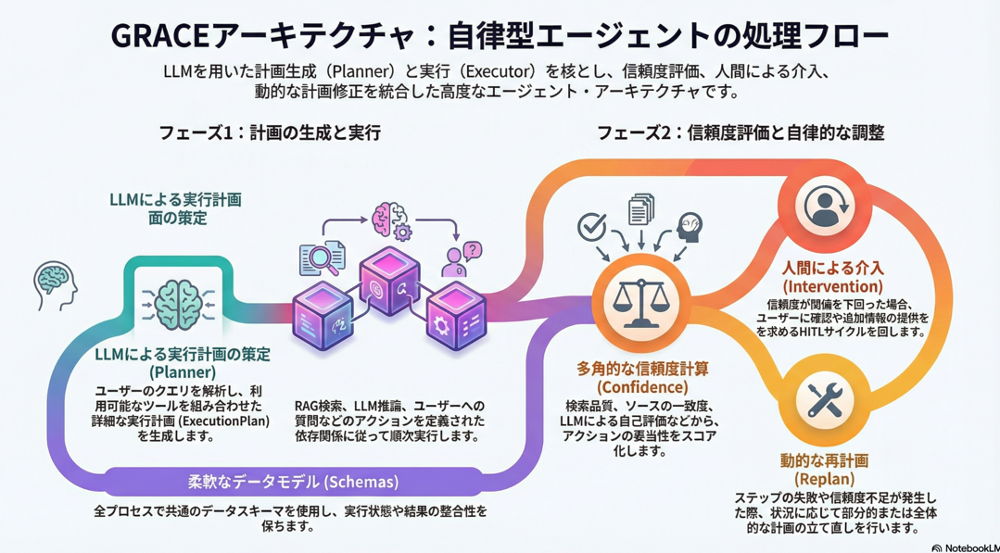

📝 **注意**: GRACE の正式な定義は `grace/__init__.py` の「Guided Reasoning with Adaptive Confidence Execution（適応型計画実行エージェント）」です。UIキャプション（`st.caption`）には移行前の旧表記「Goal-Reasoning-Action-Critique-Execute Architecture」が残っていますが、これは表示文言のみの負債であり、本ドキュメントでは実コードの定義を正とします。

### 主な責務

- ユーザーからの質問入力の受付
- Planner による実行計画の策定と表示（**二層計画生成**: 単純質問はルールベース即時生成・複雑質問のみLLM生成）
- 曖昧クエリ（指示語のみで対象不明）の検知と明確化（ask_user）計画への振り分け
- Executor による計画の逐次実行と進捗表示（Generator ベースのリアルタイム更新、依存なし検索ステップの並列プリフェッチ）
- 各ステップの信頼度スコア表示と実行結果サマリの提示（groundedness ブレンド＋温度スケーリング較正済み）
- 会話履歴の管理とセッション状態の維持
- 検索対象コレクションの参考表示（GRACEは全コレクションを自動検索。実行メモリ層による優先コレクション学習あり）
- Qdrantコレクションデータのプレビュー表示
- キャッシュ管理と統計表示

### 各責務対応のモジュール


| #  | 責務             | 対応モジュール          | 説明                                                                                       |
| -- | ---------------- | ----------------------- | ------------------------------------------------------------------------------------------ |
| 1  | 実行計画の策定   | `grace/planner.py`      | 二層計画生成（ルールベース / OpenAI Structured Outputs）、曖昧クエリ判定、リトライ付き生成 |
| 2  | 計画の逐次実行   | `grace/executor.py`     | Generator ベースのステップ実行、並列プリフェッチ、タイムアウト、動的フォールバック連鎖     |
| 3  | 信頼度評価       | `grace/confidence.py`   | LLM自己評価 + Heuristic、GroundednessVerifier（根拠妥当性）、統合最終評価（#65）           |
| 4  | 信頼度較正       | `grace/calibration.py`  | 温度スケーリング（Temperature Scaling）による confidence 較正（S1）                        |
| 5  | 介入判定（HITL） | `grace/intervention.py` | 信頼度に基づく SILENT/NOTIFY/CONFIRM/ESCALATE の4段階判定                                  |
| 6  | リプラン         | `grace/replan.py`       | ステップ失敗時の PARTIAL/FULL 戦略による計画修正（低信頼度トリガーは検索系のみ・#64）      |
| 7  | 実行メモリ層     | `grace/memory.py`       | 実行実績（質問キーワード×コレクション×成否×信頼度）の蓄積とコレクション事前分布（P4）  |
| 8  | ツール実行       | `grace/tools.py`        | ToolRegistry（RAGSearchTool, WebSearchTool, ReasoningTool, AskUserTool）                   |
| 9  | データモデル     | `grace/schemas.py`      | ExecutionPlan, PlanStep, StepResult, ExecutionResult, SearchResultItem 等                  |
| 10 | 設定管理         | `grace/config.py`       | GraceConfig（YAML + 環境変数）、Planner/Executor/Memory 等の新設定を含む                   |
| 11 | ベンチマーク     | `grace/benchmark.py`    | BenchmarkRunner による Plan/Execute/Confidence 指標の計測・CSV出力                         |

### 主要機能一覧


| 機能                     | 説明                                                                      |
| ------------------------ | ------------------------------------------------------------------------- |
| `show_grace_chat_page()` | メインページ表示関数                                                      |
| サイドバー設定           | モデル選択（OpenAI GPT）、コレクション参考表示、キャッシュ管理            |
| コレクションデータ表示   | Qdrantコレクションの内容プレビュー（最大100件）                           |
| チャット履歴表示         | 会話履歴の表示                                                            |
| 計画策定表示             | Planner が生成した ExecutionPlan の構造化表示（📋 計画策定）              |
| 実行プロセス表示         | Executor のステップ実行ログ・信頼度のリアルタイム表示（⚡ 実行）          |
| 実行結果サマリ           | 全体ステータス・信頼度・リプラン回数・実行時間の表示（📊 実行結果サマリ） |

### アーキテクチャ概要

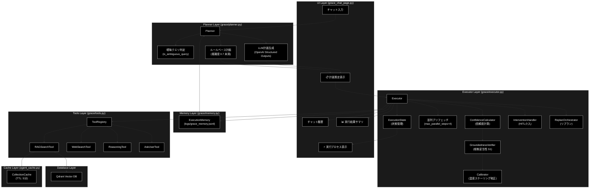

### Planner / Executor 2フェーズ処理フロー

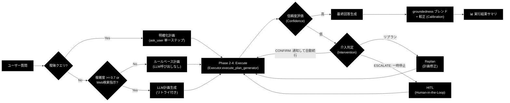

---

## 1. 画面レイアウト図

### 1.1 全体レイアウト

```mermaid
flowchart TB
    subgraph Browser["ブラウザウィンドウ"]
        direction TB
        subgraph Sidebar["📋 サイドバー (280px固定)"]
            direction TB
            S1["⚙️ 設定ヘッダー"]
            S2["モデル選択<br/>[selectbox]"]
            S3["コレクション選択<br/>[multiselect] (参考表示)"]
            S4["☑️ ハイブリッド検索<br/>(disabled)"]
            S5["[🗑️ 履歴クリア]"]
            S6["[🔄 キャッシュリセット]"]
            S7["📊 キャッシュ統計<br/>(expander)"]
            S1 --> S2 --> S3 --> S4 --> S5 --> S6 --> S7
        end
        subgraph Main["📄 メインエリア (残り幅)"]
            direction TB
            M1["🧠 タイトル<br/>自律型エージェント GRACE"]
            M2["キャプション<br/>Planner + Executor"]
            M3["📊 コレクションデータ表示<br/>(expander)"]
            M4["💬 チャットセクション"]
            M5["チャット履歴エリア"]
            M6["📋 計画策定 Plan<br/>(expander, 展開)"]
            M7["⚡ 実行 Execute<br/>(expander, 展開)"]
            M8["📊 実行結果サマリ<br/>(expander, 折りたたみ)"]
            M9["最終回答表示"]
            M10["📝 チャット入力"]
            M1 --> M2 --> M3 --> M4 --> M5 --> M6 --> M7 --> M8 --> M9 --> M10
        end
    end

    Sidebar -.-> Main
classDef default fill:#000,stroke:#fff,color:#fff
classDef subgraphStyle fill:#1a1a1a,stroke:#fff,color:#fff
class S1,S2,S3,S4,S5,S6,S7,M1,M2,M3,M4,M5,M6,M7,M8,M9,M10 default
style Browser fill:#1a1a1a,stroke:#fff,color:#fff
style Sidebar fill:#1a1a1a,stroke:#fff,color:#fff
style Main fill:#1a1a1a,stroke:#fff,color:#fff
```

### 1.2 コンポーネント配置図

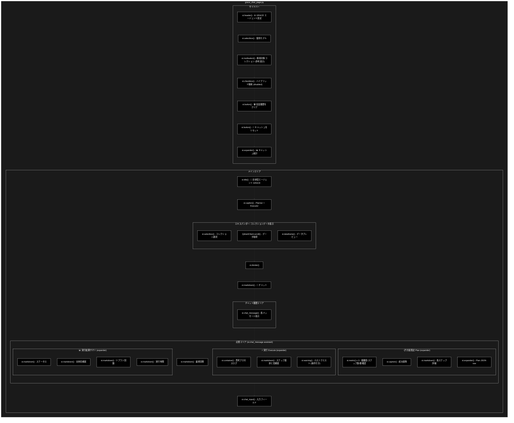

### 1.3 応答エリア内部構造

ユーザーが質問を送信した際、`st.chat_message("assistant")` 内に以下の3つのExpanderが順次生成されます。

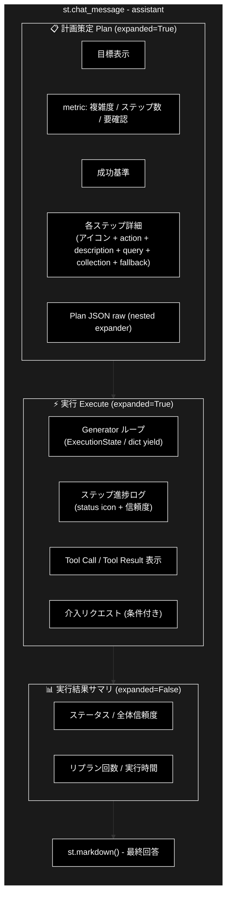

---

## 2. UIコンポーネント詳細

### 2.1 サイドバー


| コンポーネント     | 種類             | キー | デフォルト値             | 説明                                                              |
| ------------------ | ---------------- | ---- | ------------------------ | ----------------------------------------------------------------- |
| 設定ヘッダー       | `st.header`      | -    | -                        | 「⚙️ GRACE エージェント設定」                                   |
| モデル選択         | `st.selectbox`   | -    | `AgentConfig.MODEL_NAME` | 使用するLLMモデル（OpenAI GPT）                                   |
| コレクション選択   | `st.multiselect` | -    | 全コレクション           | 検索対象コレクション（参考表示。GRACEは全コレクションを自動検索） |
| ハイブリッド検索   | `st.checkbox`    | -    | `True`                   | Sparse + Dense検索（`disabled=True`、GRACE側デフォルトに委任）    |
| 履歴クリア         | `st.button`      | -    | -                        | 会話履歴・Planner・Executor 状態のクリア                          |
| キャッシュリセット | `st.button`      | -    | -                        | セッションキャッシュのクリア                                      |
| キャッシュ統計     | `st.expander`    | -    | 折りたたみ               | キャッシュ状態の詳細表示                                          |

#### モデル選択の詳細

```python
selected_model = st.selectbox(
    "使用モデル (Model)",
    options=GeminiConfig.AVAILABLE_MODELS,
    index=GeminiConfig.AVAILABLE_MODELS.index(AgentConfig.MODEL_NAME)
    if AgentConfig.MODEL_NAME in GeminiConfig.AVAILABLE_MODELS else 0
)
```

📝 **注意**: クラス名 `GeminiConfig` は移行期の名残であり、実体は **OpenAI モデル設定**です（`config.py` のコメント参照）。中身はすべて OpenAI GPT モデルです。

**オプション一覧** (`GeminiConfig.AVAILABLE_MODELS`):


| モデル名       | 説明                             |
| -------------- | -------------------------------- |
| `gpt-5-mini`   | 最新・高速（**デフォルト**）     |
| `gpt-4o-mini`  | 高速・低コスト                   |
| `gpt-4o`       | 高性能                           |
| `gpt-4.1`      | GPT-4.1                          |
| `gpt-4.1-mini` | GPT-4.1 軽量版                   |
| `o1-mini`      | 推論特化                         |

#### コレクション選択の詳細

```python
selected_collections = st.multiselect(
    "検索対象コレクション (参考表示)",
    options=all_collections,
    default=all_collections if all_collections != ["(None)"] else [],
    help="GRACEエージェントはQdrant上の全コレクションを自動検索します。"
)
```

コレクション選択はUIでの参考表示のみです。GRACE Executor 内の `RAGSearchTool` が Qdrant から動的にコレクション一覧を取得し、優先順位に従って全コレクションを順次検索します。さらに実行メモリ層（`grace/memory.py`）に十分な実績があるコレクションは、Planner がルールベース計画時に優先指定します。

#### キャッシュ統計の詳細


| 表示項目       | 説明                               |
| -------------- | ---------------------------------- |
| キャッシュ状態 | 🟢 ヒット / ⚪ なし                |
| コレクション   | キャッシュされているコレクション名 |
| 前回スコア     | 直近の検索スコア                   |
| ヒット回数     | キャッシュヒット累計               |
| 経過時間       | キャッシュ作成からの経過秒数       |

### 2.2 メインエリア


| コンポーネント           | 種類                           | 説明                                                                          |
| ------------------------ | ------------------------------ | ----------------------------------------------------------------------------- |
| タイトル                 | `st.title`                     | 「🧠 自律型エージェント (GRACE)」                                             |
| キャプション             | `st.caption`                   | 「Goal-Reasoning-Action-Critique-Execute Architecture — Planner + Executor」（旧表記のまま。正式名称は概要参照） |
| コレクションデータ表示   | `st.expander` + `st.dataframe` | Qdrantデータのプレビュー                                                      |
| チャットセクション見出し | `st.markdown`                  | 「### 💬 チャット」                                                           |
| チャット履歴             | `st.chat_message`              | 会話の表示                                                                    |
| 📋 計画策定 (Plan)       | `st.expander`                  | Planner が生成した ExecutionPlan の表示                                       |
| ⚡ 実行 (Execute)        | `st.expander`                  | Executor のステップ実行ログのリアルタイム表示                                 |
| 📊 実行結果サマリ        | `st.expander`                  | 全体ステータス・信頼度・リプラン回数・実行時間                                |
| 最終回答                 | `st.markdown`                  | Executor の最終回答テキスト                                                   |
| チャット入力             | `st.chat_input`                | ユーザー入力                                                                  |

### 2.3 エキスパンダー一覧


| エキスパンダー名            | 初期状態   | 表示タイミング   | 内容                                                                       |
| --------------------------- | ---------- | ---------------- | -------------------------------------------------------------------------- |
| 📊 コレクションデータの表示 | 折りたたみ | 常時             | コレクション選択 + DataFrameプレビュー（100件）                            |
| 📋 計画策定 (Plan)          | **展開**   | 質問送信後       | 目標、複雑度/ステップ数/要確認のmetric、成功基準、各ステップ詳細           |
| 🔧 Plan JSON (raw)          | 折りたたみ | 計画策定内       | ExecutionPlan の JSON ダンプ（`created_at` 除外、デバッグ用、ネストExpander） |
| ⚡ 実行 (Execute)           | **展開**   | 計画策定後       | ステップ進捗ログ（status icon + 信頼度）、Tool Call/Result、介入リクエスト |
| 📊 実行結果サマリ           | 折りたたみ | 実行完了後（final_answer 存在時） | ステータス、全体信頼度、リプラン回数、実行時間                             |
| 📊 キャッシュ統計           | 折りたたみ | 常時(サイドバー) | キャッシュヒット状態、統計情報                                             |

### 2.4 計画策定 (Plan) Expander 内部詳細

計画策定 Expander は `Planner.create_plan()` の結果である `ExecutionPlan` を構造化表示します。


| 表示要素   | コンポーネント          | データソース                                                                                    |
| ---------- | ----------------------- | ----------------------------------------------------------------------------------------------- |
| 目標       | `st.markdown`           | `plan.original_query`                                                                           |
| 複雑度     | `st.metric` (3カラム左) | `plan.complexity`（0.0-1.0）                                                                    |
| ステップ数 | `st.metric` (3カラム中) | `plan.estimated_steps`                                                                          |
| 要確認     | `st.metric` (3カラム右) | `plan.requires_confirmation`（⚠️/✅）                                                         |
| 成功基準   | `st.caption`            | `plan.success_criteria`                                                                         |
| 各ステップ | `st.markdown` (ループ)  | `plan.steps[]` の action, description, query, collection, expected_output, fallback, depends_on |

**ステップのアクションアイコンマッピング**:


| action             | アイコン |
| ------------------ | -------- |
| `rag_search`       | 🔍       |
| `web_search`       | 🌐       |
| `reasoning`        | 🧠       |
| `ask_user`         | 💬       |
| `code_execute`     | 💻       |
| `run_legacy_agent` | 🤖       |
| その他             | ▶️     |

### 2.5 実行 (Execute) Expander 内部詳細

実行 Expander は `Executor.execute_plan_generator()` の Generator から yield される値をリアルタイム表示します。


| yield 型                     | 表示処理                                                                                         |
| ---------------------------- | ------------------------------------------------------------------------------------------------ |
| `ExecutionState`             | ステップID、ステータスアイコン、信頼度を1行で表示。介入リクエストがある場合は`st.warning` で表示 |
| `dict` (type=`log`)          | 思考プロセスログを`st.markdown` で追記                                                           |
| `dict` (type=`tool_call`)    | ツール名・引数を表示（🛠️）                                                                     |
| `dict` (type=`tool_result`)  | ツール結果を表示（📝、500文字で切り詰め）                                                        |
| `dict` (type=`final_answer`) | Legacy Agent 経由の最終回答を取得                                                                |
| `StopIteration.value`        | `ExecutionResult` を取得（Generator 終了時）                                                     |

**ステータスアイコンマッピング**:


| StepStatus | アイコン |
| ---------- | -------- |
| `SUCCESS`  | ✅       |
| `FAILED`   | ❌       |
| `SKIPPED`  | ⏭️     |
| `RUNNING`  | 🔄       |
| `PENDING`  | ⏳       |
| その他     | ❓       |

📝 動的挿入されたステップは step_id が「元のRAGステップID + 100」（web_search）、「+ 200」（ask_user）として表示されます。

### 2.6 実行結果サマリ Expander 内部詳細


| 表示項目     | コンポーネント | データソース                                                          |
| ------------ | -------------- | --------------------------------------------------------------------- |
| ステータス   | `st.markdown`  | `execution_result.overall_status`（success/partial/failed/cancelled） |
| 全体信頼度   | `st.markdown`  | `execution_result.overall_confidence`（0.00-1.00、groundedness ブレンド＋較正適用後） |
| リプラン回数 | `st.markdown`  | `execution_result.replan_count`                                       |
| 実行時間     | `st.markdown`  | `execution_result.total_execution_time_ms`（ミリ秒、存在時のみ表示）  |

### 2.7 ダイアログ・モーダル

（このページではダイアログ・モーダルは使用していません）

---

## 3. セッション状態管理

### 3.1 状態一覧


| キー                       | 型           | 初期値                             | 説明                              | リセット条件                |
| -------------------------- | ------------ | ---------------------------------- | --------------------------------- | --------------------------- |
| `grace_chat_history`       | `List[Dict]` | `[]`                               | 会話履歴（role, content）         | クリアボタン                |
| `grace_session_id`         | `str`        | `uuid.uuid4()`                     | セッション識別子                  | ページリロード              |
| `grace_planner`            | `Planner`    | `None`（初回アクセス時に自動生成） | 計画策定エージェント              | モデル変更時 / クリアボタン |
| `grace_executor`           | `Executor`   | `None`（初回アクセス時に自動生成） | 計画実行エージェント              | モデル変更時 / クリアボタン |
| `grace_current_model`      | `str`        | -                                  | 選択中モデル                      | モデル変更時 / クリアボタン |
| `grace_collection_selector`| `str`        | 先頭コレクション                   | プレビュー用selectboxのウィジェットキー | ウィジェット操作            |

📝 クリアボタンは互換のため旧キー `grace_current_collections` も削除対象に含めています（現行コードでは設定されないため通常は存在しません）。

#### 旧バージョン（v1.0）からの変更点


| 旧キー（削除）                | 新キー（追加）                     | 変更理由                                        |
| ----------------------------- | ---------------------------------- | ----------------------------------------------- |
| `grace_agent`（ReActAgent）   | `grace_planner` + `grace_executor` | 単一エージェント → 2フェーズ分離               |
| `grace_current_hybrid_search` | （削除）                           | GRACE側デフォルトに委任（UI は`disabled=True`） |
| `grace_current_collections`   | （削除）                           | GRACEが全コレクション自動検索のため不要         |

### 3.2 状態遷移図

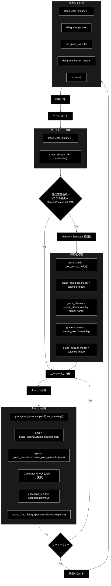

### 3.3 初期化・リセット条件


| 条件                    | 対象状態                                                                       | 処理                                      |
| ----------------------- | ------------------------------------------------------------------------------ | ----------------------------------------- |
| ページ初回ロード        | `grace_chat_history`, `grace_session_id`                                       | デフォルト値で初期化                      |
| モデル変更              | `grace_planner`, `grace_executor`, `grace_current_model`                       | Planner + Executor 再初期化、トースト表示 |
| Planner/Executor 未生成 | `grace_planner`, `grace_executor`                                              | 初期化処理を実行（初回アクセス時）        |
| クリアボタン            | `grace_chat_history`, `grace_planner`, `grace_executor`, `grace_current_model` | 全状態クリア後`st.rerun()`                |
| キャッシュリセット      | キャッシュのみ                                                                 | `collection_cache.clear(session_id)`      |

### 3.4 初期化処理の詳細

Planner と Executor の初期化は以下の条件のいずれかを満たす場合に実行されます。

```python
should_reinitialize = (
    "grace_current_model" not in st.session_state
    or st.session_state.grace_current_model != selected_model
    or "grace_planner" not in st.session_state
    or "grace_executor" not in st.session_state
)
```

初期化フロー:

```python
# 1. GraceConfig を取得し、UIで選択したモデルを反映
grace_config = get_grace_config()      # grace/config.py のシングルトン
grace_config.llm.model = selected_model

# 2. Planner を初期化（モデル名を明示的に指定）
#    内部で create_llm_client("openai", default_model=selected_model) を生成
st.session_state.grace_planner = create_planner(
    config=grace_config,
    model_name=selected_model
)

# 3. Executor を初期化（ToolRegistry, Confidence, Groundedness, Calibrator,
#    Intervention, Replan, ExecutionMemory を内包）
st.session_state.grace_executor = create_executor(
    config=grace_config
)

# 4. 現在のモデルを記録
st.session_state.grace_current_model = selected_model
```

旧バージョンとの主な違い:

- 旧: コレクション変更・ハイブリッド検索変更でもエージェント再初期化が必要だった
- 新: **モデル変更のみ**で再初期化。コレクション検索は `RAGSearchTool` が Qdrant から動的に取得するため、UI 側の選択は再初期化トリガーにならない

---

## 4. ユーザー操作フロー

### 4.1 基本操作フロー

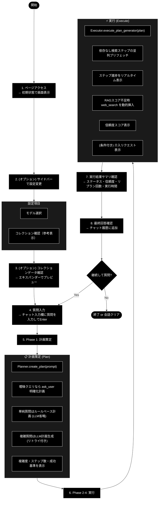

### 4.2 操作シーケンス図

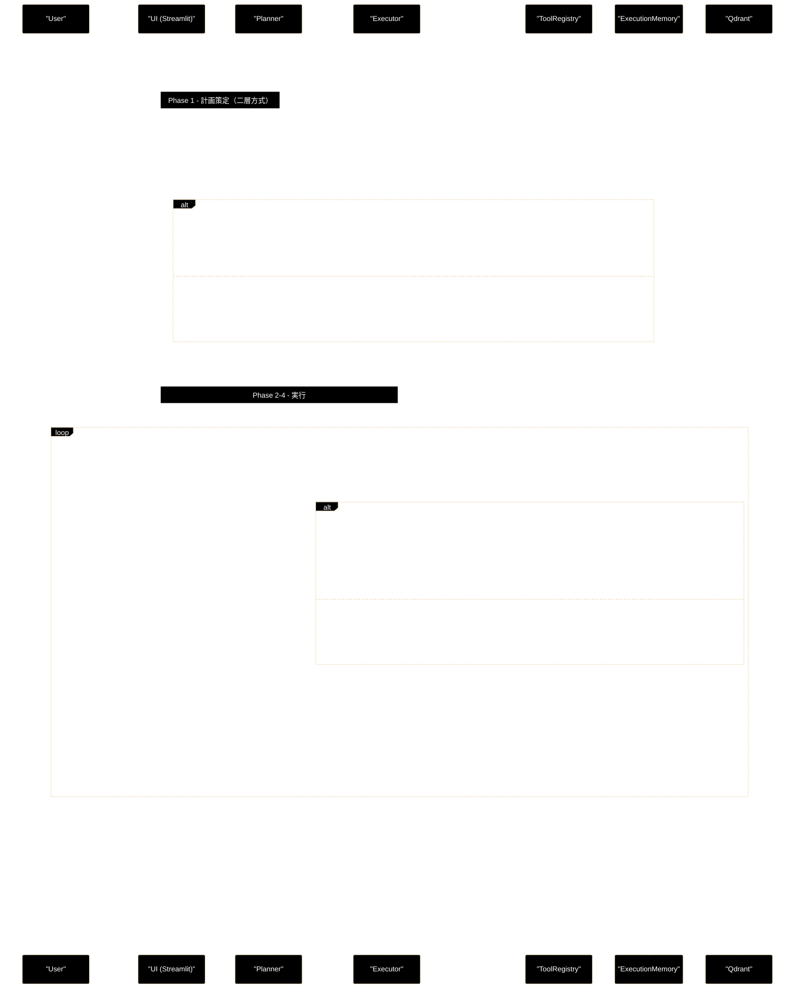

---

## 5. 関数一覧表

### 5.1 メイン関数


| 関数名                   | 概要                           |
| ------------------------ | ------------------------------ |
| `show_grace_chat_page()` | ページ全体のレンダリングと制御 |

### 5.2 ヘルパー関数・クラス（インポート）


| 関数 / クラス                                    | モジュール               | 概要                                                 |
| ------------------------------------------------ | ------------------------ | ---------------------------------------------------- |
| `get_available_collections_from_qdrant_helper()` | `services.agent_service` | Qdrantコレクション一覧取得                           |
| `create_planner()`                               | `grace.planner`          | 計画策定エージェントの生成                           |
| `Executor` / `create_executor()`                 | `grace.executor`         | 計画実行エージェントの生成                           |
| `ExecutionPlan`                                  | `grace.schemas`          | 実行計画データモデル                                 |
| `ExecutionState`                                 | `grace.executor`         | 実行状態管理データクラス                             |
| `ExecutionResult`                                | `grace.schemas`          | 全体実行結果データモデル                             |
| `StepStatus`                                     | `grace.schemas`          | ステップの状態Enum                                   |
| `get_config()`（`get_grace_config` として別名インポート） | `grace.config`   | GRACE設定の取得                                      |
| `get_qdrant_client()`                            | `qdrant_client_wrapper`  | Qdrantクライアント取得（シングルトン）               |
| `collection_cache`                               | `agent_cache`            | コレクションキャッシュ管理（グローバルインスタンス） |
| `AgentConfig` / `GeminiConfig`                   | `config`                 | UIモデル選択の設定（GeminiConfig の実体はOpenAIモデル設定） |

### 5.3 grace/ パッケージ内部構成

`grace_chat_page.py` が直接利用するのは Planner / Executor / schemas / config のみですが、Executor 内部で以下のモジュールが連携します。


| モジュール              | 概要                                                         | 利用形態                          |
| ----------------------- | ------------------------------------------------------------ | --------------------------------- |
| `grace/planner.py`      | 二層計画生成（ルールベース / OpenAI Structured Outputs）     | UI から直接呼び出し               |
| `grace/executor.py`     | 計画実行（Generator + 状態管理 + 並列プリフェッチ）          | UI から直接呼び出し               |
| `grace/schemas.py`      | データモデル定義                                             | ExecutionPlan, ExecutionResult 等 |
| `grace/config.py`       | 設定管理（YAML + 環境変数、Planner/Executor/Memory 設定含む）| get_config() 経由                 |
| `grace/tools.py`        | ToolRegistry（RAG, Web, Reasoning, AskUser）                 | Executor 内部で自動利用           |
| `grace/confidence.py`   | 信頼度計算（LLM自己評価 + Groundedness + 網羅度）            | Executor 内部で自動利用           |
| `grace/calibration.py`  | confidence 較正（温度スケーリング、config/calibration.json） | Executor 内部で自動利用           |
| `grace/memory.py`       | 実行メモリ層（コレクション事前分布、logs/grace_memory.jsonl）| Planner / Executor 内部で自動利用 |
| `grace/intervention.py` | HITL介入（Confirm, Escalate）                                | Executor 内部で自動利用           |
| `grace/replan.py`       | リプラン戦略（部分/全体リプラン）                            | Executor 内部で自動利用           |
| `grace/benchmark.py`    | ベンチマーク計測（BenchmarkRunner、CSV出力）                 | CLI / ベンチマークページから利用  |

---

## 6. 関数 IPO詳細

### 6.1 `show_grace_chat_page`

**概要**: GRACEエージェントチャットページのメイン表示関数。サイドバー設定、コレクションデータプレビュー、チャット履歴、Planner による計画策定、Executor による計画実行を統合管理する。

```python
def show_grace_chat_page() -> None
```


| 項目        | 内容                                                                                                                                                                                                                                                                                                                                                                                                                            |
| ----------- | ------------------------------------------------------------------------------------------------------------------------------------------------------------------------------------------------------------------------------------------------------------------------------------------------------------------------------------------------------------------------------------------------------------------------------- |
| **Input**   | なし（セッション状態から取得）                                                                                                                                                                                                                                                                                                                                                                                                  |
| **Process** | 1. コレクションデータ表示エリアの描画<br>2. サイドバー設定UIの描画<br>3. セッション状態の初期化・更新チェック<br>4. Planner + Executor の初期化（必要時）<br>5. チャット履歴の表示<br>6. ユーザー入力の処理<br>7. Phase 1: Planner.create_plan() → 計画策定 Expander 表示<br>8. Phase 2-4: Executor.execute_plan_generator() → 実行 Expander 表示<br>9. ExecutionResult → 実行結果サマリ表示<br>10. 最終回答の表示・履歴追加 |
| **Output**  | なし（画面描画のみ）                                                                                                                                                                                                                                                                                                                                                                                                            |

**主要処理フロー**:

```python
# 1. コレクションデータ表示
with st.expander("📊 コレクションデータの表示", expanded=False):
    target_collection = st.selectbox("コレクションを選択:", preview_collections,
                                     key="grace_collection_selector")
    points, _ = client.scroll(collection_name=target_collection, limit=100)
    st.dataframe(df_preview, use_container_width=True, hide_index=True, height=600)

# 2. サイドバー設定
with st.sidebar:
    selected_model = st.selectbox("使用モデル", options=GeminiConfig.AVAILABLE_MODELS)  # 実体はOpenAIモデル一覧
    selected_collections = st.multiselect("検索対象コレクション (参考表示)", ...)
    use_hybrid_search = st.checkbox("ハイブリッド検索", value=True, disabled=True)

# 3. セッション状態初期化
if "grace_chat_history" not in st.session_state:
    st.session_state.grace_chat_history = []
if "grace_session_id" not in st.session_state:
    st.session_state.grace_session_id = str(uuid.uuid4())

# 4. Planner + Executor 初期化（モデル変更時 or 未生成時）
if should_reinitialize:
    grace_config = get_grace_config()
    grace_config.llm.model = selected_model
    st.session_state.grace_planner = create_planner(config=grace_config, model_name=selected_model)
    st.session_state.grace_executor = create_executor(config=grace_config)
    st.session_state.grace_current_model = selected_model

# 5. チャット履歴表示
for message in st.session_state.grace_chat_history:
    with st.chat_message(message["role"]):
        st.markdown(message["content"])

# 6. ユーザー入力処理
if prompt := st.chat_input("質問を入力してください..."):
    st.session_state.grace_chat_history.append({"role": "user", "content": prompt})

    with st.chat_message("assistant"):
        # 7. Phase 1: 計画策定
        with st.expander("📋 計画策定 (Plan)", expanded=True):
            plan = st.session_state.grace_planner.create_plan(prompt)
            # metric: 複雑度, ステップ数, 要確認
            # 各ステップ詳細表示

        # 8. Phase 2-4: 実行
        with st.expander("⚡ 実行 (Execute)", expanded=True):
            gen = st.session_state.grace_executor.execute_plan_generator(plan)
            try:
                while True:
                    yielded = next(gen)
                    if isinstance(yielded, ExecutionState):
                        ...  # ステップ状態・信頼度を表示
                    elif isinstance(yielded, dict):
                        ...  # log / tool_call / tool_result / final_answer を表示
            except StopIteration as e:
                execution_result = e.value  # ExecutionResult

        # 9. 実行結果サマリ（final_answer 存在時のみ）
        with st.expander("📊 実行結果サマリ", expanded=False):
            ...  # ステータス, 全体信頼度, リプラン回数, 実行時間

        # 10. 最終回答表示
        st.markdown(execution_result.final_answer)
        st.session_state.grace_chat_history.append({"role": "assistant", "content": ...})
```

### 6.2 `Planner.create_plan`（二層計画生成・#61）

**概要**: ユーザーの質問を分析して ExecutionPlan を生成する。まず曖昧クエリ判定を行い、通常クエリはキーワードベースの複雑度推定でルールベース計画（LLM呼び出しなし）を即時生成、複雑クエリ・明示的なWeb検索指示のみ LLM 計画生成（OpenAI Structured Outputs、リトライ付き）を行う。

**参照**: `grace/planner.py`

```python
def create_plan(self, query: str) -> ExecutionPlan
```


| 項目        | 内容                                                                                                                                                                                                                                                                                                                                                                                                                                             |
| ----------- | ------------------------------------------------------------------------------------------------------------------------------------------------------------------------------------------------------------------------------------------------------------------------------------------------------------------------------------------------------------------------------------------------------------------------------------------------ |
| **Input**   | `query: str` — ユーザーの質問文                                                                                                                                                                                                                                                                                                                                                                                                                 |
| **Process** | 1.`is_ambiguous_query(query)` — 曖昧クエリなら `_create_clarification_plan()`（ask_user 単一ステップ、`requires_confirmation=True`）を返す<br>2. `estimate_complexity(query)` — キーワードベースの複雑度推定<br>3. `_should_use_llm_plan()` — `force_llm_plan=True`、Web検索マーカー（「最新ニュース」「web検索」等）、または複雑度 >= `planner.llm_plan_complexity_threshold`（既定 0.7）で LLM 生成を選択<br>4a. ルートA: `_create_rule_based_plan()` — rag_search（fallback=web_search）→ reasoning の標準2ステップ計画。実行メモリの事前分布（`_prioritized_collection()`）で優先コレクションを設定<br>4b. ルートB: `_create_llm_plan()` — `_generate_plan_with_retry()` で `generate_structured(response_schema=ExecutionPlan, max_completion_tokens=8192)` を実行。複雑度は構造化出力の `plan.complexity` をそのまま使用<br>5. `validate_plan_dependencies()` で依存関係を検証（警告のみ）<br>6. 計画IDを付与（`create_plan_id()`） |
| **Output**  | `ExecutionPlan` — 実行計画（LLM失敗時はフォールバック計画を返却）                                                                                                                                                                                                                                                                                                                                                                               |

**フォールバック動作**: LLM呼び出しが失敗した場合、`_create_fallback_plan()` が2ステップの単純計画（rag_search → reasoning）を返します。フォールバック計画では利用可能コレクションのうち名前に `wikipedia` を含むものが collection に設定されます（無ければ `None` = 全コレクション検索）。

### 6.3 `is_ambiguous_query`（モジュール関数）

**概要**: 指示語のみで対象が特定できない「曖昧クエリ」かどうかを判定する。曖昧クエリは検索しても無関係チャンクが当たるだけなので、プランナー段で検知して ask_user（明確化）経路へ振り分ける。

```python
def is_ambiguous_query(query: str) -> bool
```


| 項目        | 内容                                                                                                                                                                                                                            |
| ----------- | -------------------------------------------------------------------------------------------------------------------------------------------------------------------------------------------------------------------------------- |
| **Input**   | `query: str` — ユーザーの質問文                                                                                                                                                                                                |
| **Process** | 1. 空文字列は True<br>2. 「あの件」「その件」「例の話」等の未解決指示対象パターンを含めば True<br>3. 指示語（「あの」「その」「例の」等）を含み、かつ具体的手がかり（英数字 / 3文字以上のカタカナ語）が無く 30 文字以下なら True |
| **Output**  | `bool` — 曖昧クエリなら True                                                                                                                                                                                                   |

**使用例**: 「あの件について詳しく教えて」→ True（明確化計画へ） / 「金色夜叉の構成者は誰ですか？」→ False（通常計画へ）

### 6.4 `Planner._generate_plan_with_retry`

**概要**: LLM計画生成を指数バックオフ付きリトライで実行する。一時的なエラー（レート制限・タイムアウト・5xx）のみリトライし、認証エラー等は即座に送出する。

```python
def _generate_plan_with_retry(self, prompt: str) -> ExecutionPlan
```


| 項目        | 内容                                                                                                                                                                                                                                                    |
| ----------- | --------------------------------------------------------------------------------------------------------------------------------------------------------------------------------------------------------------------------------------------------------- |
| **Input**   | `prompt: str` — 計画生成プロンプト                                                                                                                                                                                                                     |
| **Process** | 1. 最大 `config.error.max_retries`（既定 3）回試行<br>2. `llm.generate_structured(prompt, response_schema=ExecutionPlan, max_completion_tokens=8192, temperature=config.llm.temperature)` を呼び出し<br>3. `_is_transient_error()` — status_code（408/409/429/5xx）またはエラーメッセージ（timeout / rate limit / overloaded 等）で一時的エラーを判定<br>4. リトライ間隔は `retry_delay_base * 2^attempt`（上限 `retry_delay_max`）の指数バックオフ |
| **Output**  | `ExecutionPlan` — 生成された計画。全試行失敗時は最後の例外を送出                                                                                                                                                                                       |

### 6.5 `Planner.estimate_complexity`

**概要**: キーワードベースの簡易的な複雑度推定。二層計画生成のルート判定（ルールベース or LLM）に使用される。

```python
def estimate_complexity(self, query: str) -> float
```


| 項目        | 内容                                                                                                                                                                                          |
| ----------- | -------------------------------------------------------------------------------------------------------------------------------------------------------------------------------------------- |
| **Input**   | `query: str` — ユーザーの質問文                                                                                                                                                              |
| **Process** | 1. ベーススコア 0.5 から開始<br>2. キーワード（「比較」「違い」「複数」「最新」等 11個）の出現で加算<br>3. 質問文の長さ（100文字以上で+0.1、200文字以上で+0.1）を加算<br>4. 最大1.0でクランプ |
| **Output**  | `float` — 複雑度スコア（0.0-1.0）                                                                                                                                                            |

📝 `estimate_complexity_with_llm()` も残されていますが、`create_plan()` からは呼ばれなくなりました（#61: LLM計画生成時は構造化出力の `plan.complexity` を直接使用し、別途のLLM呼び出しを統合・削除）。

### 6.6 `Planner._prioritized_collection`（P4: 実行メモリ層）

**概要**: 実行メモリ（`grace/memory.py`）の事前分布から、この質問で当たりやすいコレクションを返す。十分な実績が無ければ None（= 全コレクション検索）を返す。

```python
def _prioritized_collection(self, query: str) -> Optional[str]
```


| 項目        | 内容                                                                                                                                                                                     |
| ----------- | ----------------------------------------------------------------------------------------------------------------------------------------------------------------------------------------- |
| **Input**   | `query: str` — ユーザーの質問文                                                                                                                                                         |
| **Process** | `ExecutionMemory.best_collection(query, min_count=config.memory.min_count, min_score=config.memory.min_score)` を呼び出し。キーワード重なりでフィルタしたレコードから、実績件数 >= 3 かつ score（Laplace平滑化 success_rate × mean_confidence）>= 0.6 の最良コレクションを選ぶ |
| **Output**  | `Optional[str]` — 優先コレクション名（条件を満たさない/メモリ無効時は None）                                                                                                            |

### 6.7 `Planner.refine_plan`

**概要**: フィードバックに基づいて計画を修正する。元計画の完全なJSON（query・依存関係・fallback含む）をプロンプトに含め、指摘箇所のみを変更させる。

```python
def refine_plan(self, plan: ExecutionPlan, feedback: str) -> ExecutionPlan
```


| 項目        | 内容                                                                                                                              |
| ----------- | ---------------------------------------------------------------------------------------------------------------------------------- |
| **Input**   | `plan: ExecutionPlan` — 元の計画<br>`feedback: str` — ユーザーからのフィードバック                                              |
| **Process** | 元計画のJSONとフィードバックをプロンプトに含め、`generate_structured(response_schema=ExecutionPlan, max_completion_tokens=4096)` で修正計画を生成。新しい plan_id を付与 |
| **Output**  | `ExecutionPlan` — 修正された計画（失敗時は元の計画をそのまま返却）                                                               |

### 6.8 `Executor.execute_plan_generator`

**概要**: 計画をステップごとに実行し、進捗を Generator で逐次返す。UI でのリアルタイム表示に使用。並列プリフェッチ・タイムアウト・動的フォールバック連鎖・介入・リプラン・実行メモリ記録を統合する。

**参照**: `grace/executor.py`

```python
def execute_plan_generator(
    self, plan: ExecutionPlan, state: Optional[ExecutionState] = None
) -> Generator[ExecutionState | dict, None, ExecutionResult]
```


| 項目        | 内容                                                                                                                                                                                                                                                                                                                                                                                                                                                                                                                                                                                                                                                                                                                                                                                                                                                                                     |
| ----------- | ------------------------------------------------------------------------------------------------------------------------------------------------------------------------------------------------------------------------------------------------------------------------------------------------------------------------------------------------------------------------------------------------------------------------------------------------------------------------------------------------------------------------------------------------------------------------------------------------------------------------------------------------------------------------------------------------------------------------------------------------------------------------------------------------------------------------------------------------------------------------------------------- |
| **Input**   | `plan: ExecutionPlan` — 実行する計画<br>`state: Optional[ExecutionState]` — 既存状態（再開時、省略時は新規作成）                                                                                                                                                                                                                                                                                                                                                                                                                                                                                                                                                                                                                                                                                                                                                                       |
| **Process** | 1.`ExecutionState` を初期化（全ステップを PENDING に設定、プリフェッチキャッシュをクリア）<br>2. 未完了ステップをフィルタ（既にSUCCESSのステップはスキップ、SKIPPED マーク済みもスキップ）<br>3. 各ステップをループ: キャンセルチェック → 依存チェック → 並列プリフェッチ（`executor.parallel_search=True` 時、`_prefetch_parallel_searches()`）→ ステップ実行 → 信頼度計算 → 介入判定<br>4. ステップ実行は `_execute_step()`。プリフェッチ済み結果があれば消費（#60）、無ければ `_run_tool_with_timeout()` で `timeout_seconds` 制限付き実行（#57）<br>5. rag_search 成功後の動的分岐: 最高スコア < `qdrant.rag_sufficient_score`（既定 0.7）なら `_execute_dynamic_web_search()` を挿入。スコア十分でも `_evaluate_rag_relevance()`（LLMによるYES/NO判定）で不適合なら web_search 実行。Web も失敗なら `_execute_dynamic_ask_user()` を挿入。逆にRAGが十分なら計画上の後続 web_search ステップを SKIPPED 化<br>6. 介入チェック: **ESCALATE のみ一時停止**（InterventionRequest を設定して yield 後 return）。**CONFIRM は警告ログ＋通知のみで自動続行**。SILENT/NOTIFY は自動続行<br>7. リプラン（#64）: ステップ失敗時は常に、低信頼度（< `replan.confidence_threshold`）は**検索系ステップのみ** ReplanOrchestrator がリプランを試行（`yield from` で再帰呼び出し）<br>8. 全ステップ完了後に `_calculate_overall_confidence()` — evaluate_final（自己評価＋網羅度を1回のLLM呼び出しで統合・#65）→ groundedness ブレンド → 較正（温度スケーリング）<br>9. `_record_memory()` — 使用コレクションごとの成否・信頼度を実行メモリへ記録（P4） |
| **Yield**   | `ExecutionState` — ステップ完了/一時停止の通知（status, confidence, intervention_request）<br>`dict` — ツール実行イベント（type: log / tool_call / tool_result / final_answer）                                                                                                                                                                                                                                                                                                                                                                                                                                                                                                                                                                                                                                                                                                        |
| **Return**  | `ExecutionResult` — 最終実行結果（`StopIteration.value` で取得。ベンチマーク計測フィールド rag_max_score / rag_search_count / web_search_used を含む）                                                                                                                                                                                                                                                                                                                                                                                                                                                                                                                                                                                                                                                                                                                                  |

**Generator のライフサイクル**:

```
┌─ next(gen) ─────────────────────────────────────────────────┐
│                                                              │
│  [並列プリフェッチ (#60)]                                      │
│    └─ _prefetch_parallel_searches(step, steps, state)        │
│        └─ 依存なし検索ステップを ThreadPoolExecutor で先行実行  │
│           (max_parallel_steps=4, 結果/例外をキャッシュ)         │
│                                                              │
│  [ステップ開始]                                                │
│    └─ _execute_step(step, state)                             │
│        ├─ プリフェッチ済み結果を消費 or                          │
│        ├─ _run_tool_with_timeout(tool, kwargs, step)  (#57)  │
│        │   └─ timeout_seconds 超過で TimeoutError            │
│        ├─ yield dict(type="log", content=ツール実行結果)       │
│        └─ return StepResult                                  │
│                                                              │
│  [動的フォールバック連鎖 (rag_search 成功後)]                    │
│    ├─ RAGスコア < rag_sufficient_score(0.7)                   │
│    │   → _execute_dynamic_web_search() (step_id+100)         │
│    ├─ スコア十分 → _evaluate_rag_relevance() LLM判定           │
│    │   → 不適合なら web_search / 適合なら後続 web_search SKIP    │
│    └─ Web も失敗 → _execute_dynamic_ask_user() (step_id+200)  │
│                                                              │
│  [信頼度計算]                                                  │
│    └─ _llm_calculate_step_confidence(tool_result, ...)       │
│        ├─ _build_confidence_factors() (共通部・#66)           │
│        ├─ ConfidenceCalculator.llm_calculate()               │
│        └─ Heuristic再計算・比較（LLMスコア < 0.6 の検索ステップ）│
│                                                              │
│  [介入判定]                                                    │
│    ├─ SILENT/NOTIFY → 自動続行                                │
│    ├─ CONFIRM → 警告ログ + 通知して自動続行                     │
│    └─ ESCALATE → yield ExecutionState (paused) → return      │
│                                                              │
│  [ステップ完了]                                                │
│    └─ yield ExecutionState (status + confidence)             │
│                                                              │
│  [失敗/低信頼(検索系のみ・#64)時リプラン]                        │
│    └─ yield from execute_plan_generator(new_plan, state)     │
│                                                              │
├─ ... (次ステップへ) ...                                        │
│                                                              │
│  [全ステップ完了]                                              │
│    ├─ _calculate_overall_confidence(state)                   │
│    │   ├─ LLMSelfEvaluator.evaluate_final()  (#65 統合評価)   │
│    │   ├─ ConfidenceAggregator.aggregate(weighted)           │
│    │   ├─ _blend_groundedness_confidence()  (S1)             │
│    │   └─ Calibrator.transform()  (温度スケーリング較正)        │
│    ├─ _record_memory(state)  (P4 実行メモリ記録)               │
│    └─ return ExecutionResult ← StopIteration.value           │
└──────────────────────────────────────────────────────────────┘
```

📝 ブロッキング版 `execute_plan(plan)` は `execute_plan_generator()` をドレインする薄いラッパーであり、動的 web_search・介入・SKIP・リプラン処理を含めジェネレータ版と完全に同一ロジックで実行されます（#59）。`execute(plan)` は `benchmark.py` 互換の統一エントリーポイントです。

### 6.9 `Executor._prefetch_parallel_searches`（#60）

**概要**: 現在のステップと依存関係のない後続検索ステップ（rag_search / web_search）を ThreadPoolExecutor で並列に先行実行する。

```python
def _prefetch_parallel_searches(
    self, current_step: PlanStep, steps_to_execute: List[PlanStep], state: ExecutionState
) -> None
```


| 項目        | 内容                                                                                                                                                                                                                                                       |
| ----------- | ------------------------------------------------------------------------------------------------------------------------------------------------------------------------------------------------------------------------------------------------------------ |
| **Input**   | `current_step` — 現在のステップ / `steps_to_execute` — 実行予定ステップのリスト / `state` — 実行状態                                                                                                                                                     |
| **Process** | 1. 現在のステップが検索系（rag_search / web_search）でなければ何もしない<br>2. 同一ウェーブ（依存DAG上、互いに依存しない）の検索ステップを最大 `executor.max_parallel_steps`（既定 4）件まで収集<br>3. 2件以上あれば ThreadPoolExecutor で並列実行し、結果（または例外）を `_prefetched_tool_results` にキャッシュ<br>4. 各ステップ処理時にキャッシュを消費。例外はその時点で再送出されるため fallback 処理は逐次実行と同じ経路を通る |
| **Output**  | なし（キャッシュへの副作用のみ）                                                                                                                                                                                                                           |

### 6.10 `Executor._run_tool_with_timeout`（#57）

**概要**: ツールを `PlanStep.timeout_seconds` 制限付きで実行する。タイムアウト時は `TimeoutError` を送出し、呼び出し元のフォールバック/失敗処理に委ねる。

```python
def _run_tool_with_timeout(self, tool: Any, kwargs: Dict[str, Any], step: PlanStep) -> ToolResult
```


| 項目        | 内容                                                                                                                                        |
| ----------- | -------------------------------------------------------------------------------------------------------------------------------------------- |
| **Input**   | `tool` — 実行するツール / `kwargs` — ツール引数 / `step` — 対象ステップ                                                                   |
| **Process** | `timeout_seconds` 未指定なら直接実行。指定時は ThreadPoolExecutor（1ワーカー）で `future.result(timeout=...)` を待機。超過時は TimeoutError |
| **Output**  | `ToolResult`（タイムアウト時は例外送出）                                                                                                    |

### 6.11 `Executor._blend_groundedness_confidence`（S1）

**概要**: GroundednessVerifier の支持率（support_rate）を主成分に、最終 confidence を合成する。「検索スコアの言い換え」だった confidence を根拠妥当性ベースへ移行する S1 の中核。

```python
def _blend_groundedness_confidence(
    self, query: str, final_answer: Optional[str], self_eval: Optional[float],
    coverage: Optional[float], aggregated: float, sources: List[str],
) -> float
```


| 項目        | 内容                                                                                                                                                                                                                                                                                                                                                                                                    |
| ----------- | ---------------------------------------------------------------------------------------------------------------------------------------------------------------------------------------------------------------------------------------------------------------------------------------------------------------------------------------------------------------------------------------------------------- |
| **Input**   | 質問・最終回答・自己評価スコア・網羅度スコア・検索ベース集約値・引用ソースのリスト                                                                                                                                                                                                                                                                                                                      |
| **Process** | 1. `groundedness_enabled=False` または最終回答なしなら aggregated をそのまま返す<br>2. `GroundednessVerifier.verify()` — 回答を主張（claim）に分解し supported / contradicted / neutral をLLM判定<br>3. 未検証（ソース無し/LLM失敗）または判定不能（decided=0）: self_eval(0.5) / coverage(0.3) / aggregated(0.2) の従来ブレンドへフォールバック（ソース皆無なら ×0.85 の過信抑制）<br>4. 検証済み: support_rate（重み `groundedness_weight=0.6`）＋ self_eval（0.25）＋ coverage（0.15）の加重平均<br>5. 矛盾検出時は answer_conf を 0.3 で上限キャップ<br>6. 最終値 = (1 - `search_aux_weight`) × answer_conf + `search_aux_weight`(0.2) × aggregated |
| **Output**  | `float` — ブレンド後の信頼度（この後 `Calibrator.transform()` で較正される）                                                                                                                                                                                                                                                                                                                           |

### 6.12 `get_available_collections_from_qdrant_helper`

**概要**: Qdrantから利用可能なコレクション一覧を取得する。

**参照**: `services/agent_service.py`


| 項目        | 内容                                                      |
| ----------- | --------------------------------------------------------- |
| **Input**   | なし                                                      |
| **Process** | QdrantClient でコレクション一覧を取得                     |
| **Output**  | `List[str]`: コレクション名のリスト（エラー時は空リスト） |

### 6.13 主要データモデル

#### ExecutionPlan（`grace/schemas.py`）


| フィールド              | 型                   | 説明                                |
| ----------------------- | -------------------- | ----------------------------------- |
| `original_query`        | `str`                | ユーザーの元の質問                  |
| `complexity`            | `float` (0.0-1.0)    | 推定複雑度                          |
| `estimated_steps`       | `int` (1-20)         | 推定ステップ数                      |
| `requires_confirmation` | `bool`               | 実行前に確認が必要か                |
| `steps`                 | `List[PlanStep]`     | 実行ステップのリスト（1個以上必須） |
| `success_criteria`      | `str`                | 計画成功の判定基準                  |
| `created_at`            | `Optional[datetime]` | 計画作成日時（自動設定）            |
| `plan_id`               | `Optional[str]`      | 計画ID（MD5ハッシュ先頭12文字）     |

#### PlanStep（`grace/schemas.py`）


| フィールド        | 型                      | 説明                                                                                          |
| ----------------- | ----------------------- | --------------------------------------------------------------------------------------------- |
| `step_id`         | `int` (≥1)             | ステップ番号                                                                                  |
| `action`          | `Literal[...]`          | アクション種別（rag_search, web_search, reasoning, ask_user, code_execute, run_legacy_agent） |
| `description`     | `str`                   | ステップの説明（1文字以上必須）                                                               |
| `query`           | `Optional[str]`         | 検索クエリ（検索系アクション用）                                                              |
| `collection`      | `Optional[str]`         | 検索対象コレクション（原則 null — 全コレクション自動検索。メモリ層の優先指定あり）           |
| `depends_on`      | `List[int]`             | 依存する先行ステップID                                                                        |
| `expected_output` | `str`                   | 期待される出力の説明                                                                          |
| `fallback`        | `Optional[str]`         | 失敗時の代替アクション                                                                        |
| `timeout_seconds` | `Optional[int]` (1-300) | タイムアウト秒数（デフォルト30。`_run_tool_with_timeout` が適用）                             |

#### ExecutionResult（`grace/schemas.py`）


| フィールド                | 型                   | 説明                                                  |
| ------------------------- | -------------------- | ----------------------------------------------------- |
| `plan_id`                 | `str`                | 計画ID                                                |
| `original_query`          | `str`                | 元のクエリ                                            |
| `final_answer`            | `Optional[str]`      | 最終回答                                              |
| `step_results`            | `List[StepResult]`   | 各ステップの結果                                      |
| `overall_confidence`      | `float` (0.0-1.0)    | 全体の信頼度（groundedness ブレンド＋較正適用後）     |
| `overall_status`          | `Literal[...]`       | 全体ステータス（success, partial, failed, cancelled） |
| `replan_count`            | `int`                | リプラン回数                                          |
| `total_execution_time_ms` | `Optional[int]`      | 総実行時間（ミリ秒）                                  |
| `total_token_usage`       | `Optional[dict]`     | 総トークン使用量                                      |
| `total_cost_usd`          | `Optional[float]`    | 総コスト（USD）                                       |
| `rag_max_score`           | `Optional[float]`    | **NEW**: RAG検索ステップの最高類似度スコア（ベンチマーク計測用。検索未実行ならNone） |
| `rag_search_count`        | `int`                | **NEW**: 実行された rag_search ステップ数（ベンチマーク計測用） |
| `web_search_used`         | `bool`               | **NEW**: web_search ステップ（計画/動的挿入いずれか）が実際に実行されたか |
| `created_at`              | `Optional[datetime]` | 結果作成日時                                          |

#### ExecutionState（`grace/executor.py`）


| フィールド             | 型                              | 説明                            |
| ---------------------- | ------------------------------- | ------------------------------- |
| `plan`                 | `ExecutionPlan`                 | 実行中の計画                    |
| `current_step_id`      | `int`                           | 現在のステップID                |
| `step_results`         | `Dict[int, StepResult]`         | ステップID → 結果のマップ      |
| `step_statuses`        | `Dict[int, StepStatus]`         | ステップID → 状態のマップ      |
| `overall_confidence`   | `float`                         | 全体信頼度（実行中は暫定値）    |
| `is_cancelled`         | `bool`                          | キャンセル済みフラグ            |
| `is_paused`            | `bool`                          | 一時停止フラグ（介入待ち）      |
| `intervention_request` | `Optional[InterventionRequest]` | 介入リクエスト                  |
| `replan_count`         | `int`                           | リプラン回数                    |
| `max_replans`          | `int`                           | 最大リプラン回数（デフォルト3） |
| `start_time`           | `Optional[float]`               | 実行開始時刻                    |
| `end_time`             | `Optional[float]`               | 実行終了時刻                    |
| `used_collections`     | `List[str]`                     | **NEW**: 実行中に使用したRAGコレクション（実行メモリ記録用・P4） |
| `web_search_executed`  | `bool`                          | **NEW**: 動的挿入含む web_search が実行されたか（ベンチマーク計測用） |

#### StepResult（`grace/schemas.py`）


| フィールド          | 型                                        | 説明                       |
| ------------------- | ----------------------------------------- | -------------------------- |
| `step_id`           | `int`                                     | ステップID                 |
| `status`            | `Literal["success", "partial", "failed"]` | 実行結果ステータス         |
| `output`            | `Optional[str]`                           | 出力内容                   |
| `confidence`        | `float` (0.0-1.0)                         | 信頼度スコア               |
| `sources`           | `List[str]`                               | 引用ソース                 |
| `error`             | `Optional[str]`                           | エラーメッセージ（失敗時） |
| `execution_time_ms` | `Optional[int]`                           | 実行時間（ミリ秒）         |
| `token_usage`       | `Optional[dict]`                          | トークン使用量             |
| `created_at`        | `Optional[datetime]`                      | 結果作成日時               |

#### SearchResultPayload / SearchResultItem（`grace/schemas.py`・NEW）

RAG/Web 検索結果を共通フォーマットで扱うためのスキーマです。


| モデル / フィールド            | 型       | 説明                                              |
| ------------------------------ | -------- | ------------------------------------------------- |
| `SearchResultPayload.question` | `str`    | 関連質問文（RAG検索時）                           |
| `SearchResultPayload.answer`   | `str`    | 回答・スニペット文                                |
| `SearchResultPayload.content`  | `str`    | 本文コンテンツ（question/answerがない場合）       |
| `SearchResultPayload.source`   | `str`    | 出典URLまたはファイル名                           |
| `SearchResultPayload.title`    | `str`    | ドキュメント・ページタイトル                      |
| `SearchResultItem.score`       | `float`  | 関連度スコア（0.0-1.0）                           |
| `SearchResultItem.payload`     | `SearchResultPayload` | 検索結果の詳細情報                   |
| `SearchResultItem.collection`  | `str`    | 検索元コレクション名（例: 'wikipedia_ja', 'web_search'） |

---

## 7. 依存関係

### 7.1 外部ライブラリ


| ライブラリ      | バージョン | 用途                                         |
| --------------- | ---------- | -------------------------------------------- |
| `streamlit`     | >= 1.28    | UIフレームワーク                             |
| `pandas`        | >= 2.0     | データフレーム表示                           |
| `qdrant-client` | >= 1.6     | Qdrant接続・データ取得                       |
| `openai`        | >= 1.100   | OpenAI API（LLM / Embedding、`helper` 経由） |
| `pydantic`      | >= 2.0     | データモデル（ExecutionPlan, StepResult 等） |
| `pyyaml`        | >= 6.0     | GraceConfig の YAML 読み込み                 |
| `MeCab`         | (Optional) | 日本語形態素解析（KeywordExtractor）         |
| `cohere`        | (Optional) | Re-ranking API                               |

### 7.2 内部モジュール（設定）


| モジュール                  | 用途                                                                          |
| --------------------------- | ----------------------------------------------------------------------------- |
| `config.AgentConfig`        | エージェント設定（デフォルトモデル、RAG設定）                                 |
| `config.GeminiConfig`       | OpenAIモデル設定（利用可能モデル一覧。クラス名は移行期の名残）                |
| `grace.config.GraceConfig`  | GRACE統合設定（LLM, Confidence, Intervention, Replan, Qdrant, Planner, Executor, Memory, WebSearch） |
| `grace.config.get_config()` | GraceConfig シングルトン取得（YAML + 環境変数）                               |
| `helper.helper_llm`         | `create_llm_client("openai")` — LLMクライアント生成（Structured Outputs 対応）|
| `helper.helper_embedding`   | `create_embedding_client("openai")` — Embeddingクライアント生成              |

### 7.3 サービス層


| サービス                                                              | 用途                             | 旧版からの変更 |
| --------------------------------------------------------------------- | -------------------------------- | -------------- |
| `grace.Planner` / `create_planner()`                                  | 二層計画生成（ルールベース / OpenAI Structured Outputs） | 二層化（#61） |
| `grace.Executor` / `create_executor()`                                | 計画実行（Generator + 状態管理 + 並列化） | 並列プリフェッチ・タイムアウト追加 |
| `services.agent_service.get_available_collections_from_qdrant_helper` | Qdrantコレクション取得           | 維持           |
| `agent_cache.collection_cache`                                        | セッションベースのキャッシュ管理 | 維持           |
| `qdrant_client_wrapper.get_qdrant_client`                             | Qdrantクライアント取得           | 維持           |

#### 旧版（v1.0）から削除されたサービス


| 旧サービス                                     | 理由                                  |
| ---------------------------------------------- | ------------------------------------- |
| `services.agent_service.ReActAgent`            | Planner + Executor に置換             |
| `agent_parallel_search.parallel_search_engine` | `grace/tools.py` RAGSearchTool に統合 |
| `agent_tools`（UIからの直接利用）              | `grace/tools.py` ToolRegistry に統合  |

### 7.4 grace/ パッケージ構成図

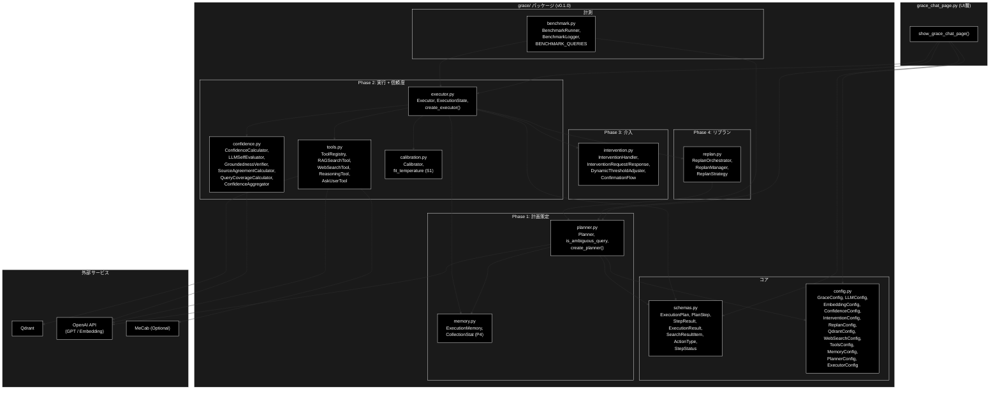

### 7.5 依存モジュール詳細

#### 7.5.1 grace/config.py — GRACE 統合設定

YAML ファイル（`config/grace_config.yml`）と環境変数（`GRACE_` プレフィックス、例: `GRACE_LLM_MODEL`）から設定を読み込みます。

**主要クラス**:


| クラス               | 説明                                                             |
| -------------------- | ---------------------------------------------------------------- |
| `GraceConfig`        | 統合設定ルート                                                   |
| `LLMConfig`          | LLM設定（provider="openai", model="gpt-5-mini" 等）              |
| `EmbeddingConfig`    | Embedding設定（provider="openai", model="text-embedding-3-large", dimensions=3072） |
| `ConfidenceConfig`   | 信頼度閾値・groundedness ブレンド重み・較正設定                  |
| `InterventionConfig` | 介入レベル設定                                                   |
| `ReplanConfig`       | リプラン制御設定（max_replans 等）                               |
| `QdrantConfig`       | Qdrant接続・検索設定（search_priority, rag_sufficient_score 等） |
| `WebSearchConfig`    | **NEW**: Web検索設定（backend="serpapi" 等）                     |
| `ToolsConfig`        | 有効/無効ツール設定                                              |
| `MemoryConfig`       | **NEW**: 実行メモリ層設定（P4）                                  |
| `PlannerConfig`      | **NEW**: 二層計画生成設定（llm_plan_complexity_threshold=0.7）   |
| `ExecutorConfig`     | **NEW**: フォールバック連鎖・並列検索設定                        |

**デフォルトモデル**: `gpt-5-mini`（`LLMConfig.model`）。詳細は[付録B](#付録b-設定リファレンス)を参照。

#### 7.5.2 grace/tools.py — ToolRegistry

Executor が使用するツール群を管理するレジストリです。

**主要クラス**:


| クラス          | ActionType   | 説明                                                               |
| --------------- | ------------ | ------------------------------------------------------------------ |
| `ToolRegistry`  | -            | ツール管理・ルーティング                                           |
| `BaseTool`      | -            | ツール基底クラス（ABC）                                            |
| `RAGSearchTool` | `rag_search` | Qdrant全コレクション自動検索（auto-collection fallback、有効コレクションのクラス単位キャッシュ、`restrict_to_collection` による単一コレクション固定モードあり） |
| `WebSearchTool` | `web_search` | **NEW**: Web検索（backend: serpapi / google_cse / duckduckgo。既定 serpapi） |
| `ReasoningTool` | `reasoning`  | LLM推論（検索結果を基に OpenAI GPT で回答生成）                    |
| `AskUserTool`   | `ask_user`   | HITL（ユーザーへの確認要求）                                       |

**RAGSearchTool の検索戦略**:

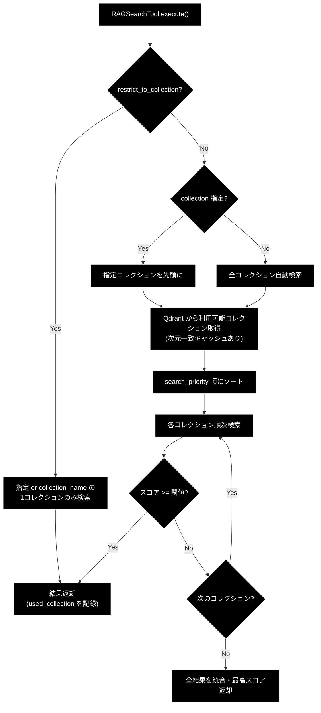

#### 7.5.3 grace/confidence.py — 信頼度計算

ステップ実行結果の信頼度を多角的に評価します。LLM方式とHeuristic方式のハイブリッド計算に加え、S1 で **GroundednessVerifier（根拠妥当性検証）** が導入されました。

**主要コンポーネント**:


| コンポーネント              | 説明                                                                                              |
| --------------------------- | ------------------------------------------------------------------------------------------------- |
| `ConfidenceCalculator`      | 統合信頼度計算（calculate → Heuristic / llm_calculate → LLM / decide_action → 介入レベル判定） |
| `LLMSelfEvaluator`          | OpenAI GPT による自己評価。`evaluate_final()` は自己評価＋クエリ網羅度を**1回のLLM呼び出しに統合**（#65） |
| `GroundednessVerifier`      | **NEW (S1)**: 最終回答を主張（claim）に分解し、各主張が引用ソースに支持されるか（supported/contradicted/neutral）をLLM判定。support_rate を最終信頼度の主成分にする |
| `SourceAgreementCalculator` | 複数ソース間の一致度計算（OpenAI Embedding のコサイン類似度）                                     |
| `QueryCoverageCalculator`   | クエリキーワードの網羅度計算（evaluate_final 統合後はフォールバック用）                           |
| `ConfidenceAggregator`      | 複数信頼度指標の重み付け統合（weighted: 後半ステップを重視）                                      |
| `EvaluationResult`          | LLM信頼度評価の応答スキーマ（Pydantic: score, reason）                                            |
| `FinalEvaluationResult`     | **NEW**: 統合最終評価スキーマ（self_eval_score, coverage_score, reason）                          |
| `ClaimVerdict` / `GroundednessResponse` / `GroundednessResult` | **NEW**: groundedness 検証のスキーマ・集計結果                 |

**ステップ信頼度計算フロー（`_llm_calculate_step_confidence`）**:

1. `_build_confidence_factors()`（共通部・#66）で ConfidenceFactors を構築（ソース一致度計算・依存ステップからのスコア継承を含む）
2. LLM方式で信頼度を計算（`ConfidenceCalculator.llm_calculate()`。検索ステップで search_max_score > 0.7 の場合は検索スコアを優先するガードレールあり）
3. LLMスコアが0.6未満かつ検索ステップの場合、Heuristic方式で再計算して高い方を採用
4. LLM方式失敗時はHeuristicにフォールバック

**全体信頼度計算フロー（`_calculate_overall_confidence`）**:

1. `LLMSelfEvaluator.evaluate_final()` — 自己評価＋網羅度を1回で取得（#65）
2. `ConfidenceAggregator.aggregate(method="weighted")` — 検索ベースの集約値（補助項）
3. `_blend_groundedness_confidence()` — groundedness（重み0.6）を主成分にブレンド（S1）
4. `Calibrator.transform()` — 温度スケーリングによる較正（`calibration_enabled=True` 時）

**介入レベル判定**:


| InterventionLevel | 信頼度範囲     | 動作                                             |
| ----------------- | -------------- | ------------------------------------------------ |
| `SILENT`          | >= 0.9         | 自動続行、ログのみ                               |
| `NOTIFY`          | >= 0.7         | 自動続行、UI に通知                              |
| `CONFIRM`         | >= 0.4         | **警告ログ＋通知して自動続行**（v4.0 で変更）    |
| `ESCALATE`        | < 0.4          | 一時停止、エスカレーション（Generator が return）|

#### 7.5.4 grace/calibration.py — confidence 較正（S1・NEW）

confidence（自己申告の信頼度）と実正解率のズレ（ECE）を、**温度スケーリング（Temperature Scaling）** による事後較正で縮小します。

```
z  = logit(p) = ln(p / (1 - p))
p' = sigmoid(z / T)
```

- T = 1.0: 無変換（恒等） / T > 1.0: 自信過剰を緩和 / T < 1.0: 自信不足を補正

**主要要素**:


| 名前                           | 説明                                                                        |
| ------------------------------ | --------------------------------------------------------------------------- |
| `Calibrator`                   | 較正器（`transform()` / `is_identity()` / `save()` / `load()` / `fit()`）  |
| `fit_temperature()`            | (confidence, 正誤) ペアから二値NLL最小の温度Tを1次元探索で推定（scipy非依存）|
| `apply_temperature()`          | 温度Tを適用して較正後の確率を返す                                           |
| `expected_calibration_error()` | ECE（等幅ビン）の計算                                                       |

較正パラメータは JSON（既定 `config/calibration.json`）に保存され、Executor が実行時に `overall_confidence` へ適用します。**較正ファイルが存在しない場合は恒等較正（T=1.0）となり挙動は変わりません。**

#### 7.5.5 grace/memory.py — 実行メモリ層（P4・NEW）

実行ログから「(質問キーワード, 当たったコレクション, 成否, confidence)」を蓄積し、Planner のコレクション優先順位に反映します。外部依存なし・決定的で、永続化は JSONL（既定 `logs/grace_memory.jsonl`、1行=1実行レコード）です。

**主要要素**:


| 名前                        | 説明                                                                                 |
| --------------------------- | ------------------------------------------------------------------------------------ |
| `ExecutionMemory`           | 実行レコードの蓄積（`record()` / `record_many()`）と事前分布の算出                  |
| `MemoryRecord`              | 1実行レコード（query, keywords, collection, success, confidence, timestamp）        |
| `CollectionStat`            | コレクション集計（`score()` = Laplace平滑化 success_rate × mean_confidence）        |
| `extract_keywords()`        | 軽量キーワード抽出（形態素解析非依存・決定的）                                       |
| `best_collection()`         | 実績 count >= `min_count`(3) かつ score >= `min_score`(0.6) の最良コレクションを返す |
| `create_execution_memory()` | ファクトリ関数                                                                       |

- **記録**: Executor が実行完了時に `_record_memory()` で使用コレクションごとの成否・信頼度を記録
- **参照**: Planner がルールベース計画生成時に `_prioritized_collection()` で優先コレクションを取得
- `memory.enabled=False` で無効化可能

#### 7.5.6 grace/intervention.py — HITL 介入

信頼度が低い場合のユーザー介入フローを管理します。

**主要クラス**:


| クラス                     | 説明                                                                                                 |
| -------------------------- | ---------------------------------------------------------------------------------------------------- |
| `InterventionHandler`      | 介入要否判定・リクエスト生成                                                                         |
| `InterventionRequest`      | 介入リクエスト（level, step_id, message, question, reason, options, confidence_score, plan, timeout_seconds=300） |
| `InterventionResponse`     | ユーザー応答（action: PROCEED / MODIFY / CANCEL / INPUT / RETRY / SKIP）                             |
| `InterventionAction`       | 介入アクションEnum（6種類）                                                                          |
| `DynamicThresholdAdjuster` | フィードバックに基づく閾値自動調整                                                                   |
| `ConfirmationFlow`         | 確認フロー管理                                                                                       |
| `FeedbackRecord`           | フィードバック記録                                                                                   |

#### 7.5.7 grace/replan.py — リプラン戦略

ステップ失敗時に計画を動的に修正します。

**主要クラス**:


| クラス               | 説明                                                                                     |
| -------------------- | ---------------------------------------------------------------------------------------- |
| `ReplanOrchestrator` | リプラン全体制御（失敗検知 → 戦略選択 → 新計画生成）                                   |
| `ReplanManager`      | リプラン戦略の管理・実行                                                                 |
| `ReplanStrategy`     | リプラン戦略Enum（PARTIAL / FULL / FALLBACK / SKIP / ABORT）                             |
| `ReplanTrigger`      | トリガーEnum（STEP_FAILED / LOW_CONFIDENCE / USER_FEEDBACK / NEW_INFORMATION / TIMEOUT） |
| `ReplanContext`      | リプラン時のコンテキスト                                                                 |
| `ReplanResult`       | リプラン結果（success, new_plan, reason）                                                |

**リプランフロー**:

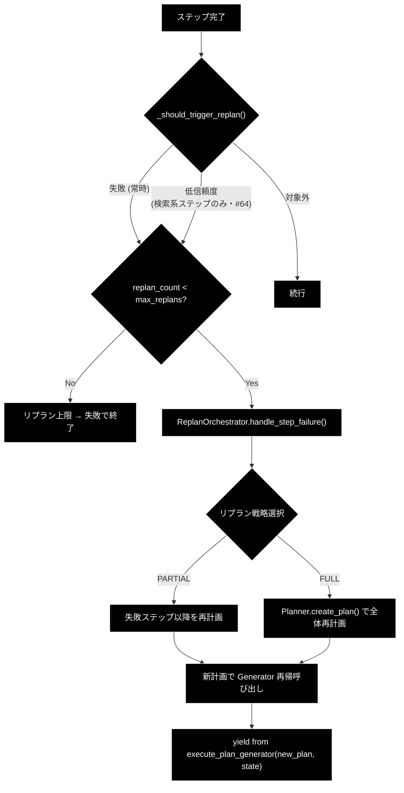

📝 #64: reasoning 成功後に計画全体を再実行すると同一検索を繰り返しコストが max_replans 倍に膨らむため、低信頼度トリガーは検索系ステップ（rag_search / web_search）に限定されています。

#### 7.5.8 grace/benchmark.py — ベンチマーク計測（NEW）

GRACEエージェントの各フェーズ（Plan / Execute / Confidence / Intervention / Replan）の性能指標を計測・記録・CSV出力します。

**主要クラス**:


| 名前                | 説明                                                                                      |
| ------------------- | ----------------------------------------------------------------------------------------- |
| `BenchmarkRunner`   | パイプライン全体をラップして1クエリ / クエリセット（`run()` / `run_query_set()`）を実行  |
| `BenchmarkLogger`   | `[BENCHMARK]` ログと `logs/benchmark_results.csv` へのCSV追記                             |
| `BenchmarkSession`  | 1回の実行セッションの計測データ（plan_time_sec / execute_time_sec / confidence 統計等）   |
| `BENCHMARK_QUERIES` | 標準クエリセット（Q01〜Q12: Easy/Medium/Hard × 事実検索/推論・比較/手順説明/曖昧）       |

```python
from grace.benchmark import BenchmarkRunner

runner = BenchmarkRunner(qdrant_collection="cc_news_2per_openai")
sessions = runner.run_query_set(runs_per_query=3)
```

モデル名・プロバイダーは `config.llm` から自動取得されます。`ExecutionResult` のベンチマーク計測フィールド（rag_max_score / rag_search_count / web_search_used）と連携します。

#### 7.5.9 agent_cache.py — コレクションキャッシュ

前回の検索成功コレクションをセッション単位でキャッシュし、検索効率を向上させます（旧版から変更なし）。

**主要クラス**:


| 名前                   | 種類                   | 説明                                                                    |
| ---------------------- | ---------------------- | ----------------------------------------------------------------------- |
| `CollectionCache`      | クラス                 | キャッシュ管理                                                          |
| `CollectionCacheEntry` | dataclass              | キャッシュエントリ（collection_name, last_score, timestamp, hit_count） |
| `collection_cache`     | グローバルインスタンス | デフォルトキャッシュ（TTL: 300秒）                                      |

---

## 8. イベント処理

### 8.1 ボタンイベント


| ボタン                  | イベント | 処理内容                                                                                                   |
| ----------------------- | -------- | ---------------------------------------------------------------------------------------------------------- |
| 🗑️ 会話履歴をクリア   | クリック | `grace_chat_history` クリア、`grace_planner` / `grace_executor` / `grace_current_model`（および旧キー `grace_current_collections`）削除、`st.rerun()` |
| 🔄 キャッシュをリセット | クリック | `collection_cache.clear(session_id)`、トースト表示                                                         |

### 8.2 入力イベント


| コンポーネント                   | イベント | 処理内容                                                  | 旧版との差分                                         |
| -------------------------------- | -------- | --------------------------------------------------------- | ---------------------------------------------------- |
| モデル選択                       | 変更     | `should_reinitialize = True`、Planner + Executor 再初期化 | ReActAgent → Planner + Executor                     |
| コレクション選択                 | 変更     | UI表示のみ更新（再初期化は発生しない）                    | 旧: 再初期化トリガー →**新: 参考表示のみ**          |
| ハイブリッド検索                 | -        | `disabled=True` のため操作不可                            | 旧: 再初期化トリガー →**新: 操作無効化**            |
| コレクション選択（プレビュー用） | 変更     | Qdrantからデータ取得、DataFrame更新                       | 変更なし                                             |
| チャット入力                     | Enter    | Plan → Execute → Result → 最終回答 の一連処理開始      | execute_turn → create_plan + execute_plan_generator |

### 8.3 Generator イベント処理

`Executor.execute_plan_generator()` が Generator として yield する値をリアルタイムに処理します。

#### 処理ループ構造

```python
gen = executor.execute_plan_generator(plan)
execution_result: Optional[ExecutionResult] = None

try:
    while True:
        yielded = next(gen)

        if isinstance(yielded, ExecutionState):
            # --- ステップ完了/一時停止の通知 ---
            ...
        elif isinstance(yielded, dict):
            # --- ツール実行イベント ---
            event_type = yielded.get("type", "")
            ...

except StopIteration as e:
    execution_result = e.value  # ExecutionResult
```

#### yield 型別イベント処理

**ExecutionState（ステップ状態通知）**:


| 処理           | 詳細                                                                           |
| -------------- | ------------------------------------------------------------------------------ |
| ステータス表示 | `Step {sid}: {status_icon} {status}{conf_str}` を `thought_container` に追記   |
| 信頼度表示     | `state.step_results[sid].confidence` を `(信頼度: 0.XX)` 形式で付記            |
| 介入リクエスト | `state.is_paused and state.intervention_request` の場合、`st.warning()` で表示 |
| 自動続行       | 現Phase では介入リクエスト後も`st.info("（自動続行します）")` で自動続行       |

**dict イベント**:


| type           | 処理内容                                                      | 表示コンポーネント                     |
| -------------- | ------------------------------------------------------------- | -------------------------------------- |
| `log`          | 思考プロセスログを追記 +`st.divider()`                        | `thought_container` 内の `st.markdown` |
| `tool_call`    | `🛠️ Tool Call: {name}` + `Args: {args}` を表示              | `thought_container` 内の `st.markdown` |
| `tool_result`  | `📝 Tool Result:` + 内容（500文字で切り詰め）+ `st.divider()` | `thought_container` 内の `st.markdown` |
| `final_answer` | Legacy Agent 経由の最終回答を`final_response_content` に格納  | 直接代入（後続で`st.markdown` 表示）   |

**StopIteration（Generator 終了）**:


| 処理         | 詳細                                                                            |
| ------------ | ------------------------------------------------------------------------------- |
| 結果取得     | `e.value` から `ExecutionResult` を取得                                         |
| 最終回答抽出 | `execution_result.final_answer` を `final_response_content` に設定              |
| サマリ表示   | `📊 実行結果サマリ` Expander にステータス・信頼度・リプラン回数・実行時間を表示 |
| 履歴追加     | `grace_chat_history.append({"role": "assistant", "content": ...})`              |

### 8.4 イベント処理フロー図

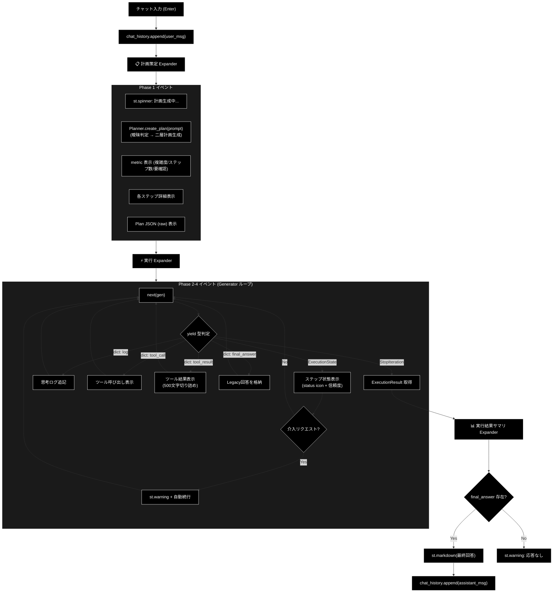

### 8.5 旧版イベント処理との対比


| 観点            | 旧版（v1.0）                                                | 新版（v2.0+）                                                      |
| --------------- | ----------------------------------------------------------- | ------------------------------------------------------------------ |
| イベントソース  | `ReActAgent.execute_turn()` Generator                       | `Executor.execute_plan_generator()` Generator                      |
| yield 型        | `dict` のみ（type: log/tool_call/tool_result/final_answer） | `ExecutionState` + `dict`（2種類の yield）                         |
| ステップ状態    | なし（ReAct フェーズとして一括）                            | ステップ単位の status + confidence をリアルタイム表示              |
| 介入            | なし                                                        | `ExecutionState.is_paused` + `intervention_request` で一時停止通知（ESCALATE のみ） |
| 最終結果取得    | `final_answer` イベント（dict）                             | `StopIteration.value`（`ExecutionResult`）+ Legacy 用 dict         |
| 表示先 Expander | 1つ（🤔 エージェントの思考プロセス）                        | 3つ（📋 計画策定 / ⚡ 実行 / 📊 実行結果サマリ）                   |
| エラー時        | try/except で`st.error`                                     | 同様 +`ExecutionResult(status="failed")` でも結果返却              |

---

## 9. エラーハンドリング

### 9.1 エラー種別


| エラー種別                    | 発生箇所             | 発生条件                                          | 対処                                                      |
| ----------------------------- | -------------------- | ------------------------------------------------- | --------------------------------------------------------- |
| Qdrant接続エラー              | サイドバー初期化     | サーバー未起動、ネットワーク障害                  | `st.warning` で警告表示、`["(None)"]` で続行              |
| Planner/Executor 初期化エラー | セッション初期化     | API認証失敗（`OPENAI_API_KEY` 未設定等）、GraceConfig 読み込みエラー | `st.error` でエラー表示、`return` で処理中断 |
| 計画策定エラー（一時的）      | Phase 1（Plan）      | レート制限・タイムアウト・5xx                     | `_generate_plan_with_retry()` が指数バックオフでリトライ  |
| 計画策定エラー（恒久的）      | Phase 1（Plan）      | LLM呼び出し失敗、スキーマ検証エラー               | Planner 内部でフォールバック計画を自動生成                |
| ステップ実行エラー            | Phase 2-4（Execute） | ツール実行失敗、`timeout_seconds` 超過（TimeoutError） | Executor 内部でフォールバック（PlanStep.fallback）→ 動的フォールバック連鎖 → リプラン試行 |
| Generator 例外                | Phase 2-4（Execute） | 予期しないランタイムエラー                        | `ExecutionResult(status="failed", confidence=0.0)` を返却 |
| Groundedness/較正エラー       | 全体信頼度計算       | LLM検証失敗、較正ファイル破損                     | 未検証扱いで従来ブレンドへフォールバック / 恒等較正（T=1.0） |
| 実行メモリ記録エラー          | 実行完了時           | ファイルI/Oエラー                                 | 警告ログのみ（best-effort、実行は止めない）               |
| チャット処理エラー            | 全体 try/except      | 上記以外の未捕捉エラー                            | `st.error` でエラー表示、`logger.error(exc_info=True)`    |
| コレクションデータ取得エラー  | データプレビュー     | コレクション不在、スキーマ不一致                  | `st.error` でエラー表示                                   |

### 9.2 エラー処理の多層構造

新アーキテクチャではエラーが3つの層で処理されます。

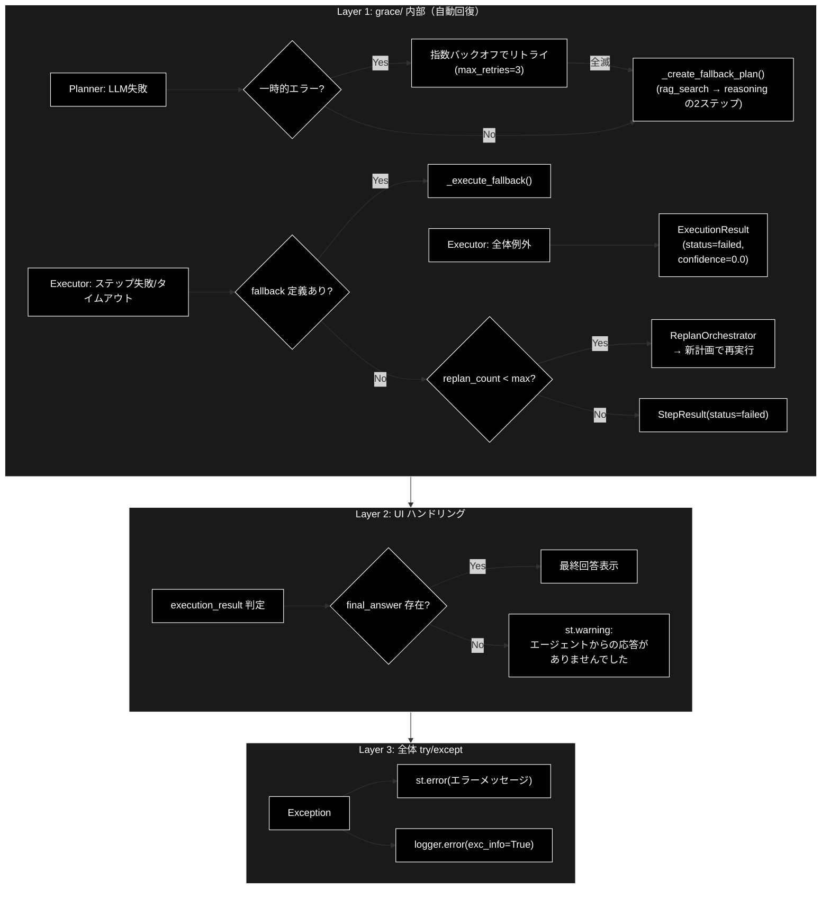

### 9.3 エラー表示コンポーネント


| 表示種別 | Streamlitコンポーネント | 用途                                                     |
| -------- | ----------------------- | -------------------------------------------------------- |
| エラー   | `st.error()`            | 致命的エラー（初期化失敗、未捕捉例外）                   |
| 警告     | `st.warning()`          | 注意喚起（コレクション未検出、応答なし、介入リクエスト） |
| 情報     | `st.info()`             | 補足情報（データなし、自動続行通知）                     |
| トースト | `st.toast()`            | 一時的な通知（設定変更、キャッシュクリア、初期化完了）   |

### 9.4 エラー処理コード例

```python
# Planner + Executor 初期化エラー
try:
    grace_config = get_grace_config()
    grace_config.llm.model = selected_model
    st.session_state.grace_planner = create_planner(config=grace_config, model_name=selected_model)
    st.session_state.grace_executor = create_executor(config=grace_config)
    st.toast("GRACE Planner + Executor の準備が完了しました。")
except Exception as e:
    st.error(f"GRACE エージェントの初期化に失敗しました: {e}")
    logger.error(f"GRACE init failed: {e}", exc_info=True)
    return

# チャット処理エラー（全体を包む try/except）
try:
    # Phase 1: 計画策定
    plan = st.session_state.grace_planner.create_plan(prompt)
    # → 一時的エラー: リトライ / 恒久的エラー: フォールバック計画を自動生成

    # Phase 2-4: 実行
    gen = st.session_state.grace_executor.execute_plan_generator(plan)
    try:
        while True:
            yielded = next(gen)
            # イベント処理...
    except StopIteration as e:
        execution_result = e.value
    # → Generator 内部例外: ExecutionResult(status="failed") を返却

    # 最終回答チェック
    if final_response_content:
        st.markdown(final_response_content)
    else:
        st.warning("エージェントからの応答がありませんでした。")

except Exception as e:
    st.error(f"エラーが発生しました: {e}")
    logger.error(f"GRACE Chat Error: {e}", exc_info=True)
```

---

## 10. 使用例

### 10.1 基本的な使用方法

1. UI を起動: `uv run streamlit run agent_rag.py --server.port 8501`
2. サイドバーのメニューから「[最新] 自律型Agent(Plan+Executor)」を選択
3. サイドバーで必要に応じてモデルを変更（デフォルト: `gpt-5-mini`）
4. （オプション）コレクションデータのプレビュー — エキスパンダーを開いてコレクションを選択し、登録されているQ&Aデータを確認
5. チャット入力欄に質問を入力して Enter
6. **📋 計画策定 (Plan)** を確認 — 複雑度、ステップ数、各ステップの詳細（単純質問はルールベース計画が即時表示される）
7. **⚡ 実行 (Execute)** を確認 — ステップ進捗、ツール呼び出し・結果、信頼度スコア
8. **📊 実行結果サマリ** を確認（任意）— 全体ステータス、信頼度、リプラン回数、実行時間
9. 最終回答を確認
10. 必要に応じて追加の質問を続ける

### 10.2 典型的な質問例

```
- 「カリン・フォン・アロルディンゲンについて教えてください」
- 「Wikipediaの情報から、〇〇の歴史を説明してください」
- 「ライブドアニュースで報じられた××について教えて」
- 「△△と□□の違いは何ですか？」
```

📝 「あの件について詳しく教えて」のような曖昧クエリを入力すると、検索を行わず「対象の明確化を求める」ask_user 計画（要確認: ⚠️ はい）が生成されます。

### 10.3 計画策定の表示例

```
📋 計画策定 (Plan)

目標: カリン・フォン・アロルディンゲンについて教えてください

  複雑度: 0.5    ステップ数: 2    要確認: ✅ いいえ

🎯 成功基準: ユーザーの質問に適切に回答できている
────────────────────────────
🔍 Step 1: [rag_search] 全コレクションから関連情報を検索
   🔑 Query: `カリン・フォン・アロルディンゲンについて教えてください`
   📤 期待出力: 関連するドキュメントや情報
   🔄 Fallback: `web_search`

🧠 Step 2: [reasoning] 取得した情報を元に回答を生成  ← 依存: Step [1]
   📤 期待出力: ユーザーへの回答
```

（複雑度 0.7 未満の通常クエリでは、上記のようなルールベース2ステップ計画が LLM 呼び出しなしで即時生成されます。実行メモリに実績があれば Step 1 の Collection に優先コレクションが指定されます。）

### 10.4 実行プロセスの表示例

```
⚡ 実行 (Execute)

📝 【ツール実行結果: rag_search】
  [検索結果 JSON...]
────────────────────────────
Step 1: ✅ success (信頼度: 0.82)

📝 【ツール実行結果: reasoning】
  カリン・フォン・アロルディンゲンは...
────────────────────────────
Step 2: ✅ success (信頼度: 0.78)
```

RAGスコアが不足（< 0.7）した場合や、スコアが高くてもLLMの意味的適合性チェックで不適合と判定された場合は、`Step 101: [動的挿入] RAGスコア不足のためWeb検索を実行` のような動的ステップが挿入されます。

### 10.5 実行結果サマリの表示例

```
📊 実行結果サマリ

ステータス: success
全体信頼度: 0.82
リプラン回数: 0
実行時間: 3450ms
```

全体信頼度は groundedness（根拠支持率）を主成分とするブレンド値であり、`config/calibration.json` が存在する場合は温度スケーリング較正が適用されます。

---

## 11. 変更履歴


| バージョン | 日付           | 変更内容                                                                                                                                                                                                                                                                                                                                                                                                                                                                                                                                                                                                                                                                                                                                                                                                                                                                                                                                           |
| ---------- | -------------- | -------------------------------------------------------------------------------------------------------------------------------------------------------------------------------------------------------------------------------------------------------------------------------------------------------------------------------------------------------------------------------------------------------------------------------------------------------------------------------------------------------------------------------------------------------------------------------------------------------------------------------------------------------------------------------------------------------------------------------------------------------------------------------------------------------------------------------------------------------------------------------------------------------------------------------------------------- |
| 1.0        | 2025-01-29     | 初版作成                                                                                                                                                                                                                                                                                                                                                                                                                                                                                                                                                                                                                                                                                                                                                                                                                                                                                                                                           |
| 1.1        | 2025-01-29     | 依存モジュール詳細（agent_cache, agent_parallel_search, agent_tools, regex_mecab）を追加                                                                                                                                                                                                                                                                                                                                                                                                                                                                                                                                                                                                                                                                                                                                                                                                                                                           |
| **2.0**    | **2025-06-14** | **ReActAgent → Planner + Executor アーキテクチャに全面移行**。主な変更: (1) アーキテクチャ概要を2フェーズ分離型に更新、(2) 画面レイアウトを3 Expander 構成に変更、(3) セッション状態から `grace_agent` / `grace_current_hybrid_search` / `grace_current_collections` を削除し `grace_planner` / `grace_executor` を追加、(4) イベント処理を Generator ベース（ExecutionState + dict yield）に刷新、(5) 依存関係に grace/ パッケージ構成図を追加、(6) エラーハンドリングを3層構造（grace内部自動回復 / UI判定 / 全体try-except）に整理、(7) 使用例を計画策定・実行プロセス・結果サマリの表示例に更新、(8) 付録Bに GraceConfig 設定リファレンスを追加                                                                                                                                                                                                                                                                                               |
| **3.0**    | **2026-02-17** | **ソースコード全量解析に基づく全面改訂**。主な変更: (1) H1見出しをフォーマット仕様v1.4に準拠、(2) 概要セクションに「各責務対応のモジュール」テーブルを追加、(3) `__init__.py` の "Guided Reasoning with Adaptive Confidence Execution" 定義を注記、(4) Planner IPO詳細を追記、(5) Executor IPO詳細に未完了ステップフィルタ・LLM/Heuristicハイブリッド信頼度計算・依存スコア継承ロジックを追記、(6) confidence.py に SourceAgreementCalculator・EvaluationResult を追加、(7) intervention.py に ConfirmationFlow・InterventionAction(6種類)を追加、(8) replan.py に ReplanTrigger(5種類)・ReplanStrategy(5種類)・ReplanContext を追加、(9) schemas.py に token_usage・total_token_usage・total_cost_usd・created_at フィールドを追加、(10) Planner.estimate_complexity / Planner.refine_plan の IPO を追加、(11) grace/ パッケージ構成図を全モジュール反映に更新 |
| **4.0**    | **2026-07-10** | **OpenAI 移行＋新機能反映の全面最新化**。主な変更: (1) 技術スタック表記を OpenAI GPT（既定 `gpt-5-mini`）/ `text-embedding-3-large`（3072次元）/ `create_llm_client("openai")` / `OPENAI_API_KEY` に統一（Gemini・AFC関連の記述を全廃）、(2) Planner の**二層計画生成**（`PlannerConfig.llm_plan_complexity_threshold=0.7`、ルールベース計画によるLLM省略）・`is_ambiguous_query` による曖昧クエリ→明確化計画・`_generate_plan_with_retry`（指数バックオフ）・`_prioritized_collection`（実行メモリ層）を追記、(3) Executor の並列プリフェッチ（`_prefetch_parallel_searches`、max_parallel_steps=4）・`_run_tool_with_timeout`・動的フォールバック連鎖（rag_search→web_search→ask_user、`rag_sufficient_score=0.7`、LLM意味的適合性チェック）・`_build_confidence_factors` 共通化・CONFIRM自動続行/ESCALATEのみ一時停止・低信頼度リプランの検索系限定（#64）を追記、(4) **S1**: GroundednessVerifier（根拠妥当性）・`_blend_groundedness_confidence`・calibration.py（温度スケーリング較正、config/calibration.json）を新規記載、(5) **P4**: memory.py（実行メモリ層、logs/grace_memory.jsonl、min_count=3/min_score=0.6）を新規記載、(6) benchmark.py（BenchmarkRunner）と ExecutionResult のベンチマーク計測フィールド（rag_max_score / rag_search_count / web_search_used）・schemas.py の SearchResultPayload/SearchResultItem を追記、(7) 設定リファレンスを実コード準拠に全面更新（PlannerConfig / ExecutorConfig / MemoryConfig / WebSearchConfig 等を追加）、(8) 付録A のページ一覧・起動コマンドを現行 `agent_rag.py` に更新、(9) 付録D のエクスポート一覧を実 `__all__` に同期（WebSearchTool / SearchResultPayload / SearchResultItem 追加）、(10) Mermaid 図を黒背景・白文字規約（classDef / sequenceDiagram init ヘッダー）に統一 |

---

## 付録A: アプリケーション構成

### A.1 メインアプリケーション (agent_rag.py)

`grace_chat_page.py`は`agent_rag.py`からインポートされ、サイドバーのメニューから呼び出されます。

```bash
# UI 起動
uv run streamlit run agent_rag.py --server.port 8501
```

```python
# agent_rag.py より抜粋
from ui.pages import show_grace_chat_page

page_mapping = {
    "explanation": show_system_explanation_page,
    "agent_chat": show_agent_chat_page,
    "grace_chat": show_grace_chat_page,
    "log_viewer": show_log_viewer_page,
    "rag_data_creation": show_rag_data_creation_page,
    "qdrant_crud": show_qdrant_crud_page,
    "qdrant_search": show_qdrant_search_page,
}
```

**利用可能なページ一覧**（`agent_rag.py` の `st.radio` メニュー）:


| ページID            | 表示名                              | 説明                                 |
| ------------------- | ----------------------------------- | ------------------------------------ |
| `explanation`       | 📖 説明                             | システム説明ページ                   |
| `qdrant_search`     | 🔎 Qdrant検索                       | 検索テスト                           |
| `agent_chat`        | 🤖 Agent(ReAct+Reflection)          | ReAct+Reflectionエージェント（→ [readme_react_reflection.md](readme_react_reflection.md)） |
| `grace_chat`        | [最新] 自律型Agent(Plan+Executor)   | **本ページ（Planner + Executor）**   |
| `log_viewer`        | 📊 未回答ログ                       | 未回答質問のログ閲覧                 |
| `rag_data_creation` | 📄 RAGデータ作成                    | チャンク分割→Q/A生成→Qdrant登録の手順ガイド（→ [readme_usage_tools.md](readme_usage_tools.md)） |
| `qdrant_crud`       | 🗄️ QdrantのCRUD                   | コレクション管理                     |

### A.2 CLI版エージェント (agent_main.py)

同等の機能を持つCLI版エージェントも提供されています。

```bash
# CLI版エージェントの実行
uv run python agent_main.py
```

**CLI版の機能**:

- Planner + Executor 2フェーズ処理
- 動的コレクション取得
- キーワード抽出（オプション）
- 多言語対応の検索戦略
- 信頼度評価・リプラン

### A.3 関連ドキュメント


| ファイル                                                   | 内容                                          |
| ---------------------------------------------------------- | --------------------------------------------- |
| [README.md](README.md)                                     | プロジェクト全体・GRACE自律エージェント詳細   |
| [readme_rag.md](readme_rag.md)                             | RAGパイプライン設計・クラス・関数 IPO詳細     |
| [readme_react_reflection.md](readme_react_reflection.md)   | ReAct+Reflectionエージェントの設計と実装      |
| [readme_usage_tools.md](readme_usage_tools.md)             | チャンク作成・Q&A生成・Qdrant登録の操作手順   |
| [readme_make_env.md](readme_make_env.md)                   | Mac向け環境構築手順                           |

---

## 付録B: 設定リファレンス

### B.1 AgentConfig（UI共通）


| 設定項目                 | デフォルト値                 | 説明                             |
| ------------------------ | ---------------------------- | -------------------------------- |
| `RAG_DEFAULT_COLLECTION` | `"wikipedia_ja_5per"`        | デフォルト検索コレクション       |
| `RAG_SEARCH_LIMIT`       | 3                            | 検索結果の最大件数               |
| `RAG_SCORE_THRESHOLD`    | 0.50                         | 検索結果として採用する最小スコア |
| `MODEL_NAME`             | `GeminiConfig.DEFAULT_MODEL` | デフォルトモデル（= `gpt-5-mini`）|
| `CHAT_LOG_FILE_NAME`     | `"agent_chat.log"`           | チャットログファイル名           |
| `CHAT_LOG_LEVEL`         | `"INFO"`                     | ログレベル                       |

### B.2 GeminiConfig（実体はOpenAIモデル設定）

クラス名は移行期の名残です。中身はすべて OpenAI の設定値です。


| 設定項目          | デフォルト値               | 説明             |
| ----------------- | -------------------------- | ---------------- |
| `DEFAULT_MODEL`   | `"gpt-5-mini"`             | デフォルトモデル |
| `AVAILABLE_MODELS`| `gpt-5-mini`, `gpt-4o-mini`, `gpt-4o`, `gpt-4.1`, `gpt-4.1-mini`, `o1-mini` | UIモデル選択肢 |
| `EMBEDDING_MODEL` | `"text-embedding-3-large"` | 埋め込みモデル   |
| `EMBEDDING_DIMS`  | 3072                       | 埋め込み次元数   |

### B.3 GraceConfig（grace/config.py — GRACE 統合設定）

GraceConfig は `config/grace_config.yml` から読み込まれ、環境変数（`GRACE_` プレフィックス、例: `GRACE_LLM_MODEL`）で上書き可能です。

#### B.3.1 LLMConfig


| 設定項目      | デフォルト値   | 説明                  |
| ------------- | -------------- | --------------------- |
| `provider`    | `"openai"`     | LLMプロバイダー       |
| `model`       | `"gpt-5-mini"` | 使用モデル            |
| `temperature` | 0.7            | 温度パラメータ        |
| `max_tokens`  | 4096           | 最大トークン数        |
| `timeout`     | 30             | APIタイムアウト（秒） |

#### B.3.2 EmbeddingConfig


| 設定項目     | デフォルト値               | 説明                                         |
| ------------ | -------------------------- | -------------------------------------------- |
| `provider`   | `"openai"`                 | 埋め込みプロバイダー                         |
| `model`      | `"text-embedding-3-large"` | 埋め込みモデル                               |
| `dimensions` | 3072                       | 埋め込み次元数（既存Qdrantコレクションと互換）|

#### B.3.3 ConfidenceConfig


| 設定項目                   | デフォルト値                 | 説明                                                          |
| -------------------------- | ---------------------------- | ------------------------------------------------------------- |
| `weights.search_quality`   | 0.25                         | 検索品質の重み                                                |
| `weights.source_agreement` | 0.20                         | ソース一致度の重み                                            |
| `weights.llm_self_eval`    | 0.25                         | LLM自己評価の重み                                             |
| `weights.tool_success`     | 0.15                         | ツール成功率の重み                                            |
| `weights.query_coverage`   | 0.15                         | クエリ網羅度の重み                                            |
| `thresholds.silent`        | 0.9                          | SILENT 介入レベルの閾値                                       |
| `thresholds.notify`        | 0.7                          | NOTIFY 介入レベルの閾値                                       |
| `thresholds.confirm`       | 0.4                          | CONFIRM 介入レベルの閾値                                      |
| `groundedness_enabled`     | `true`                       | **NEW (S1)**: groundedness を最終 confidence の主成分にする   |
| `groundedness_weight`      | 0.6                          | **NEW (S1)**: 支持率（主成分）の重み                          |
| `self_eval_weight`         | 0.25                         | **NEW (S1)**: 自己評価（従）の重み                            |
| `coverage_weight`          | 0.15                         | **NEW (S1)**: 網羅度（従）の重み                              |
| `search_aux_weight`        | 0.2                          | **NEW (S1)**: 検索ベース集約値（補助）の重み                  |
| `clarification_confidence` | 0.3                          | **NEW**: 明確化（ask_user）計画時の低信頼値                   |
| `calibration_enabled`      | `true`                       | **NEW (S1)**: 温度スケーリング較正を適用するか                |
| `calibration_path`         | `"config/calibration.json"`  | **NEW (S1)**: 較正パラメータの保存先（無ければ恒等 T=1.0）    |

#### B.3.4 InterventionConfig


| 設定項目                   | デフォルト値 | 説明                     |
| -------------------------- | ------------ | ------------------------ |
| `default_timeout`          | 300（5分）   | 介入タイムアウト（秒）   |
| `auto_proceed_on_timeout`  | `false`      | タイムアウト時の自動続行 |
| `max_clarification_rounds` | 3            | 最大確認回数             |

#### B.3.5 ReplanConfig


| 設定項目                   | デフォルト値 | 説明                           |
| -------------------------- | ------------ | ------------------------------ |
| `max_replans`              | 3            | 最大リプラン回数               |
| `confidence_threshold`     | 0.4          | リプラントリガーの信頼度閾値（検索系ステップのみ・#64） |
| `partial_replan_threshold` | 0.6          | 部分リプランの閾値             |
| `cooldown_seconds`         | 5            | リプラン間のクールダウン（秒） |

#### B.3.6 QdrantConfig


| 設定項目                 | デフォルト値                                               | 説明                                                             |
| ------------------------ | ---------------------------------------------------------- | ---------------------------------------------------------------- |
| `url`                    | `"http://localhost:6333"`                                  | QdrantサーバーURL                                                |
| `collection_name`        | `"customer_support_faq"`                                   | デフォルトコレクション                                           |
| `search_limit`           | 5                                                          | 検索結果の最大件数                                               |
| `score_threshold`        | 0.35                                                       | 最小スコア閾値                                                   |
| `rag_sufficient_score`   | 0.7                                                        | **NEW**: RAG結果が十分と判断するスコア閾値（未満なら web_search を動的実行） |
| `restrict_to_collection` | `false`                                                    | **NEW**: RAG検索を1コレクションに固定（ベンチマーク等でアクセス回数を最小化） |
| `search_priority`        | `["wikipedia_ja", "livedoor", "cc_news", "japanese_text"]` | コレクション検索優先順位                                         |

#### B.3.7 WebSearchConfig（NEW）


| 設定項目               | デフォルト値 | 説明                                                    |
| ---------------------- | ------------ | ------------------------------------------------------- |
| `backend`              | `"serpapi"`  | Web検索バックエンド（serpapi / google_cse / duckduckgo）|
| `num_results`          | 5            | 取得件数                                                |
| `language`             | `"ja"`       | 検索言語                                                |
| `timeout`              | 30           | タイムアウト（秒）                                      |
| `serpapi_api_key`      | `""`         | SerpAPI キー（backend="serpapi" の場合）                |
| `google_cse_api_key`   | `""`         | Google CSE キー（backend="google_cse" の場合。新規受付停止）|
| `google_cse_engine_id` | `""`         | Google CSE エンジンID                                   |

#### B.3.8 PlannerConfig（NEW: 二層計画生成）


| 設定項目                        | デフォルト値 | 説明                                                                       |
| ------------------------------- | ------------ | -------------------------------------------------------------------------- |
| `llm_plan_complexity_threshold` | 0.7          | この複雑度（ヒューリスティック推定）未満の質問はルールベース計画（LLM呼び出しなし）で即時生成 |
| `force_llm_plan`                | `false`      | `true` の場合、複雑度に関わらず常に LLM 計画生成を使用                     |

#### B.3.9 ExecutorConfig（NEW）


| 設定項目             | デフォルト値                                             | 説明                                                       |
| -------------------- | -------------------------------------------------------- | ---------------------------------------------------------- |
| `fallback_chain`     | `{"rag_search": "web_search", "web_search": "ask_user"}` | 検索結果不十分時に動的挿入するフォールバックアクションの連鎖（PlanStep.fallback 未指定時のデフォルト） |
| `parallel_search`    | `true`                                                   | 依存関係のない検索ステップを並列実行する（#60）            |
| `max_parallel_steps` | 4                                                        | 並列実行する最大ステップ数                                 |

#### B.3.10 MemoryConfig（NEW: 実行メモリ層 P4）


| 設定項目    | デフォルト値                 | 説明                                                             |
| ----------- | ---------------------------- | ---------------------------------------------------------------- |
| `enabled`   | `true`                       | 実行メモリ層の有効化                                             |
| `path`      | `"logs/grace_memory.jsonl"`  | 実行レコードの永続化先（JSONL）                                  |
| `min_count` | 3                            | best_collection 採用に必要な実績件数                             |
| `min_score` | 0.6                          | best_collection 採用に必要な score（平滑化 success_rate × mean_confidence）の下限 |

#### B.3.11 その他


| サブ設定        | 主要項目                                                          | 説明           |
| --------------- | ----------------------------------------------------------------- | -------------- |
| `CostConfig`    | `daily_limit_usd=10.0`, `hourly_limit_usd=2.0`, `per_query_limit_usd=0.50` | コスト管理 |
| `ErrorConfig`   | `max_retries=3`, `retry_delay_base=1.0`, `retry_delay_max=30.0`, `exponential_backoff=true` | エラーリトライ（Planner のリトライにも使用） |
| `LoggingConfig` | `level="INFO"`, `file="logs/grace.log"`                           | ロギング       |
| `ToolsConfig`   | `enabled=["rag_search", "web_search", "reasoning", "ask_user"]`, `disabled=[]` | 有効/恒久禁止ツール一覧 |

### B.4 CohereConfig（オプション）


| 設定項目       | デフォルト値                  | 説明           |
| -------------- | ----------------------------- | -------------- |
| `API_KEY`      | `os.getenv("COHERE_API_KEY")` | Cohere APIキー |
| `RERANK_MODEL` | `"rerank-multilingual-v3.0"`  | Rerankモデル   |

---

## 付録C: トラブルシューティング

### C.1 よくある問題と解決策


| 問題                                     | 原因                               | 解決策                                                                                       |
| ---------------------------------------- | ---------------------------------- | -------------------------------------------------------------------------------------------- |
| 「コレクションがありません」と表示される | Qdrantサーバー未起動               | `docker-compose -f docker-compose/docker-compose.yml up -d` でQdrantを起動                   |
| Planner/Executor 初期化エラー            | APIキー未設定                      | `.env` に `OPENAI_API_KEY` を設定                                                            |
| GraceConfig 読み込みエラー               | YAML ファイル不在 or 構文エラー    | `config/grace_config.yml` を確認。不在時はデフォルト値で動作                                 |
| 計画策定が常にフォールバック             | LLM呼び出し失敗（認証・ネットワーク・レート制限） | APIキー・ネットワーク・モデル名を確認。一時的エラーは指数バックオフで自動リトライされる。ログ `logs/grace_run.log` 参照 |
| LLM応答が空（構造化出力・YES/NO判定等）  | gpt-5系（推論モデル）が出力枠を推論トークンで消費 | `max_completion_tokens` に十分な枠が確保されているか確認（実装済み: 判定系 256〜1024）       |
| 信頼度が常に0.0                          | Confidence計算の依存エラー         | `grace_config.yml` の `confidence.weights` 合計が1.0か確認                                   |
| 信頼度が期待とズレる（過信/過小）        | 較正未実施                         | (confidence, 正誤) ペアから `Calibrator.fit()` で温度Tを推定し `config/calibration.json` に保存 |
| 常に同じコレクションばかり検索される     | 実行メモリの事前分布が固定化       | `logs/grace_memory.jsonl` を削除、または `GRACE_MEMORY_ENABLED=false` で無効化              |
| 検索結果が見つからない                   | コレクションにデータがない         | RAGデータ作成ページの手順（チャンク分割 → Q/A生成 → Qdrant登録）でデータを登録。[readme_usage_tools.md](readme_usage_tools.md) 参照 |
| MeCabエラー                              | MeCab未インストール                | `pip install mecab-python3` でインストール（Optional）                                       |
| キャッシュが効かない                     | TTL切れ                            | 5分以内に同一セッションで検索を実行                                                          |
| web_search が失敗する                    | SerpAPI キー未設定                 | `web_search.serpapi_api_key`（または `SERPAPI_API_KEY`）を設定。backend の切り替えも可       |

### C.2 ログの確認方法

```bash
# GRACE エージェントログ
tail -f logs/grace_run.log

# 実行メモリ（P4）の蓄積レコード
tail -f logs/grace_memory.jsonl

# ベンチマーク結果
cat logs/benchmark_results.csv

# 旧エージェントログ
tail -f logs/agent_chat.log
```

---

## 付録D: grace/ パッケージ エクスポート一覧

`grace/__init__.py` (v0.1.0) で公開されている全要素:

```python
__all__ = [
    # Version
    "__version__",
    # Schemas
    "ExecutionPlan", "PlanStep", "StepResult", "ExecutionResult",
    "ActionType", "StepStatus", "SearchResultPayload", "SearchResultItem",
    "create_plan_id", "validate_plan_dependencies",
    # Config
    "GraceConfig", "get_config", "reload_config",
    # Planner
    "Planner", "create_planner",
    # Tools
    "ToolResult", "BaseTool", "RAGSearchTool", "WebSearchTool",
    "ReasoningTool", "AskUserTool", "ToolRegistry", "create_tool_registry",
    # Executor
    "ExecutionState", "Executor", "create_executor",
    # Confidence (Phase 2)
    "ConfidenceFactors", "ConfidenceScore", "ActionDecision", "InterventionLevel",
    "ConfidenceCalculator", "LLMSelfEvaluator", "SourceAgreementCalculator",
    "QueryCoverageCalculator", "ConfidenceAggregator",
    "create_confidence_calculator", "create_llm_evaluator",
    "create_source_agreement_calculator", "create_query_coverage_calculator",
    "create_confidence_aggregator",
    # Intervention (Phase 3)
    "InterventionRequest", "InterventionResponse", "InterventionAction",
    "FeedbackRecord", "InterventionHandler", "DynamicThresholdAdjuster",
    "ConfirmationFlow", "create_intervention_handler",
    "create_threshold_adjuster", "create_confirmation_flow",
    # Replan (Phase 4)
    "ReplanTrigger", "ReplanStrategy", "ReplanContext", "ReplanResult",
    "ReplanManager", "ReplanOrchestrator",
    "create_replan_manager", "create_replan_orchestrator",
]
```

📝 以下の要素はパッケージルートでは再エクスポートされていないため、モジュールから直接インポートします。

```python
from grace.memory import ExecutionMemory, create_execution_memory        # P4 実行メモリ層
from grace.calibration import Calibrator, fit_temperature               # S1 較正
from grace.benchmark import BenchmarkRunner, BENCHMARK_QUERIES          # ベンチマーク
from grace.confidence import GroundednessVerifier, create_groundedness_verifier  # S1 根拠妥当性
from grace.planner import is_ambiguous_query                            # 曖昧クエリ判定
```
