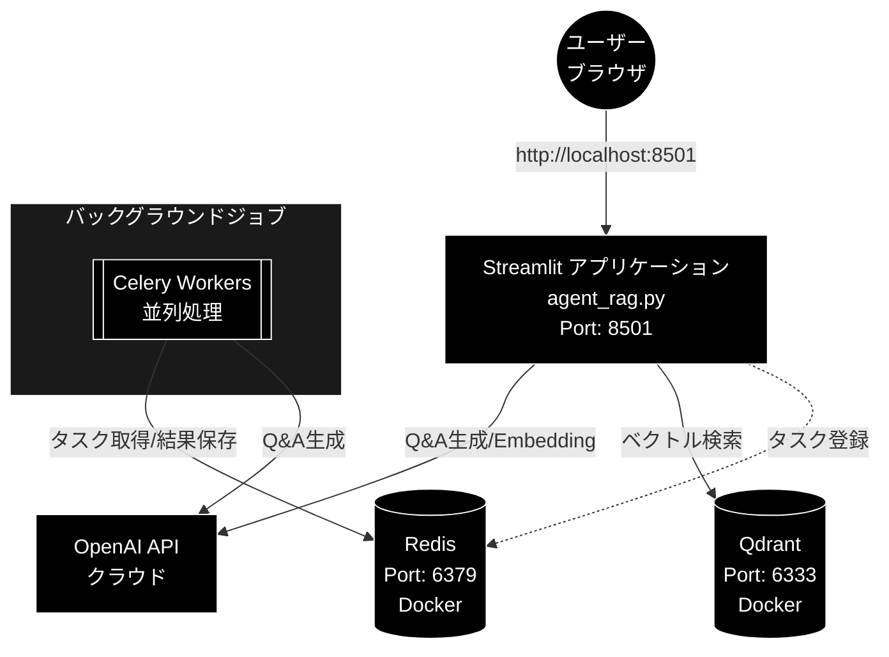

# Agent RAG (OpenAI) 環境構築手順書

**Version 2.0** | 最終更新: 2026-07-10

**開発マシン:** MacBook Air M2 / 24GB メモリ / macOS

---

## 1. 前提ソフトウェアのインストール

システム構成図



- LLM（Q&A生成・Plan/Execute 等）: OpenAI GPT（デフォルト `gpt-5-mini`）
- Embedding（ベクトル検索）: OpenAI Embedding `text-embedding-3-large`（3072次元）
- APIキー: `OPENAI_API_KEY` のみ必須

### 1.1 Homebrew（未インストールの場合）

```bash
/bin/bash -c "$(curl -fsSL https://raw.githubusercontent.com/Homebrew/install/HEAD/install.sh)"
```

### 1.2 uv（Python パッケージマネージャー）

本プロジェクトは **uv** で依存関係を管理します（`pyproject.toml` + `uv.lock`）。

```bash
# 公式インストーラ
curl -LsSf https://astral.sh/uv/install.sh | sh

# または Homebrew
brew install uv
```

### 1.3 Python 3.13

`pyproject.toml` は `requires-python = ">=3.13,<3.14"` を要求します。
uv で管理する場合、個別インストールは不要です（`uv sync` が自動取得）。

```bash
# 明示的にインストールしたい場合
uv python install 3.13
```

### 1.4 Docker Desktop for Mac

[Docker Desktop](https://www.docker.com/products/docker-desktop/) をインストール。
Apple Silicon (M2) 版を選択すること。

インストール後、Docker Desktop を起動し、Settings → Resources で以下を推奨:

| リソース | 推奨値 |
| -------- | ------ |
| CPUs     | 4      |
| Memory   | 8 GB   |
| Swap     | 1 GB   |

### 1.5 Redis（Celery ブローカー用）

Docker 経由で起動するため個別インストールは不要。
ローカルで直接使いたい場合:

```bash
brew install redis
brew services start redis
```

### 1.6 MeCab（オプション: キーワード抽出用）

```bash
brew install mecab mecab-ipadic
```

> Python バインディング（`mecab-python3`）は `uv sync` で自動インストールされます。
> MeCab がなくてもアプリは動作します（キーワード抽出機能が無効になるのみ）。

---

## 2. プロジェクトのセットアップ

### 2.1 リポジトリのクローン

```bash
git clone https://github.com/nakashima2toshio/openai_grace_agent.git
cd openai_grace_agent
```

### 2.2 依存関係のインストール（uv）

```bash
# 推奨: pyproject.toml + uv.lock から一括インストール（.venv を自動作成）
uv sync

# 開発用依存（ruff, pytest 等）も含める場合
uv sync --all-groups
```

インストール確認:

```bash
uv run python -c "import streamlit, qdrant_client, openai; print('OK')"
# → OK
```

### 2.3 requirements.txt を使う場合（代替手段）

`requirements.txt` / `requirements_openai.txt` は `uv export --format requirements-txt` で
自動生成されたロックファイルです。手書きせず、以下のように利用します:

```bash
uv venv
uv pip install -r requirements.txt
```

---

## 3. 主要パッケージ

依存関係は `pyproject.toml` で管理されています（抜粋）:

| カテゴリ | パッケージ | 用途 |
| -------- | ---------- | ---- |
| LLM / Embedding | `openai` | OpenAI GPT（Q&A生成）・OpenAI Embedding |
| トークンカウント | `tiktoken` | チャンクサイズ管理 |
| Web UI | `streamlit` | 検索・エージェント UI |
| API サーバー | `fastapi`, `uvicorn` | API エンドポイント |
| ベクトルDB | `qdrant-client` | Qdrant クライアント |
| 非同期タスク | `celery`, `redis`, `flower`, `kombu` | Q&A生成の並列処理 |
| データ処理 | `pandas`, `numpy`, `pydantic`, `pyarrow` | 前処理・スキーマ |
| データセット | `datasets`, `huggingface-hub` | HuggingFace データ取得 |
| NLP | `spacy` | 日本語テキスト処理 |
| ユーティリティ | `python-dotenv`, `tenacity` | 環境変数・リトライ |
| キーワード抽出（オプション） | `mecab-python3` | MeCab バインディング |

> パッケージの追加・更新は `uv add <package>` / `uv lock` で行い、
> `requirements*.txt` は `uv export` で再生成してください。

---

## 4. Docker Compose（Qdrant + Redis）

### 4.1 docker-compose/docker-compose.yml

compose ファイルはリポジトリ直下ではなく **`docker-compose/` ディレクトリ配下**にあります:

```yaml
services:
  qdrant:
    image: qdrant/qdrant:latest
    ports:
      - "6333:6333"
    volumes:
      - qdrant_data:/qdrant/storage
    healthcheck:
      test: ["CMD", "wget", "--quiet", "--tries=1", "--spider", "http://localhost:6333/health"]
      interval: 10s
      timeout: 5s
      retries: 3

  redis:
    image: redis:7-alpine
    ports:
      - "6379:6379"
    command: redis-server --appendonly yes
    volumes:
      - redis_data:/data
    healthcheck:
      test: ["CMD", "redis-cli", "ping"]
      interval: 5s
      timeout: 3s
      retries: 5

volumes:
  qdrant_data:
  redis_data:

networks:
  default:
    name: qdrant-network
```

### 4.2 起動・停止

```bash
# 起動（バックグラウンド）
docker compose -f docker-compose/docker-compose.yml up -d

# 状態確認
docker compose -f docker-compose/docker-compose.yml ps

# ログ確認
docker compose -f docker-compose/docker-compose.yml logs -f qdrant
docker compose -f docker-compose/docker-compose.yml logs -f redis

# 停止
docker compose -f docker-compose/docker-compose.yml down

# 停止 + データ削除
docker compose -f docker-compose/docker-compose.yml down -v
```

### 4.3 動作確認

```bash
# Qdrant ヘルスチェック
curl http://localhost:6333/health

# Redis 接続確認
docker compose -f docker-compose/docker-compose.yml exec redis redis-cli ping
# → PONG が返れば OK
```

---

## 5. Celery ワーカーの起動

### 5.1 起動スクリプト（start_celery.sh）

```bash
# 実行権限付与（初回のみ）
chmod +x start_celery.sh

# 起動（推奨設定: concurrency=8 + Flower モニタリング）
./start_celery.sh start -c 8 --flower

# 再起動
./start_celery.sh restart -c 8 --flower

# 停止
./start_celery.sh stop

# 状態確認
./start_celery.sh status
```

> 優先度別キュー（high/normal/low）でワーカーを分けたい場合は
> `./start_workers.sh` も利用できます（`celery -A celery_config worker` をキューごとに起動）。
> Celery の設定本体は `celery_config.py`（ブローカー/バックエンドは `REDIS_URL`、
> デフォルト `redis://localhost:6379/0`）。

### 5.2 Flower（タスクモニタリング）

Flower を起動した場合、ブラウザで確認可能:

```
http://localhost:5555
```

ポートは `--flower-port PORT` で変更できます。

### 5.3 M2 MacBook Air 推奨設定

| パラメータ  | 推奨値 | 説明                                |
| ----------- | ------ | ----------------------------------- |
| concurrency | 8      | 8 vCPU に対応、API レート制限も考慮 |
| Flower      | 有効   | タスク状況のリアルタイム監視        |

---

## 6. 環境変数の設定

### 6.1 `.env` ファイルの作成

プロジェクトルートに `.env` を作成:

```bash
# === OpenAI API（必須: LLM = gpt-5-mini / Embedding = text-embedding-3-large） ===
OPENAI_API_KEY=your_openai_api_key_here

# === Redis / Celery（オプション: デフォルトは redis://localhost:6379/0） ===
REDIS_URL=redis://localhost:6379/0

# === プロバイダー切り替え（オプション: デフォルトはいずれも "openai"） ===
LLM_PROVIDER=openai
EMBEDDING_PROVIDER=openai

# === Cohere API（オプション: Rerank 用。config.py の RerankConfig で参照） ===
# COHERE_API_KEY=your_cohere_api_key_here
```

> Qdrant の接続先はデフォルトで `http://localhost:6333`（`config.py` の `QdrantConfig`）。
> GRACE エージェント設定は `GRACE_` プレフィックスの環境変数で上書きできます
> （例: `GRACE_QDRANT_URL=http://localhost:6333`。`grace/config.py` の
> `_apply_env_overrides` 参照）。

### 6.2 API キーの取得先

| API              | 取得先                                                 |
| ---------------- | ------------------------------------------------------ |
| OpenAI API Key   | https://platform.openai.com/api-keys                   |
| Cohere API Key   | https://dashboard.cohere.com/api-keys （オプション）   |

---

## 7. アプリケーションの起動

### 7.1 起動手順（まとめ）

```bash
# 1. Docker コンテナ起動（Qdrant + Redis）
docker compose -f docker-compose/docker-compose.yml up -d

# 2. Celery ワーカー起動
./start_celery.sh start -c 8 --flower

# 3. Streamlit アプリ起動
uv run streamlit run agent_rag.py --server.port 8501
```

ブラウザで以下にアクセス:

```
http://localhost:8501
```

### 7.2 データ投入（参考）

チャンク作成 → Q&A生成 + Qdrant 登録の詳細は `readme_usage_tools.md` を参照:

```bash
# チャンク分割
uv run python -m chunking.csv_text_to_chunks_text_csv \
  --input-file OUTPUT/cc_news_1per.csv \
  --output output_chunked

# Q&A生成 + Qdrant登録（Celery 並列）
uv run python qa_qdrant/make_qa_register_qdrant.py \
  --input-file output_chunked/cc_news_1per_chunks.csv \
  --collection cc_news_1per \
  --use-celery \
  --recreate
```

### 7.3 全サービスの停止

```bash
# Streamlit: Ctrl+C で停止

# Celery 停止
./start_celery.sh stop

# Docker 停止
docker compose -f docker-compose/docker-compose.yml down
```

---

## 8. 動作確認チェックリスト

```
[ ] uv がインストールされている（uv --version）
[ ] uv sync が正常完了（Python 3.13 / .venv 自動作成）
[ ] Docker Desktop が起動している
[ ] docker compose -f docker-compose/docker-compose.yml up -d で Qdrant / Redis が起動
[ ] curl http://localhost:6333/health が正常応答
[ ] .env に OPENAI_API_KEY が設定されている
[ ] ./start_celery.sh status でワーカーが起動中
[ ] uv run streamlit run agent_rag.py --server.port 8501 が正常起動
[ ] ブラウザで http://localhost:8501 にアクセス可能
```

---

## 9. トラブルシューティング

### Qdrant に接続できない

```bash
# コンテナの状態確認
docker compose -f docker-compose/docker-compose.yml ps
# qdrant コンテナが unhealthy の場合、再起動
docker compose -f docker-compose/docker-compose.yml restart qdrant
```

### Celery ワーカーが起動しない

```bash
# Redis が起動しているか確認
docker compose -f docker-compose/docker-compose.yml exec redis redis-cli ping

# ログ確認
tail -50 logs/celery_qa_worker.log
```

### `OPENAI_API_KEY が設定されていません` エラー

```bash
# .env がプロジェクトルートにあるか確認
cat .env | grep OPENAI_API_KEY

# シェルに直接設定する場合
export OPENAI_API_KEY=your_openai_api_key_here
```

### `uv sync` が Python バージョンエラーで失敗する

```bash
# Python 3.13 を明示指定
uv sync --python 3.13

# .python-version ファイルで固定
echo "3.13" > .python-version
uv sync
```

### `ModuleNotFoundError` が出る

```bash
# uv run 経由で実行する（.venv を自動使用）
uv run python <script>.py

# 直接実行する場合は PYTHONPATH にプロジェクトルートを追加
export PYTHONPATH="$(pwd)"
```

---

## 10. ポート一覧

| サービス  | ポート | 用途                         |
| --------- | ------ | ---------------------------- |
| Streamlit | 8501   | Web UI（agent_rag.py）       |
| Qdrant    | 6333   | ベクトルDB REST API          |
| Redis     | 6379   | Celery ブローカー / 結果保存 |
| Flower    | 5555   | Celery タスクモニタリング    |

---

## 変更履歴

| バージョン | 日付 | 変更内容 |
| ---------- | ---- | -------- |
| 2.0 | 2026-07-10 | OpenAI API 移行に伴う全面改訂: タイトル・構成図・本文の Gemini 表記を OpenAI（LLM `gpt-5-mini` / Embedding `text-embedding-3-large` 3072次元 / `OPENAI_API_KEY`）へ統一。依存管理を uv（`uv sync` / `pyproject.toml` + `uv.lock`、Python 3.13）に更新。Docker コマンドを `docker compose -f docker-compose/docker-compose.yml` に是正。UI 起動を `uv run streamlit run agent_rag.py --server.port 8501` に統一。`.env` を実コード（`helper/helper_llm.py`・`helper/helper_embedding.py`・`celery_config.py`・`grace/config.py`）と突合して是正。Mermaid 図を黒背景・白文字規約に準拠。データ投入手順（chunking / qa_qdrant）を追記。変更履歴を新設 |
| 1.0 | 2026-04-26 | 初版（Gemini 前提の環境構築手順） |
