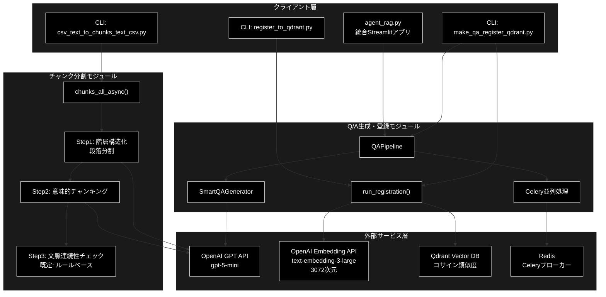
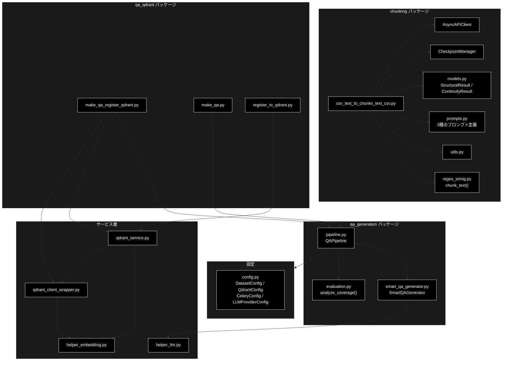
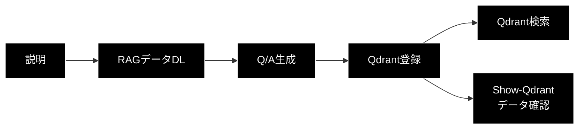
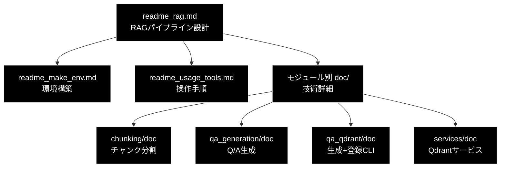
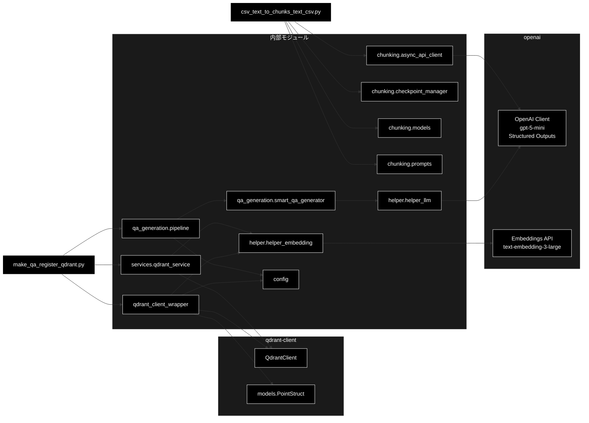

# RAG Q/A 生成・検索システム ドキュメント

**Version 3.0** | 最終更新: 2026-07-10

**プロジェクト全体** [README.md](README.md) | **GRACE（Plan+Executor）詳細** [readme_autonomous_agent.md](readme_autonomous_agent.md) | **ReAct+Reflection詳細** [readme_react_reflection.md](readme_react_reflection.md)

---

## 目次

1. [概要](#概要)
2. [アーキテクチャ構成図](#1-アーキテクチャ構成図)
3. [RAG関連 ファイル・クラス・関数 一覧表](#15-rag関連-ファイルクラス関数-一覧表)
4. [モジュール構成図](#2-モジュール構成図)
5. [クラス・関数一覧表](#3-クラス関数一覧表)
6. [クラス・関数 IPO詳細](#4-クラス関数-ipo詳細)
7. [統合アプリ agent_rag.py](#5-統合アプリ-agent_ragpy)
8. [クイックスタート](#6-クイックスタート)
9. [環境構築詳細](#7-環境構築詳細)
10. [設定・定数](#8-設定定数)
11. [使用例](#9-使用例)
12. [対応データセット](#10-対応データセット)
13. [ディレクトリ構造](#11-ディレクトリ構造)
14. [ドキュメント一覧](#12-ドキュメント一覧)
15. [エクスポート](#13-エクスポート)
16. [変更履歴](#14-変更履歴)
17. [付録: 依存関係図](#付録-依存関係図)

---

## 概要

本システムは、日本語・英語ドキュメントから文章をチャンク分割し、チャンクからQ/Aペアを自動生成し、Qdrantベクトルデータベースで類似度検索・AI応答生成（RAG）を実現する統合アプリケーションです。

LLM は **OpenAI GPT**（既定 `gpt-5-mini`）、Embedding は **OpenAI Embedding**（`text-embedding-3-large`, 3072次元）を使用します。

パイプラインは以下の **3段階** に分離されています。

- **① チャンク分割**: `chunking/csv_text_to_chunks_text_csv.py` — LLMベースの3段階セマンティックチャンキング（文書境界保証・manifest出力）
- **② Q/A生成**: `qa_generation/pipeline.py`（`QAPipeline`）＋ `qa_generation/smart_qa_generator.py`（`SmartQAGenerator`・構造化出力1回/チャンク）
- **③ Qdrant登録**: `qa_qdrant/make_qa_register_qdrant.py`（②＋③の統合CLI）／ `qa_qdrant/register_to_qdrant.py`（登録のみ）

### 主な責務

- テキスト/CSVファイルのLLMベース意味的チャンク分割（3段階: 段落分割→意味的分割→連続性チェック）
  - CSVは1行=1文書として文書境界を保持（`load_documents_from_csv` / `doc_id`）
  - 連続性チェックは既定でルールベース（`continuity_mode="rule"`・LLM呼び出しなし）
  - チャンク上限 `max_chunk_tokens=512`（Embedding入力上限対策）・manifest出力
- チャンクからのQ/Aペア自動生成（SmartQAGenerator: LLMがQ/A数を0〜5個で動的決定 / Celery並列処理対応）
- OpenAI Embedding（`text-embedding-3-large`, 3072次元）によるベクトル化
- Qdrantベクトルデータベースへの登録・検索・RAG応答生成
- カバレージ分析によるQ/A品質評価

### 各責務対応のモジュール

| # | 責務                  | 対応モジュール                            | 説明                                               |
| - | --------------------- | ----------------------------------------- | -------------------------------------------------- |
| 1 | LLMベースチャンク分割 | `chunking/csv_text_to_chunks_text_csv.py` | 3段階非同期パイプライン（段落→意味→連続性）      |
| 2 | Q/Aペア自動生成       | `qa_generation/pipeline.py` ほか          | QAPipeline経由でSmartQAGenerator使用               |
| 3 | Q/A生成＋Qdrant登録   | `qa_qdrant/make_qa_register_qdrant.py`    | Phase 1: Q/A生成 → Phase 2: Embedding→登録       |
| 4 | Qdrant登録のみ        | `qa_qdrant/register_to_qdrant.py`         | Q/AペアCSV・汎用CSVの登録専用CLI                   |
| 5 | Embedding生成         | `helper/helper_embedding.py`              | `create_embedding_client("openai")`（3072次元）    |
| 6 | ベクトル検索・RAG     | `qdrant_client_wrapper.py`                | Dense/Hybrid Search、3段階フォールバック           |

### 主要機能一覧

| 機能                          | 説明                                                              |
| ----------------------------- | ----------------------------------------------------------------- |
| `chunks_all_async()`          | テキスト/文書リストを3段階で意味的にチャンク化（asyncio並列処理） |
| `load_documents_from_csv()`   | CSVから文書リストを読み込み（1行=1文書、doc_id付与）              |
| `save_chunks_as_csv()`        | チャンクをメタデータ付きCSV + シンプルCSVで保存                   |
| `QAPipeline`                  | Q/A生成パイプライン制御クラス（チャンク済みCSV専用）              |
| `QAPipeline.run()`            | パイプライン実行（データ読込→チャンク変換→Q/A生成→保存）       |
| `SmartQAGenerator`            | 構造化出力1回/チャンクでQ/A数を動的決定（0〜5個）                 |
| `run_registration()`          | Q/AペアCSVからQdrant登録（Embedding→アップサート）               |
| `AsyncAPIClient`              | OpenAI API非同期クライアント（Semaphore並列制御+リトライ）        |
| `CheckpointManager`           | 3段階チャンク処理のチェックポイント管理（クラッシュ復旧対応）     |
| `search_collection()`         | Qdrantコレクション検索（Dense/Hybrid、3段階フォールバック）       |

---

## 1. アーキテクチャ構成図

### 1.1 システム全体構成



### 1.2 データフロー

1. 入力データ（CSV/テキスト）を `csv_text_to_chunks_text_csv.py` で3段階チャンク分割
   - CSVは1行=1文書として読み込み、チャンクが文書をまたいで結合されることはない（文書境界の保証）
   - 出力は固定ファイル名 `<name>_chunks.csv`（`--timestamp` 指定時のみ日時サフィックス）＋ manifest JSON
2. チャンクCSVを `make_qa_register_qdrant.py` に入力
3. Phase 1: `QAPipeline` → `SmartQAGenerator` でQ/Aペアを自動生成（Celery並列処理対応）
4. Phase 2: `run_registration()` でQ/AペアをOpenAI Embedding（`text-embedding-3-large`）でベクトル化
   - ベクトル化対象は **question のみ**（answer はペイロードに保持。質問クエリでの類似度低下を防止）
5. Qdrantコレクションにアップサート登録
6. ユーザー質問 → Embedding → Qdrant検索 → RAG応答生成

---

## 1.5 RAG関連 ファイル・クラス・関数 一覧表

### チャンク分割パッケージ（chunking/）

| ファイル名                       | クラス名            | メソッド/関数名                | 機能概要                                                    |
| -------------------------------- | ------------------- | ------------------------------ | ----------------------------------------------------------- |
| `csv_text_to_chunks_text_csv.py` | -                   | `chunks_all_async()`           | テキスト/文書リストを3段階で意味的にチャンク化（メイン）    |
| `csv_text_to_chunks_text_csv.py` | -                   | `load_documents_from_csv()`    | CSVから文書リストを読み込み（1行=1文書、doc_id付与）        |
| `csv_text_to_chunks_text_csv.py` | -                   | `load_text_from_csv()`         | CSVからテキスト読み込み（後方互換: 全行結合）               |
| `csv_text_to_chunks_text_csv.py` | -                   | `save_chunks_as_csv()`         | チャンクをメタデータ付きCSVで保存（+シンプルCSV同時出力）   |
| `csv_text_to_chunks_text_csv.py` | -                   | `save_chunks_as_simple_csv()`  | チャンクをシンプルCSV（Textカラムのみ）で保存               |
| `csv_text_to_chunks_text_csv.py` | -                   | `save_chunks_as_text()`        | チャンクをテキスト形式で保存（後方互換）                    |
| `csv_text_to_chunks_text_csv.py` | -                   | `generate_output_filename()`   | 出力ファイル名を自動生成（既定: 固定名 `<name>_chunks.csv`）|
| `csv_text_to_chunks_text_csv.py` | -                   | `_step1_hierarchical_split()`  | Step1: 階層構造化（段落分割） — LLMで空行ベースの段落分離  |
| `csv_text_to_chunks_text_csv.py` | -                   | `_step2_semantic_chunking()`   | Step2: 意味的チャンキング — 段落を意味単位に再分割         |
| `csv_text_to_chunks_text_csv.py` | -                   | `_step3_continuity_check()`    | Step3: 連続性チェック（rule/llm/off、上限トークン考慮）     |
| `csv_text_to_chunks_text_csv.py` | -                   | `_rule_based_continuity()`     | ルールベースの連続性判定（LLM呼び出しなし・既定モード）     |
| `csv_text_to_chunks_text_csv.py` | -                   | `_enforce_max_chunk_tokens()`  | 上限超過チャンクの強制分割（max_chunk_tokens 適用）         |
| `csv_text_to_chunks_text_csv.py` | -                   | `_split_oversized_text()`      | 巨大テキストを文単位でトークン上限内に分割                  |
| `csv_text_to_chunks_text_csv.py` | -                   | `_report_coverage()`           | 入力カバレッジ検証（無言のデータ欠落を検知）                |
| `csv_text_to_chunks_text_csv.py` | -                   | `_write_manifest()`            | チャンクCSVと対の manifest JSON を出力（後続契約の明示）    |
| `csv_text_to_chunks_text_csv.py` | -                   | `_split_document_into_blocks()`| 文書をブロック（block_size文字）に分割                      |
| `csv_text_to_chunks_text_csv.py` | -                   | `_detect_text_column()`        | CSVテキストカラムの自動検出                                 |
| `csv_text_to_chunks_text_csv.py` | -                   | `_count_tokens()`              | tiktoken（cl100k_base）によるトークン数計測                 |
| `csv_text_to_chunks_text_csv.py` | -                   | `_normalize_whitespace()`      | テキストの改行・空白を正規化（CSV出力用）                   |
| `csv_text_to_chunks_text_csv.py` | -                   | `_preprocess_text()`           | テキスト前処理（長い1行を句読点で分割）                     |
| `csv_text_to_chunks_text_csv.py` | -                   | `_postprocess_paragraph()`     | 段落の後処理（句読点で文を分割し改行区切り）                |
| `csv_text_to_chunks_text_csv.py` | -                   | `_split_sentences_simple()`    | 簡易的な文分割（日本語対応）                                |
| `csv_text_to_chunks_text_csv.py` | -                   | `main()`                       | CLIエントリポイント（argparse→チャンク実行）               |
| `async_api_client.py`            | `AsyncAPIClient`    | `__init__()`                   | OpenAI APIクライアント初期化（Semaphore並列制御）           |
| `async_api_client.py`            | `AsyncAPIClient`    | `generate_content()`           | Semaphore制御付きAPI呼び出し（OpenAI Structured Outputs）   |
| `async_api_client.py`            | `AsyncAPIClient`    | `_execute_with_retry()`        | リトライロジック（指数バックオフ、出力切断検出）            |
| `async_api_client.py`            | `AsyncAPIClient`    | `_is_truncated()`              | 出力切断チェック（finish_reason=length 判定）               |
| `async_api_client.py`            | `AsyncAPIClient`    | `_accumulate_usage()`          | トークン使用量の集計                                        |
| `async_api_client.py`            | `AsyncAPIClient`    | `get_stats()`                  | リクエスト統計情報を取得                                    |
| `async_api_client.py`            | `AsyncAPIClient`    | `reset_stats()`                | 統計情報をリセット                                          |
| `checkpoint_manager.py`          | `CheckpointManager` | `__init__()`                   | チェックポイントディレクトリ・ジョブID初期化                |
| `checkpoint_manager.py`          | `CheckpointManager` | `save()`                       | ステップ結果をJSON保存（原子書込み）                        |
| `checkpoint_manager.py`          | `CheckpointManager` | `load()`                       | ステップ結果を読み込み                                      |
| `checkpoint_manager.py`          | `CheckpointManager` | `load_with_metadata()`         | メタデータ付きでステップ結果を読み込み                      |
| `checkpoint_manager.py`          | `CheckpointManager` | `exists()`                     | チェックポイントの存在確認                                  |
| `checkpoint_manager.py`          | `CheckpointManager` | `get_latest_completed_step()`  | 最後に完了したステップを取得                                |
| `checkpoint_manager.py`          | `CheckpointManager` | `get_resume_point()`           | クラッシュからの再開ポイントを取得                          |
| `checkpoint_manager.py`          | `CheckpointManager` | `clear()`                      | ジョブのチェックポイントを削除                              |
| `checkpoint_manager.py`          | `CheckpointManager` | `get_job_info()`               | ジョブ情報を取得                                            |
| `checkpoint_manager.py`          | `CheckpointManager` | `list_jobs()`                  | 保存済みジョブの一覧を取得（クラスメソッド）                |
| `checkpoint_manager.py`          | `CheckpointManager` | `cleanup_old_jobs()`           | 古いジョブを削除（クラスメソッド）                          |
| `models.py`                      | `SentenceUnit`      | -                              | 1つの文（意味の最小単位）のPydanticモデル                   |
| `models.py`                      | `ParagraphUnit`     | `full_text`                    | 段落内の全文を改行結合して返すプロパティ                    |
| `models.py`                      | `StructuralResult`  | -                              | テキスト構造化結果（Step1/Step2のレスポンススキーマ）       |
| `models.py`                      | `ContinuityResult`  | -                              | 文脈連続性判定結果（Step3 LLMモードのレスポンススキーマ）   |
| `prompts.py`                     | -                   | `PARAGRAPH_SEPARATION_PROMPT`  | Step1: 空行ベース段落分割プロンプト                         |
| `prompts.py`                     | -                   | `SEMANTIC_CHUNKING_PROMPT`     | Step2: 意味的分割プロンプト（トピック境界検出）             |
| `prompts.py`                     | -                   | `CONTINUITY_CHECK_PROMPT`      | Step3: 文脈連続性判定プロンプト（True/False）               |
| `regex_string.py`                | -                   | `chunk_text()`                 | テキストをチャンクに分割（日本語/英語自動判定）             |
| `regex_string.py`                | -                   | `chunk_text_with_info()`       | テキスト分割+詳細情報（分割方法・言語・件数）               |
| `utils.py`                       | -                   | `show_paragraphs()`            | パラグラフリストの整形表示                                  |
| `utils.py`                       | -                   | `setup_logging()`              | ロギング設定（ファイル+コンソール）                         |
| `utils.py`                       | -                   | `format_time()`                | 秒数を読みやすい形式に変換（秒/分/時間）                    |
| `utils.py`                       | -                   | `format_size()`                | 文字数を読みやすい形式に変換（K文字/M文字）                 |
| `utils.py`                       | -                   | `estimate_api_calls()`         | API呼び出し回数と処理時間を見積もり                         |
| `utils.py`                       | -                   | `print_stats()`                | 統計情報の整形表示                                          |

### Q/A生成・Qdrant登録（qa_qdrant/）

| ファイル名                   | クラス名 | メソッド/関数名               | 機能概要                                                        |
| ---------------------------- | -------- | ----------------------------- | --------------------------------------------------------------- |
| `make_qa_register_qdrant.py` | -        | `main()`                      | 統合パイプライン実行（Phase1: Q/A生成 → Phase2: Qdrant登録）   |
| `make_qa_register_qdrant.py` | -        | `run_registration()`          | Qdrant登録ロジック（Embedding→コレクション作成→アップサート） |
| `make_qa_register_qdrant.py` | -        | `normalize_source_filename()` | ファイル名から日時サフィックスを除去して正規化                  |
| `make_qa.py`                 | -        | `main()`                      | Q/A生成のみのCLI（QAPipeline実行、Qdrant登録なし）              |
| `register_to_qdrant.py`      | -        | `register_to_qdrant()`        | CSV→Qdrant登録の本体（Q/Aペア/汎用CSV両対応）                  |
| `register_to_qdrant.py`      | -        | `detect_text_column()`        | ベクトル化対象カラムの自動検出                                  |
| `register_to_qdrant.py`      | -        | `normalize_source_filename()` | ファイル名から日時サフィックスを除去                            |
| `register_to_qdrant.py`      | -        | `main()`                      | 登録専用CLIエントリポイント                                     |

> **Note**: 旧 `combine_rows_to_chunks()`（CSV行結合）は削除済み。チャンキングは
> `chunking/csv_text_to_chunks_text_csv.py` に一本化され、`make_qa_register_qdrant.py` は
> チャンク済みCSV（または question/answer 付きCSV）のみを受け付ける（`.txt` 直接入力は不可）。

### Q/A生成パイプライン（qa_generation/）

| ファイル名              | クラス名           | メソッド/関数名           | 機能概要                                                   |
| ----------------------- | ------------------ | ------------------------- | ---------------------------------------------------------- |
| `pipeline.py`           | `QAPipeline`       | `__init__()`              | コンストラクタ（設定ロード、SmartQAGenerator初期化）       |
| `pipeline.py`           | `QAPipeline`       | `load_data()`             | データ読み込み（CSV/データセット対応）                     |
| `pipeline.py`           | `QAPipeline`       | `_load_chunks_from_csv()` | チャンク済みCSVをチャンクリストに変換                      |
| `pipeline.py`           | `QAPipeline`       | `generate_qa()`           | Q/Aペアを生成（同期/Celery並列切替）                       |
| `pipeline.py`           | `QAPipeline`       | `_generate_with_celery()` | Celery並列処理によるQ/A生成（進捗の逐次永続化）            |
| `pipeline.py`           | `QAPipeline`       | `_generate_sync()`        | 同期処理によるQ/A生成（SmartQAGenerator使用）              |
| `pipeline.py`           | `QAPipeline`       | `evaluate_coverage()`     | カバレージ評価（チャンク網羅率分析）                       |
| `pipeline.py`           | `QAPipeline`       | `save()`                  | 結果をCSV保存                                              |
| `pipeline.py`           | `QAPipeline`       | `run()`                   | パイプライン一括実行（読込→変換→生成→分析→保存）       |
| `pipeline.py`           | `QAPipeline`       | `_validate_inputs()`      | 入力パラメータの排他制御検証                               |
| `pipeline.py`           | `QAPipeline`       | `_load_config()`          | データセット/ファイル設定をロード                          |
| `pipeline.py`           | `QAPipeline`       | `_load_progress()` ほか   | 進捗JSON（progress）の読込・追記・クリア（中断復旧用）     |
| `smart_qa_generator.py` | `SmartQAPair`      | -                         | Q/Aペア1件のPydanticスキーマ（question/answer/topic）      |
| `smart_qa_generator.py` | `SmartQAResult`    | -                         | チャンク分析+Q/A生成の統合スキーマ（qa_count 0〜5等）      |
| `smart_qa_generator.py` | `SmartQAGenerator` | `analyze_and_generate()`  | 構造化出力1回でチャンク分析とQ/A生成を実行                 |
| `smart_qa_generator.py` | `SmartQAGenerator` | `process_chunk()`         | チャンク1件を処理して辞書形式で返す                        |
| `smart_qa_generator.py` | -                  | `analyze_qa_statistics()` | 生成結果の統計集計                                         |
| `semantic.py`           | `SemanticCoverage` | 各種メソッド              | 意味的チャンク分割・Embedding・コサイン類似度計算          |
| `evaluation.py`         | -                  | `analyze_coverage()`      | カバレージ分析（マルチ閾値・チャンク特性分析）             |
| `models.py`             | `QAPair` ほか      | -                         | Q/A生成用Pydanticスキーマ群                                |
| `data_io.py`            | -                  | `load_uploaded_file()` 等 | データ入出力（アップロード/前処理済みデータ/結果保存）     |

### Qdrant操作サービス（services/）

| ファイル名          | クラス名              | メソッド/関数名                              | 機能概要                                              |
| ------------------- | --------------------- | -------------------------------------------- | ----------------------------------------------------- |
| `qdrant_service.py` | `QdrantHealthChecker` | `__init__()`                                 | Qdrantヘルスチェッカー初期化                          |
| `qdrant_service.py` | `QdrantHealthChecker` | `check_port()`                               | ポートの開放状態チェック                              |
| `qdrant_service.py` | `QdrantHealthChecker` | `check_qdrant()`                             | Qdrant接続チェック（メトリクス付き）                  |
| `qdrant_service.py` | `QdrantDataFetcher`   | `__init__()`                                 | Qdrantデータフェッチャー初期化                        |
| `qdrant_service.py` | `QdrantDataFetcher`   | `fetch_collections()`                        | コレクション一覧をDataFrameで取得                     |
| `qdrant_service.py` | `QdrantDataFetcher`   | `fetch_collection_points()`                  | コレクションの詳細データをDataFrameで取得             |
| `qdrant_service.py` | `QdrantDataFetcher`   | `fetch_collection_info()`                    | コレクションの詳細情報（ベクトル設定含む）            |
| `qdrant_service.py` | `QdrantDataFetcher`   | `fetch_collection_source_info()`             | コレクションのデータソース情報を集計                  |
| `qdrant_service.py` | -                     | `embed_texts_for_qdrant()`                   | テキストをOpenAI Embeddingでバッチベクトル化          |
| `qdrant_service.py` | -                     | `create_or_recreate_collection_for_qdrant()` | コレクション作成/再作成（Sparse Vector対応）          |
| `qdrant_service.py` | -                     | `build_points_for_qdrant()`                  | Qdrantポイント構築（payload: question/answer/source） |
| `qdrant_service.py` | -                     | `upsert_points_to_qdrant()`                  | ポイントをバッチアップサート                          |
| `qdrant_service.py` | -                     | `embed_query_for_search()`                   | 検索クエリをベクトル化（次元数/モデル名で自動選択）   |
| `qdrant_service.py` | -                     | `get_collection_stats()`                     | コレクション統計情報を取得                            |
| `qdrant_service.py` | -                     | `get_all_collections()`                      | 全コレクション一覧を取得                              |
| `qdrant_service.py` | -                     | `get_all_collections_simple()`               | 全コレクション一覧を取得（シンプル版）                |
| `qdrant_service.py` | -                     | `delete_all_collections()`                   | 全コレクションを削除（除外リスト対応）                |
| `qdrant_service.py` | -                     | `load_csv_for_qdrant()`                      | CSVをロード（列名マッピング+バリデーション）          |
| `qdrant_service.py` | -                     | `build_inputs_for_embedding()`               | 埋め込み用入力テキストを構築（answer結合は選択制）    |
| `qdrant_service.py` | -                     | `scroll_all_points_with_vectors()`           | コレクションから全ポイント取得（ベクトル含む）        |
| `qdrant_service.py` | -                     | `merge_collections()`                        | 複数コレクションを統合して新コレクションに登録        |
| `qdrant_service.py` | -                     | `map_collection_to_csv()`                    | コレクション名から対応CSVファイル名を取得             |
| `qdrant_service.py` | -                     | `get_dynamic_collection_mapping()`           | コレクションとCSVの動的マッピング生成                 |
| `qdrant_service.py` | -                     | `get_collection_embedding_params()`          | コレクションの埋め込みモデル設定を推論                |
| `qa_service.py`     | -                     | `run_advanced_qa_generation()` ほか          | UI向けQ/A生成サービス（`create_llm_client("openai")`）|

### Qdrantクライアントラッパー

| ファイル名                 | クラス名              | メソッド/関数名                        | 機能概要                                              |
| -------------------------- | --------------------- | -------------------------------------- | ----------------------------------------------------- |
| `qdrant_client_wrapper.py` | `QdrantHealthChecker` | `check_port()`                         | ポートの開放状態チェック                              |
| `qdrant_client_wrapper.py` | `QdrantHealthChecker` | `check_qdrant()`                       | Qdrant接続チェック（メトリクス付き）                  |
| `qdrant_client_wrapper.py` | `QdrantHealthChecker` | `get_client()`                         | 接続済みクライアントを取得                            |
| `qdrant_client_wrapper.py` | `QdrantDataFetcher`   | `fetch_collections()`                  | コレクション一覧をDataFrameで取得                     |
| `qdrant_client_wrapper.py` | `QdrantDataFetcher`   | `fetch_collection_points()`            | コレクションの詳細データを取得                        |
| `qdrant_client_wrapper.py` | `QdrantDataFetcher`   | `fetch_collection_info()`              | コレクションの詳細情報を取得                          |
| `qdrant_client_wrapper.py` | `QdrantDataFetcher`   | `fetch_collection_source_info()`       | データソース情報を集計                                |
| `qdrant_client_wrapper.py` | -                     | `create_qdrant_client()`               | QdrantClientを作成（ファクトリ関数）                  |
| `qdrant_client_wrapper.py` | -                     | `get_qdrant_client()`                  | シングルトンQdrantClientを取得                        |
| `qdrant_client_wrapper.py` | -                     | `get_embedding_client()`               | プロバイダー別EmbeddingClientを取得（既定: openai）   |
| `qdrant_client_wrapper.py` | -                     | `get_cached_sparse_embedding_client()` | Sparse Embeddingクライアントを取得（キャッシュ付き）  |
| `qdrant_client_wrapper.py` | -                     | `create_or_recreate_collection()`      | コレクション作成/再作成（Hybrid Search対応）          |
| `qdrant_client_wrapper.py` | -                     | `embed_texts_unified()`                | テキストをベクトル化（プロバイダー統一版）            |
| `qdrant_client_wrapper.py` | -                     | `embed_query_unified()`                | 検索クエリをベクトル化（プロバイダー統一版）          |
| `qdrant_client_wrapper.py` | -                     | `embed_sparse_texts_unified()`         | テキストをSparse Embeddingでベクトル化                |
| `qdrant_client_wrapper.py` | -                     | `embed_sparse_query_unified()`         | クエリをSparse Embeddingでベクトル化                  |
| `qdrant_client_wrapper.py` | -                     | `build_points()`                       | Qdrantポイント構築（Dense/Hybrid対応）                |
| `qdrant_client_wrapper.py` | -                     | `upsert_points()`                      | ポイントをバッチアップサート                          |
| `qdrant_client_wrapper.py` | -                     | `search_collection()`                  | コレクション検索（Dense/Hybrid、3段階フォールバック） |
| `qdrant_client_wrapper.py` | -                     | `create_collection_for_provider()`     | プロバイダー別コレクション作成                        |
| `qdrant_client_wrapper.py` | -                     | `get_provider_vector_size()`           | プロバイダーのベクトル次元数を取得                    |
| `qdrant_client_wrapper.py` | -                     | `get_collection_stats()`               | コレクション統計情報を取得                            |
| `qdrant_client_wrapper.py` | -                     | `get_all_collections()`                | 全コレクション一覧を取得                              |
| `qdrant_client_wrapper.py` | -                     | `delete_all_collections()`             | 全コレクションを削除                                  |
| `qdrant_client_wrapper.py` | -                     | `load_csv_for_qdrant()`                | CSVをロード（Qdrant登録用）                           |
| `qdrant_client_wrapper.py` | -                     | `build_inputs_for_embedding()`         | 埋め込み用入力テキストを構築                          |
| `qdrant_client_wrapper.py` | -                     | `batched()`                            | イテラブルをバッチに分割                              |

### ヘルパー（helper/）

| ファイル名            | クラス名/関数名                | 機能概要                                                             |
| --------------------- | ------------------------------ | -------------------------------------------------------------------- |
| `helper_embedding.py` | `create_embedding_client()`    | Embeddingクライアントのファクトリ（既定 provider="openai"）          |
| `helper_embedding.py` | `OpenAIEmbedding`              | OpenAI Embeddings API実装（`text-embedding-3-large`, 3072次元既定）  |
| `helper_embedding.py` | `get_embedding_dimensions()`   | プロバイダー別Embedding次元数を取得（openai: 3072）                  |
| `helper_llm.py`       | `create_llm_client()`          | LLMクライアントのファクトリ（既定 provider="openai"）                |
| `helper_llm.py`       | `OpenAIClient`                 | OpenAI GPTクライアント（generate_content/generate_structured 等）    |
| `helper_rag_qa.py`    | `OpenAIClient` ほか            | RAG Q/A用LLMクライアント（既定モデル `gpt-5-mini`、tools対応）       |

### 設定管理（config.py）

| ファイル名  | クラス名             | メソッド/関数名             | 機能概要                                                       |
| ----------- | -------------------- | --------------------------- | -------------------------------------------------------------- |
| `config.py` | `ModelConfig`        | `supports_temperature()` 等 | 旧LLM設定クラス（後方互換）。現行既定は GeminiConfig 側を参照  |
| `config.py` | `DatasetInfo`        | -                           | データセット情報（dataclass）                                  |
| `config.py` | `DatasetConfig`      | `get_dataset()`             | データセット設定を取得                                         |
| `config.py` | `DatasetConfig`      | `get_dataset_dict()`        | データセット設定を辞書形式で取得                               |
| `config.py` | `DatasetConfig`      | `get_all_dataset_names()`   | 全データセット名を取得                                         |
| `config.py` | `QAGenerationConfig` | -                           | Q/A生成設定（質問タイプ階層、閾値等）                          |
| `config.py` | `QdrantConfig`       | -                           | Qdrant接続設定（VECTOR_SIZE=3072, text-embedding-3-large）     |
| `config.py` | `GeminiConfig`       | `get_model_limits()` 等     | ※クラス名は後方互換。中身はOpenAI設定（gpt-5-mini 等）        |
| `config.py` | `PathConfig`         | `ensure_dirs()`             | 必要なディレクトリを一括作成                                   |
| `config.py` | `CeleryConfig`       | -                           | Celery並列処理設定                                             |
| `config.py` | `AgentConfig`        | -                           | RAGエージェント設定（検索閾値・既定コレクション等）            |
| `config.py` | `LLMProviderConfig`  | `get_embedding_dims()`      | プロバイダー別Embedding次元数を取得（既定 "openai" → 3072）   |

---

## 2. モジュール構成図

### 2.1 内部モジュール構成



### 2.2 外部依存関係

| ライブラリ      | 用途                                 |
| --------------- | ------------------------------------ |
| `openai`        | OpenAI GPT / Embedding API           |
| `qdrant-client` | Qdrantベクトルデータベース操作       |
| `pydantic`      | レスポンススキーマ定義（構造化出力） |
| `pandas`        | CSV入出力・データ処理                |
| `tiktoken`      | トークン数計算                       |
| `celery[redis]` | 並列タスク処理                       |
| `streamlit`     | Web UIフレームワーク                 |

### 2.3 内部依存モジュール

| モジュール                         | 用途                                |
| ---------------------------------- | ----------------------------------- |
| `chunking.async_api_client`        | OpenAI API非同期呼び出し            |
| `chunking.checkpoint_manager`      | チェックポイント永続化              |
| `chunking.models`                  | Pydanticスキーマ（段落/連続性判定） |
| `chunking.prompts`                 | 3段階チャンク用プロンプト           |
| `qa_generation.pipeline`           | Q/A生成パイプライン制御             |
| `qa_generation.smart_qa_generator` | スマートQ/A生成（LLM動的決定）      |
| `services.qdrant_service`          | Qdrant操作サービス                  |
| `qdrant_client_wrapper`            | Qdrantクライアントラッパー          |
| `helper.helper_embedding`          | Embedding抽象化レイヤー             |
| `helper.helper_llm`                | LLMクライアント抽象化レイヤー       |
| `config`                           | 全体設定管理                        |

---

## 3. クラス・関数一覧表

### 3.1 csv_text_to_chunks_text_csv.py

#### 関数一覧

| 関数名                                                     | 概要                                                  |
| ---------------------------------------------------------- | ----------------------------------------------------- |
| `chunks_all_async(text, model, ..., documents, continuity_mode, max_chunk_tokens)` | テキスト/文書リストを3段階でチャンク化（メイン） |
| `load_documents_from_csv(csv_path, text_column, max_rows)` | CSVから文書リストを読み込み（1行=1文書、doc_id付与）  |
| `load_text_from_csv(csv_path, ...)`                        | CSVからテキスト読み込み（後方互換: 全行結合）         |
| `save_chunks_as_csv(chunks, output_file, ...)`             | チャンクをメタデータ付きCSVで保存                     |
| `save_chunks_as_simple_csv(chunks, output_file, ...)`      | チャンクをシンプルCSV（Textのみ）で保存               |
| `save_chunks_as_text(chunks, output_file)`                 | チャンクをテキスト形式で保存                          |
| `generate_output_filename(input_file, output_dir, dataset_type, use_timestamp)` | 出力ファイル名の自動生成（既定: 固定名） |
| `_step1_hierarchical_split(documents, client, model, ...)` | Step1: 階層構造化（段落分割）                         |
| `_step2_semantic_chunking(paragraphs, client, model, ...)` | Step2: 意味的チャンキング                             |
| `_step3_continuity_check(chunks, client, model, ..., continuity_mode, max_chunk_tokens)` | Step3: 文脈連続性チェック   |
| `_enforce_max_chunk_tokens(chunks, max_tokens)`            | 上限超過チャンクの強制分割                            |
| `_report_coverage(...)`                                    | 入力カバレッジ検証（データ欠落検知）                  |
| `_write_manifest(...)`                                     | チャンクCSVと対のmanifest JSON出力                    |
| `_normalize_whitespace(text)`                              | テキストの改行・空白を正規化                          |
| `_preprocess_text(text)`                                   | テキスト前処理（長い1行を句読点で分割）               |
| `_postprocess_paragraph(paragraph)`                        | 段落の後処理（句読点で文を分割し改行区切り）          |

#### 定数

| 定数                          | 値   | 説明                                                         |
| ----------------------------- | ---- | ------------------------------------------------------------ |
| `MAX_CHUNK_TOKENS`            | 512  | チャンク最大トークン数（Step3結合上限＋最終強制分割上限）    |
| `EMBEDDING_INPUT_TOKEN_LIMIT` | 2048 | Embedding入力上限の保守的ガード値（超過設定時に警告）        |

### 3.2 make_qa_register_qdrant.py

#### 関数一覧

| 関数名                                                                    | 概要                                                          |
| ------------------------------------------------------------------------- | ------------------------------------------------------------- |
| `main()`                                                                  | 統合パイプライン実行（Phase1: Q/A生成 → Phase2: Qdrant登録） |
| `run_registration(csv_path, collection_name, recreate, batch_size, provider, ui_output_dir)` | Qdrant登録ロジック（Embedding→アップサート） |
| `normalize_source_filename(filename)`                                     | ファイル名から日時サフィックスを除去                          |

主なCLIオプション: `--input-file`（チャンク済みCSV）/ `--dataset` / `--collection`（必須）/ `--model`（既定 `gpt-5-mini`）/ `--use-celery` / `-c, --concurrency`（既定 8）/ `--recreate` / `--batch-size`（既定 100）/ `--provider`（既定 `openai`）/ `--output` / `--ui-output`

### 3.3 AsyncAPIClient クラス

| メソッド                                                          | 概要                                          |
| ------------------------------------------------------------------ | --------------------------------------------- |
| `__init__(api_key, max_workers=8, max_retries=3, max_output_tokens=8192)` | コンストラクタ（OpenAI接続、Semaphore初期化） |
| `generate_content(model, contents, response_schema, task_id, system)` | Semaphore制御付きAPI呼び出し（構造化出力） |
| `get_stats()`                                                      | リクエスト統計情報を取得                      |
| `reset_stats()`                                                    | 統計情報をリセット                            |

### 3.4 CheckpointManager クラス

| メソッド                           | 概要                                                 |
| ---------------------------------- | ---------------------------------------------------- |
| `__init__(checkpoint_dir, job_id)` | コンストラクタ（チェックポイントディレクトリ初期化） |
| `save(step_name, data, metadata)`  | ステップの結果をJSON保存（原子書込み）               |
| `load(step_name)`                  | ステップの結果を読み込み                             |
| `exists(step_name)`                | チェックポイントの存在確認                           |
| `get_resume_point()`               | 再開ポイントを取得                                   |
| `clear()`                          | チェックポイントを削除                               |

### 3.5 QAPipeline クラス（qa_generation/pipeline.py）

| メソッド                                         | 概要                                                 |
| ------------------------------------------------ | ---------------------------------------------------- |
| `__init__(dataset_name, input_file, model="gpt-5-mini", output_dir, max_docs, client)` | コンストラクタ（設定ロード、SmartQAGenerator初期化） |
| `load_data()`                                    | データ読み込み（CSV/データセット対応）               |
| `generate_qa(chunks, use_celery, ...)`           | Q/Aペアを生成（同期/Celery並列）                     |
| `evaluate_coverage(chunks, qa_pairs, ...)`       | カバレージ評価                                       |
| `save(qa_pairs, coverage_results)`               | 結果をCSV保存                                        |
| `run(use_celery, celery_workers, concurrency, batch_chunks, analyze_coverage, coverage_threshold)` | パイプライン一括実行 |

---

## 4. クラス・関数 IPO詳細

### 4.1 chunks_all_async()

**概要**: テキストまたは文書リストを3段階（段落分割→意味的分割→連続性チェック）で意味的にチャンク化する非同期メイン関数。文書境界を保証し、manifest を出力する。

```python
async def chunks_all_async(
    text: Optional[str] = None,
    model: str = "gpt-5-mini",
    max_workers: int = 8,
    block_size: int = 1000,
    checkpoint_manager: Optional[CheckpointManager] = None,
    output_file: Optional[str] = None,
    dataset_type: str = "custom",
    source_file: Optional[str] = None,
    documents: Optional[List[Dict]] = None,
    continuity_mode: str = "rule",
    max_chunk_tokens: int = MAX_CHUNK_TOKENS,
) -> List[str]
```

| パラメータ           | 型                          | デフォルト   | 説明                                                     |
| -------------------- | --------------------------- | ------------ | -------------------------------------------------------- |
| `text`               | Optional[str]               | None         | 分割対象テキスト（単一文書。`documents` と排他）         |
| `model`              | str                         | "gpt-5-mini" | 使用するOpenAI GPTモデル                                 |
| `max_workers`        | int                         | 8            | 非同期並列ワーカー数                                     |
| `block_size`         | int                         | 1000         | Step1ブロックサイズ（文字数）                            |
| `checkpoint_manager` | Optional[CheckpointManager] | None         | チェックポイント管理                                     |
| `output_file`        | Optional[str]               | None         | 出力ファイルパス（CSV/テキスト）                         |
| `dataset_type`       | str                         | "custom"     | データセット種別                                         |
| `source_file`        | Optional[str]               | None         | 元ファイル名                                             |
| `documents`          | Optional[List[Dict]]        | None         | 文書リスト `[{'doc_id':…, 'text':…}, ...]`（境界保証） |
| `continuity_mode`    | str                         | "rule"       | Step3モード（rule / llm / off）                          |
| `max_chunk_tokens`   | int                         | 512          | チャンク最大トークン数（結合上限＋強制分割上限）         |

| 項目        | 内容                                                                                                                                                                                                                                                                                                                                                            |
| ----------- | ---------------------------------------------------------------------------------------------------------------------------------------------------------------------------------------------------------------------------------------------------------------------------------------------------------------------------------------------------------------- |
| **Input**   | `text: str` または `documents: List[Dict]`（doc_id 付き文書リスト）, `model: str`, `max_workers: int`                                                                                                                                                                                                                                                           |
| **Process** | 1. `OPENAI_API_KEY` 検証、AsyncAPIClient初期化<br>2. Step1: `_step1_hierarchical_split()` — 文書ごとにブロック分割→LLMで段落分離<br>3. Step2: `_step2_semantic_chunking()` — 段落を意味単位にチャンク化<br>4. Step3: `_step3_continuity_check()` — 隣接チャンクの連続性判定（既定ルールベース）→マージ<br>5. `_enforce_max_chunk_tokens()` で上限強制分割<br>6. `_report_coverage()` で入力カバレッジ検証<br>7. output_file指定時はCSV保存＋manifest出力 |
| **Output**  | `List[str]`: 最終チャンクリスト（doc_id 等のメタデータは出力CSVに含まれる）                                                                                                                                                                                                                                                                                     |

**戻り値例**:

```python
[
    "人工知能（AI）は、機械学習と深層学習を基盤として急速に発展しています。特に自然言語処理（NLP）の分野では、トランスフォーマーモデルが革命的な成果を上げました。",
    "BERTやGPTなどの大規模言語モデルは、文脈理解能力を大幅に向上させています。",
    "AIの応用は医療診断から自動運転まで幅広く、社会に大きな影響を与えています。"
]
```

```python
# 使用例
import asyncio
from chunking.csv_text_to_chunks_text_csv import chunks_all_async, load_documents_from_csv

documents = load_documents_from_csv("OUTPUT/cc_news_1per.csv")
chunks = asyncio.run(chunks_all_async(
    documents=documents,
    model="gpt-5-mini",
    max_workers=8,
    block_size=1000,
    output_file="output_chunked/cc_news_1per_chunks.csv"
))
print(f"生成チャンク数: {len(chunks)}")
```

---

### 4.2 load_documents_from_csv() / load_text_from_csv()

**概要**: CSVファイルから文書リストを読み込む。1行=1文書として文書（記事）境界を保持し、`doc_id` により元文書へのトレーサビリティを確保する。旧 `load_text_from_csv()` は後方互換として残るが、全行を1テキストに結合するため文書境界が失われる。

```python
def load_documents_from_csv(
    csv_path: str,
    text_column: Optional[str] = None,
    max_rows: Optional[int] = None,
) -> List[Dict]
```

| パラメータ    | 型            | デフォルト | 説明                                 |
| ------------- | ------------- | ---------- | ------------------------------------ |
| `csv_path`    | str           | -          | CSVファイルパス                      |
| `text_column` | Optional[str] | None       | テキストカラム名（None時は自動検出） |
| `max_rows`    | Optional[int] | None       | 最大処理行数                         |

| 項目        | 内容                                                                                                                            |
| ----------- | -------------------------------------------------------------------------------------------------------------------------------- |
| **Input**   | `csv_path: str`（CSVファイルパス）                                                                                              |
| **Process** | 1. CSV読み込み（pandas）<br>2. `_detect_text_column()` でテキストカラム自動検出<br>3. 空行フィルタリング<br>4. 行番号を doc_id として付与 |
| **Output**  | `List[Dict]`: `[{'doc_id': 行番号, 'text': テキスト}, ...]`                                                                     |

---

### 4.3 save_chunks_as_csv()

**概要**: チャンクをメタデータ付きCSVで保存。オプションでシンプルCSV（Textカラムのみ）も同時出力。

```python
def save_chunks_as_csv(
    chunks: List[str],
    output_file: str,
    dataset_type: str = "custom",
    source_file: Optional[str] = None,
    normalize_whitespace: bool = True,
    save_simple_csv: bool = True
) -> str
```

| パラメータ             | 型            | デフォルト | 説明                     |
| ---------------------- | ------------- | ---------- | ------------------------ |
| `chunks`               | List[str]     | -          | チャンクリスト           |
| `output_file`          | str           | -          | 出力ファイルパス         |
| `dataset_type`         | str           | "custom"   | データセット種別         |
| `source_file`          | Optional[str] | None       | 元ファイル名             |
| `normalize_whitespace` | bool          | True       | 改行・空白を正規化するか |
| `save_simple_csv`      | bool          | True       | シンプルCSVも保存するか  |

| 項目        | 内容                                                                                                                                                           |
| ----------- | -------------------------------------------------------------------------------------------------------------------------------------------------------------- |
| **Input**   | `chunks: List[str]`, `output_file: str`                                                                                                                        |
| **Process** | 1. 各チャンクの改行正規化（オプション）<br>2. メタデータ付きCSV生成（chunk_id, text, tokens, doc_id等）<br>3. `save_simple_csv=True`時、`_simple.csv`も出力 |
| **Output**  | `str`: 保存したCSVファイルパス                                                                                                                                 |

---

### 4.4 AsyncAPIClient クラス

OpenAI APIへの非同期呼び出しを管理。Semaphoreで並列数を制御し、指数バックオフでリトライする。構造化出力は OpenAI Structured Outputs（`beta.chat.completions.parse` に `response_format=Pydanticクラス` を指定）で実現。

#### コンストラクタ: `__init__`

**概要**: OpenAI APIクライアントの初期化。並列数制御用Semaphoreとリトライ設定を構成する。

```python
AsyncAPIClient(
    api_key: str,
    max_workers: int = 8,
    max_retries: int = 3,
    max_output_tokens: int = 8192
)
```

| パラメータ          | 型  | デフォルト | 説明                    |
| ------------------- | --- | ---------- | ----------------------- |
| `api_key`           | str | -          | OpenAI API Key          |
| `max_workers`       | int | 8          | 並列数（Semaphore上限） |
| `max_retries`       | int | 3          | リトライ回数            |
| `max_output_tokens` | int | 8192       | 出力トークン制限        |

| 項目        | 内容                                                     |
| ----------- | -------------------------------------------------------- |
| **Input**   | `api_key: str`, `max_workers: int`                       |
| **Process** | OpenAIクライアント初期化、Semaphore作成、統計カウンタ初期化 |
| **Output**  | AsyncAPIClientインスタンス                               |

#### メソッド: `generate_content`

**概要**: Semaphoreで並列数を制御しながらOpenAI API呼び出し。出力切断（finish_reason=length）の検出とリトライ機能を含む。

```python
async def generate_content(
    model: str,
    contents: str,
    response_schema: Type[BaseModel],
    task_id: Optional[str] = None,
    system: Optional[str] = None
) -> Optional[str]
```

| 項目        | 内容                                                                                                                                                                                                                          |
| ----------- | ---------------------------------------------------------------------------------------------------------------------------------------------------------------------------------------------------------------------------- |
| **Input**   | `model: str`, `contents: str`, `response_schema: Type[BaseModel]`, `system: Optional[str]`（システムプロンプト）                                                                                                              |
| **Process** | 1. Semaphore取得<br>2. `asyncio.to_thread()`で同期API→非同期実行（`beta.chat.completions.parse`）<br>3. 出力切断チェック（finish_reason=length）<br>4. トークン使用量集計<br>5. 失敗時は指数バックオフでリトライ（最大3回） |
| **Output**  | `Optional[str]`: JSONレスポンス文字列（Pydanticとして解析可能）、全リトライ失敗時はNone                                                                                                                                       |

---

### 4.5 CheckpointManager クラス

3段階チャンク処理の中間結果をJSON保存し、クラッシュ時に途中から再開可能にする。

#### コンストラクタ: `__init__`

**概要**: チェックポイントディレクトリとジョブIDの初期化。

```python
CheckpointManager(
    checkpoint_dir: str = "./checkpoints",
    job_id: Optional[str] = None
)
```

| 項目        | 内容                                                       |
| ----------- | ---------------------------------------------------------- |
| **Input**   | `checkpoint_dir: str`, `job_id: Optional[str]`             |
| **Process** | ジョブID生成（未指定時はタイムスタンプ）、ディレクトリ作成 |
| **Output**  | CheckpointManagerインスタンス                              |

#### メソッド: `save`

**概要**: ステップの結果をJSONとして保存（一時ファイル→リネームで原子性確保）。

```python
def save(step_name: str, data: List[str], metadata: Optional[dict] = None) -> str
```

| 項目        | 内容                                                                                                                            |
| ----------- | ------------------------------------------------------------------------------------------------------------------------------- |
| **Input**   | `step_name: str`（"step1"/"step2"/"step3"）, `data: List[str]`                                                                  |
| **Process** | 1. チェックポイントデータ構築（step, timestamp, count, data）<br>2. 一時ファイルに書き込み<br>3. `os.replace()`で原子的リネーム |
| **Output**  | `str`: 保存したファイルパス                                                                                                     |

#### メソッド: `get_resume_point`

**概要**: クラッシュからの再開ポイントを取得。

```python
def get_resume_point() -> tuple[Optional[str], Optional[List[str]]]
```

| 項目        | 内容                                                                            |
| ----------- | ------------------------------------------------------------------------------- |
| **Input**   | なし（内部ステートから判定）                                                    |
| **Process** | step3→step2→step1の順にチェックポイント存在確認                               |
| **Output**  | `Tuple[Optional[str], Optional[List[str]]]`: (再開ステップ名, 前ステップデータ) |

---

### 4.6 run_registration()（make_qa_register_qdrant.py）

**概要**: Q/AペアCSVをQdrantに登録する。Embedding生成→コレクション作成→バッチアップサート。ベクトル化対象は **question のみ**（answer を含めるとQ+A合体ベクトルとなり質問クエリでの類似度が低下するため。answer はペイロードに保持）。

```python
def run_registration(
    csv_path: str,
    collection_name: str,
    recreate: bool,
    batch_size: int,
    provider: str,
    ui_output_dir: str = "qa_output"
) -> bool
```

| パラメータ        | 型   | デフォルト  | 説明                                 |
| ----------------- | ---- | ----------- | ------------------------------------ |
| `csv_path`        | str  | -           | Q/AペアCSVのパス                     |
| `collection_name` | str  | -           | Qdrantコレクション名                 |
| `recreate`        | bool | -           | コレクションを再作成するか           |
| `batch_size`      | int  | -           | Embeddingバッチサイズ                |
| `provider`        | str  | -           | Embeddingプロバイダー（既定 openai） |
| `ui_output_dir`   | str  | "qa_output" | UI用正規化CSVの出力先                |

| 項目        | 内容                                                                                                                                                                                                                                                                 |
| ----------- | ---------------------------------------------------------------------------------------------------------------------------------------------------------------------------------------------------------------------------------------------------------------------- |
| **Input**   | `csv_path: str`, `collection_name: str`                                                                                                                                                                                                                              |
| **Process** | 1. CSV読み込み、question カラムをベクトル化対象テキストに設定（answer はペイロード保持）<br>2. Qdrantクライアント接続、コレクション作成/再作成<br>3. バッチ処理: `embed_texts_for_qdrant()`（OpenAI Embedding） → `build_points_for_qdrant()` → `upsert_points_to_qdrant()`<br>4. source を正規化ファイル名で登録、UI用正規化CSV出力 |
| **Output**  | `bool`: 成功時True、失敗時False                                                                                                                                                                                                                                      |

---

### 4.7 QAPipeline クラス（qa_generation/pipeline.py）

チャンク済みCSVからQ/Aペアを生成するパイプライン制御クラス。Q/A生成は SmartQAGenerator（構造化出力1回/チャンク）に一本化されている。

#### メソッド: `run`

**概要**: パイプライン一括実行（データ読込→チャンク変換→Q/A生成→カバレージ分析→保存）。

```python
def run(
    use_celery: bool = False,
    celery_workers: int = 1,
    concurrency: int = 8,
    batch_chunks: int = 3,
    analyze_coverage: bool = True,
    coverage_threshold: Optional[float] = None
) -> Dict
```

| パラメータ           | 型              | デフォルト | 説明                                                   |
| -------------------- | --------------- | ---------- | ------------------------------------------------------ |
| `use_celery`         | bool            | False      | Celery並列処理を使用するか                             |
| `celery_workers`     | int             | 1          | Celeryワーカープロセス数チェック用                     |
| `concurrency`        | int             | 8          | 並列タスク数                                           |
| `batch_chunks`       | int             | 3          | （非推奨・未使用）1チャンク=1タスクで処理される        |
| `analyze_coverage`   | bool            | True       | カバレージ分析を実行するか                             |
| `coverage_threshold` | Optional[float] | None       | カバレージ判定の類似度閾値                             |

| 項目        | 内容                                                                                                                                                                                                                         |
| ----------- | ---------------------------------------------------------------------------------------------------------------------------------------------------------------------------------------------------------------------------- |
| **Input**   | チャンク済みCSVファイル（コンストラクタで指定）                                                                                                                                                                              |
| **Process** | 1.`load_data()` でCSV/データセット読み込み<br>2. `_load_chunks_from_csv()` でチャンクリスト変換<br>3. `generate_qa()` でQ/Aペア生成（同期/Celery、進捗JSONによる中断復旧対応）<br>4. `evaluate_coverage()` でカバレージ分析<br>5. `save()` で結果CSV出力 |
| **Output**  | `Dict`: `{saved_files, qa_count, coverage_results, success}`                                                                                                                                                                 |

**戻り値例**:

```python
{
    "saved_files": {"qa_csv": "qa_output/pipeline/qa_pairs_20260710.csv"},
    "qa_count": 150,
    "coverage_results": {"coverage_rate": 0.85, "covered_chunks": 42, "total_chunks": 50},
    "success": True
}
```

---

### 4.8 SmartQAGenerator クラス（qa_generation/smart_qa_generator.py）

**概要**: コンテンツを考慮したインテリジェントQ/A生成クラス。OpenAI Structured Outputs（`generate_structured` / `beta.chat.completions.parse`）による構造化出力1回でチャンク分析とQ/A生成を統合実行し、チャンクごとに適切なQ/A数（0〜5個）を動的決定する。

```python
SmartQAGenerator(model: str = "gpt-5-mini", api_key: Optional[str] = None)
```

#### メソッド: `process_chunk`

```python
def process_chunk(chunk_text: str) -> Dict
```

| 項目        | 内容                                                                                                                                                          |
| ----------- | -------------------------------------------------------------------------------------------------------------------------------------------------------------- |
| **Input**   | `chunk_text: str`（チャンク本文）                                                                                                                             |
| **Process** | 1. `analyze_and_generate()` で構造化出力1回のLLM呼び出し（`create_llm_client("openai")` 経由）<br>2. `SmartQAResult` スキーマで qa_count・key_topics・importance_score・qa_pairs を取得 |
| **Output**  | `Dict`: `{qa_pairs: [{question, answer, topic}, ...], analysis: {...}}`                                                                                       |

---

## 5. 統合アプリ agent_rag.py

### 5.1 画面構成（7画面）

統合アプリ `agent_rag.py`（起動: `uv run streamlit run agent_rag.py --server.port 8501`）は以下の7画面で構成されています。

| # | 画面名                          | ページ関数                       | 機能                                             |
| - | ------------------------------- | -------------------------------- | ------------------------------------------------ |
| 1 | **説明**                        | `show_system_explanation_page()` | プロジェクト概要・ドキュメント確認               |
| 2 | **Qdrant検索**                  | `show_qdrant_search_page()`      | 質問入力→類似Q/A検索→AI応答生成                |
| 3 | **Agent(ReAct+Reflection)**     | `show_agent_chat_page()`         | ReAct+Reflectionエージェントチャット             |
| 4 | **自律型Agent(Plan+Executor)**  | `show_grace_chat_page()`         | GRACE自律エージェント（Plan+Executor）           |
| 5 | **未回答ログ**                  | `show_log_viewer_page()`         | 未回答質問ログの閲覧・分析                       |
| 6 | **RAGデータ作成**               | `show_rag_data_creation_page()`  | RAGデータ作成手順・関連ドキュメントの表示        |
| 7 | **QdrantのCRUD**                | `show_qdrant_crud_page()`        | Qdrant CRUD操作の説明                            |

また、RAGデータ作成用の操作UI（RAGツール）は `ui/app.py`（起動: `streamlit run ui/app.py`）が提供し、
「説明 / RAGデータダウンロード / Q/A生成 / Qdrant登録 / Show-Qdrant / Qdrant検索」の6画面
（`ui/pages/download_page.py`, `qa_generation_page.py`, `qdrant_registration_page.py`, `qdrant_show_page.py`, `qdrant_search_page.py`）で構成される。

### 5.2 画面フロー（RAGデータ作成の流れ）



### 5.3 各画面の概要

#### 説明（Explanation）

プロジェクトの概要とドキュメントへのリンクを表示。

#### RAGデータダウンロード（ui/app.py）

Hugging Faceからデータセットをダウンロード・前処理。対応データセット: cc_news, livedoor, wikipedia_ja, fineweb_edu_ja 等。

#### Q/A生成（ui/app.py）

チャンク済みCSV → SmartQAGeneratorによるQ/Aペア生成。同期処理 / Celery並列処理を選択可能。カバレージ分析オプション付き。

#### Qdrant登録（ui/app.py）

CSVファイルからQdrantへベクトルデータを登録。OpenAI Embedding生成（`text-embedding-3-large`, 3072次元）。

#### Show-Qdrant（ui/app.py）

登録済みコレクションの確認・統計表示。

#### Qdrant検索

質問を入力 → コレクション選択（埋め込みモデル・次元数を自動推定） → 類似Q/A検索（Dense/Hybrid） → AI応答生成。

#### Agent / GRACE チャット

- ReAct+Reflection: [readme_react_reflection.md](readme_react_reflection.md)
- GRACE（Plan+Executor）: [readme_autonomous_agent.md](readme_autonomous_agent.md)

---

## 6. クイックスタート

### 6.1 前提条件

- Python 3.10以上（uv推奨）
- Docker / Docker Compose
- OpenAI API Key（`OPENAI_API_KEY`）

### 6.2 インストール

```bash
# リポジトリのクローン
git clone <repository-url>
cd openai_grace_agent

# 依存パッケージのインストール（uv推奨）
uv venv
uv pip install -r requirements.txt

# 環境変数の設定
cp .env.example .env
# .envにOPENAI_API_KEYを設定
```

### 6.3 サービス起動

```bash
# Qdrant + Redis の起動
docker compose -f docker-compose/docker-compose.yml up -d

# Celeryワーカー起動（並列処理を使う場合）
./start_celery.sh restart -c 8 --flower

# 統合アプリの起動
uv run streamlit run agent_rag.py --server.port 8501
```

### 6.4 CLIでの実行（2段階パイプライン）

```bash
# Step 1: チャンク分割（出力は固定ファイル名 <name>_chunks.csv）
python -m chunking.csv_text_to_chunks_text_csv \
  --input-file OUTPUT/cc_news_1per.csv \
  --output output_chunked \
  --model gpt-5-mini \
  --workers 8 \
  --block-size 500

# Step 2: Q/A生成 + Qdrant登録
python qa_qdrant/make_qa_register_qdrant.py \
  --input-file output_chunked/cc_news_1per_chunks.csv \
  --collection cc_news_1per \
  --use-celery \
  --concurrency 8 \
  --recreate
```

> 出力ファイル名は既定で固定名（例: `cc_news_1per_chunks.csv`）。日時サフィックスが必要な場合のみ
> `--timestamp` を指定する（例: `cc_news_1per_chunks_20260505_004819.csv`）。

### 6.5 動作確認

ブラウザで http://localhost:8501 を開き、統合アプリが表示されることを確認。

**詳細な操作手順**: [readme_usage_tools.md](readme_usage_tools.md) / **環境構築**: [readme_make_env.md](readme_make_env.md)

---

## 7. 環境構築詳細

### 7.1 Python環境

```bash
# Python 3.10以上が必要
python --version

# uv による仮想環境の作成（推奨）
uv venv
source .venv/bin/activate  # Mac/Linux
```

### 7.2 依存パッケージ

```bash
uv pip install -r requirements.txt

# Celery関連（並列処理を使う場合）
uv pip install "celery[redis]" kombu flower
```

### 7.3 Docker（Qdrant + Redis）

```bash
# docker-compose.ymlの場所
docker compose -f docker-compose/docker-compose.yml up -d

# 起動確認
curl http://localhost:6333/collections  # Qdrant
redis-cli ping                           # Redis
```

### 7.4 環境変数

`.env`ファイルを作成:

```env
OPENAI_API_KEY=sk-XXXXXXXXXXXXXXXXXXXXX
QDRANT_URL=http://localhost:6333
REDIS_URL=redis://localhost:6379/0
```

**詳細な環境構築手順**: [readme_make_env.md](readme_make_env.md)

---

## 8. 設定・定数

### 8.1 LLM・Embedding設定（config.py: GeminiConfig ※クラス名は後方互換）

OpenAI API関連の既定値。クラス名 `GeminiConfig` は移行前の名残（後方互換のため維持）で、**中身はOpenAI設定**。

```python
class GeminiConfig:  # クラス名は後方互換。中身は OpenAI 設定
    DEFAULT_MODEL = "gpt-5-mini"
    EMBEDDING_MODEL = "text-embedding-3-large"
    EMBEDDING_DIMS = 3072
```

| キー              | デフォルト値             | 説明                                    |
| ----------------- | ------------------------ | --------------------------------------- |
| `DEFAULT_MODEL`   | "gpt-5-mini"             | デフォルトLLMモデル（OpenAI GPT）       |
| `EMBEDDING_MODEL` | "text-embedding-3-large" | Embeddingモデル（OpenAI Embedding）     |
| `EMBEDDING_DIMS`  | 3072                     | Embedding次元数                         |

`AVAILABLE_MODELS` には `gpt-5-mini`（既定・推奨）/ `gpt-4o-mini` / `gpt-4o` / `gpt-4.1` / `gpt-4.1-mini` / `o1-mini` が定義されている。

また、GRACE側の Embedding 設定は `grace/config.py` の `EmbeddingConfig` に定義されている:

```python
class EmbeddingConfig(BaseModel):
    provider: str = "openai"
    model: str = "text-embedding-3-large"
    dimensions: int = 3072
```

### 8.2 QdrantConfig

Qdrant接続設定。

```python
class QdrantConfig:
    HOST = "localhost"
    PORT = 6333
    URL = "http://localhost:6333"
    DEFAULT_VECTOR_SIZE = 3072  # text-embedding-3-large
    DEFAULT_EMBEDDING_MODEL = "text-embedding-3-large"
```

### 8.3 LLMProviderConfig

プロバイダー既定値（LLM・Embeddingとも `"openai"`）。

| キー                         | デフォルト値 | 説明                                       |
| ---------------------------- | ------------ | ------------------------------------------ |
| `DEFAULT_LLM_PROVIDER`       | "openai"     | LLMプロバイダー既定値                      |
| `DEFAULT_EMBEDDING_PROVIDER` | "openai"     | Embeddingプロバイダー既定値                |
| `get_embedding_dims()`       | 3072         | プロバイダー別Embedding次元数を返す        |

### 8.4 CeleryConfig

Celery並列処理設定。

| キー                 | デフォルト値             | 説明                     |
| -------------------- | ------------------------ | ------------------------ |
| `BROKER_URL`         | redis://localhost:6379/0 | Redisブローカー          |
| `WORKER_CONCURRENCY` | 8                        | デフォルトワーカー並列数 |
| `TASK_TIME_LIMIT`    | 300                      | タスクタイムアウト（秒） |

### 8.5 チャンク処理プロンプト・定数

3段階チャンク処理で使用するプロンプト（`chunking/prompts.py`）:

| プロンプト                    | 用途                                              |
| ----------------------------- | ------------------------------------------------- |
| `PARAGRAPH_SEPARATION_PROMPT` | Step1: 空行ベースの段落分割ルール                 |
| `SEMANTIC_CHUNKING_PROMPT`    | Step2: 意味のまとまり（トピック）ベースの再構成   |
| `CONTINUITY_CHECK_PROMPT`     | Step3: 隣接チャンクの文脈連続性判定（LLMモード）  |

チャンクサイズ関連定数（`chunking/csv_text_to_chunks_text_csv.py`）:

| 定数                          | 値   | 説明                                                          |
| ----------------------------- | ---- | ------------------------------------------------------------- |
| `MAX_CHUNK_TOKENS`            | 512  | チャンク最大トークン数（Step3結合上限＋強制分割上限）         |
| `EMBEDDING_INPUT_TOKEN_LIMIT` | 2048 | Embedding入力上限の保守的ガード値（text-embedding-3-large用） |

---

## 9. 使用例

### 9.1 基本ワークフロー（CLI 2段階パイプライン）

```bash
# Step 1: チャンク分割
python -m chunking.csv_text_to_chunks_text_csv \
  --input-file OUTPUT/wikipedia_ja_1per.csv \
  --output output_chunked \
  --model gpt-5-mini \
  --workers 8

# Step 2: Q/A生成 + Qdrant登録
python qa_qdrant/make_qa_register_qdrant.py \
  --input-file output_chunked/wikipedia_ja_1per_chunks.csv \
  --collection wikipedia_ja_1per \
  --use-celery \
  --concurrency 8 \
  --recreate
```

### 9.2 Pythonからの直接利用

```python
# 使用例: チャンク分割をPythonから実行
import asyncio
from chunking.csv_text_to_chunks_text_csv import chunks_all_async, load_documents_from_csv

# CSVから文書リスト読み込み（1行=1文書、文書境界を保持）
documents = load_documents_from_csv("OUTPUT/cc_news_1per.csv")

# チャンク分割
chunks = asyncio.run(chunks_all_async(
    documents=documents,
    model="gpt-5-mini",
    max_workers=8,
    output_file="output_chunked/cc_news_1per_chunks.csv"
))
print(f"生成チャンク数: {len(chunks)}")
```

### 9.3 Q/A生成のみ（Qdrant登録なし）

```bash
# チャンク済みCSVからQ/A生成のみ実行
python qa_qdrant/make_qa.py \
  --input-file output_chunked/cc_news_1per_chunks.csv \
  --use-celery \
  -c 8 \
  --analyze-coverage
```

### 9.4 Qdrant登録のみ（生成済みQ/AペアCSV）

```bash
# Q/AペアCSVをQdrantに登録（生成はスキップ）
python qa_qdrant/register_to_qdrant.py \
  --input-file qa_output/pipeline/qa_pairs_cc_news_1per.csv \
  --collection cc_news_1per \
  --recreate \
  --batch-size 100
```

> **Note**: テキストファイル（.txt）を `make_qa_register_qdrant.py` に直接渡すことはできない。
> 先に `chunking/csv_text_to_chunks_text_csv.py` でチャンク化し、生成された
> `output_chunked/*_chunks.csv` を `--input-file` に指定する。

---

## 10. 対応データセット

| データセット   | 言語   | 内容                             | ソース                                           |
| -------------- | ------ | -------------------------------- | ------------------------------------------------ |
| cc_news        | 英語   | ニュース記事                     | Hugging Face (cc_news)                           |
| livedoor       | 日本語 | ブログ記事（9カテゴリ、7,376件） | rondhuit.com                                     |
| wikipedia_ja   | 日本語 | Wikipedia記事                    | Hugging Face (wikimedia/wikipedia)               |
| japanese_text  | 日本語 | Webテキスト（CC100）             | Hugging Face (range3/cc100-ja)                   |
| fineweb_edu_ja | 日本語 | 教育的高品質Webテキスト          | Hugging Face (hotchpotch/fineweb-2-edu-japanese) |

---

## 11. ディレクトリ構造

```
openai_grace_agent/
├── agent_rag.py                      # 統合Streamlitアプリ（メインエントリ）
├── config.py                         # 全体設定管理
│
├── chunking/                         # ★ チャンク分割パッケージ
│   ├── __init__.py                   # パッケージエクスポート
│   ├── csv_text_to_chunks_text_csv.py  # ★ メイン: 3段階チャンク分割
│   ├── async_api_client.py           # OpenAI API非同期クライアント
│   ├── checkpoint_manager.py         # チェックポイント管理
│   ├── models.py                     # Pydanticモデル定義
│   ├── prompts.py                    # 3種のプロンプト定義
│   ├── regex_string.py               # テキスト分割ユーティリティ
│   ├── utils.py                      # ユーティリティ関数
│   └── doc/                          # モジュールドキュメント
│
├── qa_qdrant/                        # ★ Q/A生成・Qdrant登録
│   ├── make_qa_register_qdrant.py    # ★ メイン: 統合パイプライン（生成+登録）
│   ├── make_qa.py                    # Q/A生成のみのCLI
│   ├── register_to_qdrant.py         # Qdrant登録のみのCLI
│   └── doc/                          # モジュールドキュメント
│
├── qa_generation/                    # Q/A生成パッケージ
│   ├── pipeline.py                   # QAPipelineクラス
│   ├── smart_qa_generator.py         # SmartQAGenerator（構造化出力1回）
│   ├── semantic.py                   # SemanticCoverage（意味的カバレージ）
│   ├── evaluation.py                 # カバレージ分析
│   ├── models.py                     # Pydanticスキーマ
│   ├── data_io.py                    # データ入出力
│   └── doc/                          # モジュールドキュメント
│
├── services/                         # サービス層
│   ├── qdrant_service.py             # Qdrant操作サービス
│   ├── qa_service.py                 # UI向けQ/A生成サービス
│   ├── dataset_service.py            # データセット管理
│   └── ...                           # agent/cache/config/file/json/log/token 各サービス
│
├── helper/                           # ヘルパー
│   ├── helper_embedding.py           # Embedding抽象化レイヤー（create_embedding_client）
│   ├── helper_embedding_sparse.py    # Sparse Embedding
│   ├── helper_llm.py                 # LLMクライアント（create_llm_client）
│   └── helper_rag_qa.py              # RAG Q/A用LLMクライアント
│
├── grace/                            # GRACE自律エージェント（Plan+Executor）
│   └── config.py                     # EmbeddingConfig ほか
│
├── qdrant_client_wrapper.py          # Qdrantクライアントラッパー
├── celery_tasks.py                   # Celeryタスク定義
│
├── ui/                               # UIコンポーネント
│   ├── app.py                        # RAGツール（データ作成系6画面）
│   └── pages/                        # 各画面のページ関数
│
├── docs/                             # 設計・移植ドキュメント
├── docker-compose/                   # Docker設定（Qdrant + Redis）
│   └── docker-compose.yml
│
├── output_chunked/                   # チャンク分割出力（固定ファイル名）
├── qa_output/                        # 生成されたQ/Aデータ
├── OUTPUT/                           # 前処理済みデータ
├── checkpoints/                      # チェックポイント
├── tests/                            # pytestスイート
│
├── requirements.txt                  # 依存パッケージ
├── pyproject.toml                    # プロジェクト設定（uv）
├── .env                              # 環境変数（gitignore）
├── start_celery.sh                   # Celeryワーカー起動スクリプト
└── CLAUDE.md                         # Claude Code用ガイド
```

---

## 12. ドキュメント一覧

### 12.1 ドキュメント相関図



### 12.2 ドキュメント概要

| ドキュメント                                                     | 主題                                     | 対象読者       |
| ----------------------------------------------------------------- | ---------------------------------------- | -------------- |
| [README.md](README.md)                                            | プロジェクト全体・GRACE自律エージェント  | 全員           |
| [readme_make_env.md](readme_make_env.md)                          | Mac向け環境構築手順                      | 導入者・開発者 |
| [readme_usage_tools.md](readme_usage_tools.md)                    | チャンク作成・Q&A生成・Qdrant登録の手順  | 利用者・開発者 |
| [readme_react_reflection.md](readme_react_reflection.md)          | ReAct+Reflectionエージェント設計・実装   | 開発者         |
| [readme_autonomous_agent.md](readme_autonomous_agent.md)          | GRACEアーキテクチャ（Plan+Executor）     | 開発者         |
| `chunking/doc/csv_text_to_chunks_text_csv.md` ほか                | チャンク分割技術詳細                     | 開発者         |
| `qa_generation/doc/pipeline.md` / `smart_qa_generator.md` ほか    | Q/Aペア生成処理                          | 開発者         |
| `qa_qdrant/doc/make_qa_register_qdrant.md` ほか                   | 生成+登録CLI・Celery並列処理             | 開発者         |
| `services/doc/qdrant_service.md`                                  | Embedding・Qdrant登録・検索              | 開発者         |

---

## 13. エクスポート

### chunking パッケージ

```python
__all__ = [
    # Models
    "SentenceUnit", "ParagraphUnit", "StructuralResult", "ContinuityResult",
    # Prompts
    "PARAGRAPH_SEPARATION_PROMPT", "SEMANTIC_CHUNKING_PROMPT", "CONTINUITY_CHECK_PROMPT",
    # API Client
    "AsyncAPIClient",
    # Checkpoint
    "CheckpointManager",
    # Main Processor
    "chunks_all_async", "load_text_from_csv", "save_chunks_as_csv", "save_chunks_as_text",
    # Utils
    "show_paragraphs", "setup_logging", "format_time", "format_size", "estimate_api_calls",
    # Version
    "__version__",
]
```

### qdrant_client_wrapper.py

```python
__all__ = [
    # 定数
    "QDRANT_CONFIG", "DEFAULT_EMBEDDING_MODEL", "DEFAULT_VECTOR_SIZE",
    "COLLECTION_EMBEDDINGS", "COLLECTION_CSV_MAPPING",
    # プロバイダー設定
    "DEFAULT_EMBEDDING_PROVIDER", "PROVIDER_DEFAULTS", "COLLECTION_EMBEDDINGS_GEMINI",
    # ユーティリティ
    "batched",
    # クライアント・ヘルスチェック
    "QdrantHealthChecker", "create_qdrant_client", "get_qdrant_client",
    # コレクション管理
    "get_collection_stats", "get_all_collections", "delete_all_collections",
    "create_or_recreate_collection",
    # データ読み込み
    "load_csv_for_qdrant", "build_inputs_for_embedding",
    # 埋め込み（レガシー: OpenAI用）
    "embed_texts", "embed_query",
    # 埋め込み（抽象化版）
    "embed_texts_unified", "embed_query_unified",
    "get_embedding_client", "get_cached_sparse_embedding_client",
    "create_collection_for_provider", "get_provider_vector_size",
    # ポイント操作
    "build_points", "upsert_points",
    # データ取得
    "QdrantDataFetcher",
    # 検索
    "search_collection",
    # 後方互換性エイリアス
    "embed_texts_for_qdrant", "create_or_recreate_collection_for_qdrant",
    "build_points_for_qdrant", "upsert_points_to_qdrant", "embed_query_for_search",
]
```

---

## 14. 変更履歴

| バージョン | 変更内容                                                                                                                                                                                                                      |
| ---------- | ----------------------------------------------------------------------------------------------------------------------------------------------------------------------------------------------------------------------------- |
| 1.0        | 初版作成（OpenAI GPT-4o / text-embedding-3-small ベース）                                                                                                                                                                     |
| 1.5        | Gemini API対応、SemanticCoverageクラスによるチャンク分割                                                                                                                                                                      |
| 2.0        | フォーマット仕様書準拠で全面再構成。LLMベース3段階チャンク分割（csv_text_to_chunks_text_csv.py）導入。make_qa_register_qdrant.py統合パイプライン追加。IPO詳細追加。                                                           |
| 3.0        | OpenAI API への統一を反映（LLM: `gpt-5-mini` / Embedding: `text-embedding-3-large`, 3072次元, `OPENAI_API_KEY`）。文書境界保証（`load_documents_from_csv` / doc_id）・`continuity_mode="rule"`・`max_chunk_tokens=512`・manifest出力・固定ファイル名出力（`--timestamp`）を反映。`combine_rows_to_chunks` 削除、`make_qa.py` / `register_to_qdrant.py` 追記。agent_rag.py 7画面構成・ui/app.py（RAGツール）を反映。Mermaid黒背景規約適用。クロスリンク・ドキュメント一覧を実在ファイルに是正。 |

---

## 付録: 依存関係図



---

## 技術スタック

| カテゴリ       | 技術                                                     |
| -------------- | -------------------------------------------------------- |
| **言語**       | Python 3.10+                                             |
| **LLM**        | OpenAI GPT（gpt-5-mini）                                 |
| **Embedding**  | OpenAI Embedding（text-embedding-3-large, 3072次元）     |
| **ベクトルDB** | Qdrant（コサイン類似度、Hybrid Search対応）              |
| **並列処理**   | Celery + Redis / asyncio                                 |
| **Web UI**     | Streamlit                                                |
| **コンテナ**   | Docker / Docker Compose                                  |

---

## ライセンス

MIT License
