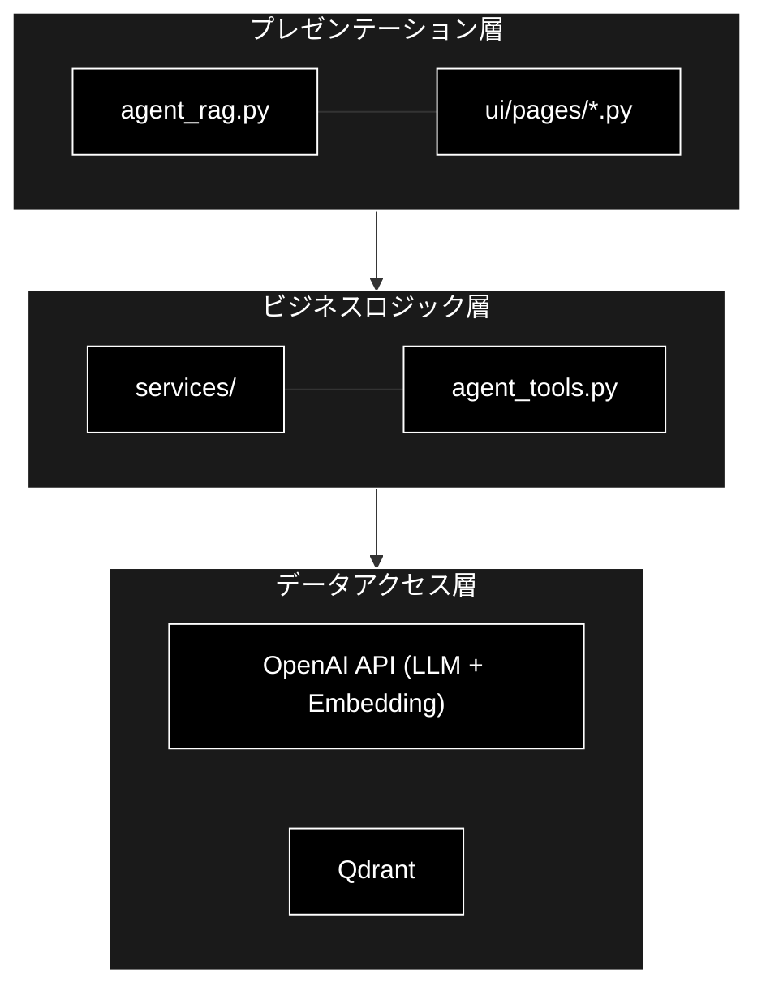
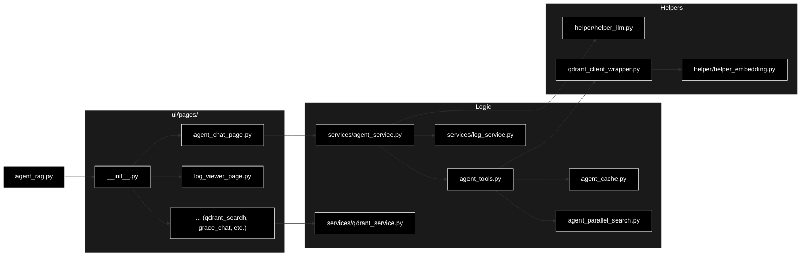
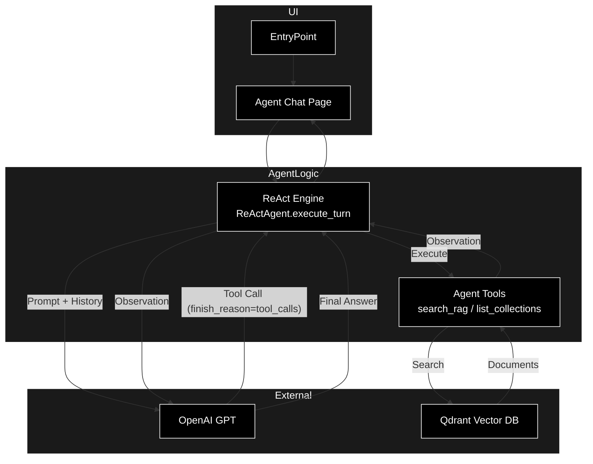
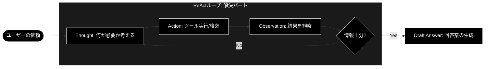
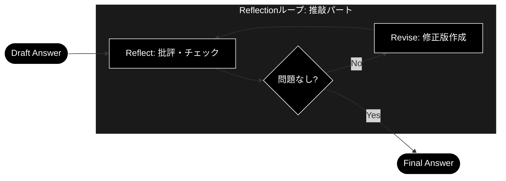
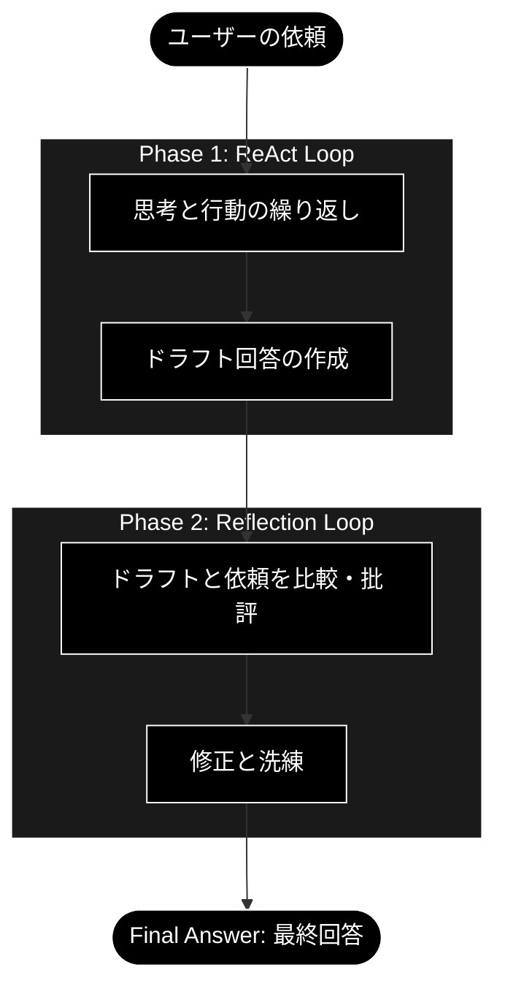
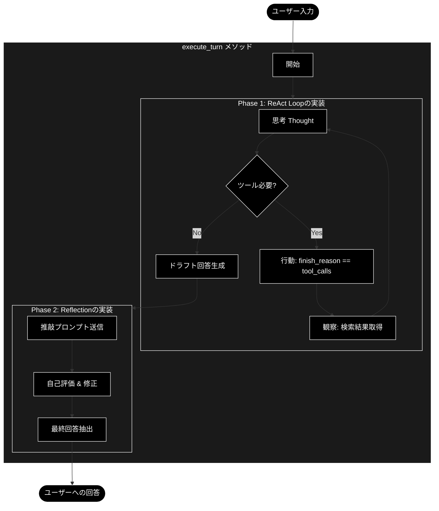
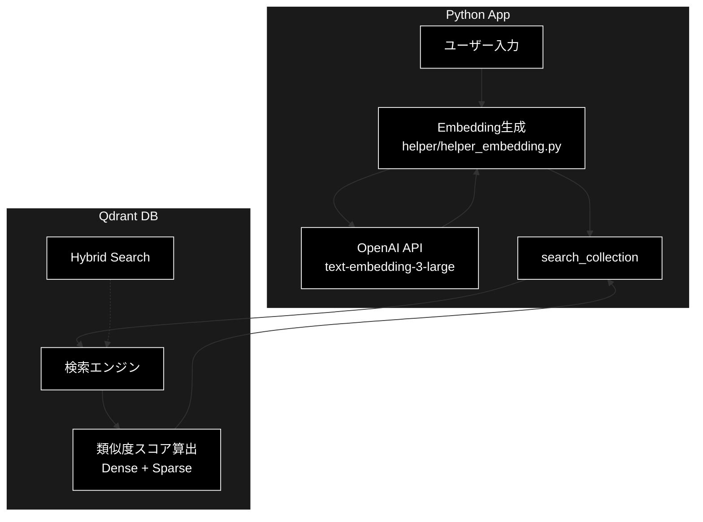
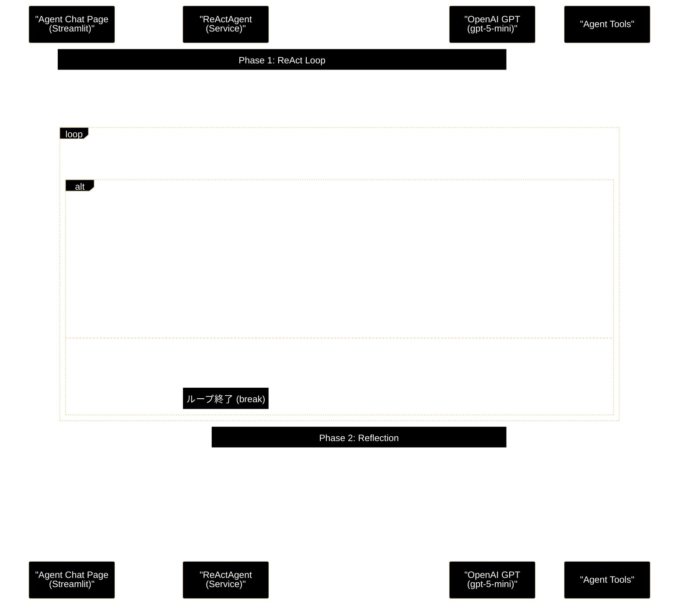
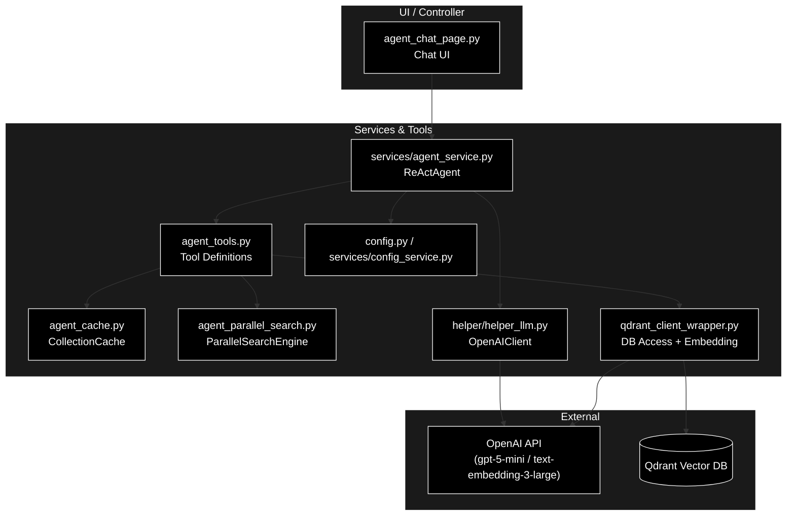

**プロジェクト全体の資料へ** [README.md](README.md) | **RAGの資料へ** [readme_rag.md](readme_rag.md) | **GRACE（Plan+Executor）の資料へ** [readme_autonomous_agent.md](readme_autonomous_agent.md)

# ReAct + Reflection エージェント 設計・実装ドキュメント

**Version 2.0** | 最終更新: 2026-07-10

## OpenAI GPT 搭載・自律型RAGエージェントシステム

本システムは、「自律型 RAG エージェント」および統合管理プラットフォームです。
システムの特徴は ReAct + Reflection、フルスクラッチ実装、OpenAI GPT（既定 `gpt-5-mini`）対応です。
Streamlit ベースの UI を通じて、データの取得・ベクトル化から、Qdrant データベース管理、
そして高度なエージェント対話まで、RAG パイプライン全体を一気通貫で管理・運用することができます。

**主な特徴と技術的工夫:**
```text
1. ReAct (Reasoning + Acting):
   　　エージェント自らが「考える（Reasoning）」と「行動する（Acting）」をループ
   　　・入力プロンプトの最適化（キーワード抽出によるクエリ拡張）
   　　・CoT（Chain-of-Thought）のLoop
   　　・Hybrid RAG (Dense + Sparse) の検索
   　　必要な情報が揃うまで自律的に検索ツール (search_rag_knowledge_base) を行使します。
2. Reflection (自己評価結果に基づき、最終回答 (Final Answer) を抽出：自己省察):
   　　回答を作成した後、即座に出力せず「自己評価」フェーズを実行し、回答の品質を向上。
   　　検索結果との整合性やスタイルを自ら批評し、ハルシネーション（幻覚）や誤りを修正してからユーザーに回答します。
3. フルスクラッチ実装:
   　　OpenAI API（Chat Completions + Function Calling）を直接利用し、柔軟な制御を実現しました。
4. スマート検索（キャッシュ + 並列検索）:
   　　前回成功したコレクションをセッション単位でキャッシュし、キャッシュミス時は
   　　全コレクションを4並列で同時検索。最高スコアの結果を自動選択します。
```

## 目次

## RAG Q/A 生成・検索システム

1. [概要](#1-概要)
   - 1.1 [本モジュールの目的](#11-本モジュールの目的)
   - 1.2 [主な機能（7画面の概要）](#12-主な機能7画面の概要)
   - 1.3 [対応データセット](#13-対応データセット)
2. [アーキテクチャ](#2-アーキテクチャ)
   - 2.1 [システム構成図（3層アーキテクチャ）](#21-システム構成図3層アーキテクチャ)
   - 2.2 [モジュール依存関係図](#22-モジュール依存関係図)
   - 2.3 [レイヤー別役割分担表](#23-レイヤー別役割分担表)
   - 2.4 [システムアーキテクチャ図（Mermaid）](#24-システムアーキテクチャ図mermaid)
3. [データフロー](#3-データフロー)
4. [サービス層 & ツール層](#4-サービス層--ツール層)
5. [UI層 (ui/pages/)](#5-ui層-uipages)
6. [メニュー単位の処理概要・処理方式](#6-メニュー単位の処理概要処理方式)
7. [設定・依存関係](#7-設定依存関係)
8. [使用方法](#8-使用方法)
9. [ReAct + Reflection エージェント詳細設計](#9-react--reflection-エージェント詳細設計)
   - 9.1 [ReAct + Reflection の仕組み](#91-react--reflection-の仕組み)
   - 9.2 [主要クラス・関数 IPO 定義](#92-主要クラス関数-ipo-定義)
   - 9.3 [シーケンス図 (Agent Turn)](#93-シーケンス図-agent-turn)

---

## 1. 概要

### 1.1 本モジュールの目的

`agent_rag.py` は、**OpenAI GPT（`gpt-5-mini` / GPT-4.1 / GPT-4o 系）** に対応したRAG（Retrieval-Augmented Generation）システムの統合管理ツールです。

**一言で言うと**: OpenAI GPT 活用型 RAG Q&A 生成・Qdrant 管理、および **ReAct型エージェント** による対話を実現する統合Streamlitアプリケーション

**役割**:

- データ取得からベクトル検索までの **RAGパイプライン全体** を管理
- **ReActエージェント** を介した、ツール利用による高度な対話機能
- **OpenAI API**（LLM: `gpt-5-mini`、Embedding: `text-embedding-3-large` 3072次元）を全面的に採用し、高速・低コスト・高精度を実現


| 項目           | 内容                                                    |
| -------------- | ------------------------------------------------------- |
| ファイル名     | agent_rag.py                                            |
| フレームワーク | Streamlit                                               |
| 起動コマンド   | `uv run streamlit run agent_rag.py --server.port 8501` |

### 1.2 主な機能（7画面の概要）


| 画面                          | アイコン | 機能概要                                                                                                       |
| ----------------------------- | -------- | -------------------------------------------------------------------------------------------------------------- |
| 説明                          | 📖       | システムのデータフロー・ディレクトリ構造を表示                                                                 |
| Qdrant検索                    | 🔎       | セマンティック検索単体のテスト・AI応答生成                                                                     |
| Agent(ReAct+Reflection)       | 🤖       | **ReAct Agent** (OpenAI GPT) との対話。ナレッジベース検索 + **Reflection (自己推敲)** による高品質な回答。     |
| 自律型Agent(Plan+Executor)    | 🧠       | GRACE アーキテクチャによる自律型エージェント（詳細は [readme_autonomous_agent.md](readme_autonomous_agent.md)） |
| 未回答ログ                    | 📊       | エージェントが回答できなかった質問のログ分析                                                                   |
| RAGデータ作成                 | 📄       | チャンク作成・Q/A生成・Qdrant登録の手順ガイド表示                                                              |
| QdrantのCRUD                  | 🗄️     | Qdrantコレクションの作成・閲覧・更新・削除                                                                     |

### 1.3 対応データセット


| データセット    | 識別子          | 説明                                   |
| --------------- | --------------- | -------------------------------------- |
| Wikipedia日本語 | `wikipedia_ja`  | Wikipedia日本語版                      |
| CC-News         | `cc_news`       | CC-News英語ニュース                    |
| Livedoor        | `livedoor`      | Livedoorニュースコーパス               |
| カスタム        | `custom_upload` | ローカルファイル（CSV/TXT/JSON/JSONL） |

---

## 2. アーキテクチャ

### 2.1 システム構成図（3層アーキテクチャ）



### 2.2 モジュール依存関係図



### 2.3 レイヤー別役割分担表


| レイヤー             | モジュール                    | 責務                                                                    |
| -------------------- | ----------------------------- | ----------------------------------------------------------------------- |
| **エントリポイント** | `agent_rag.py`                | アプリ起動、ルーティング                                                |
| **UI層**             | `ui/pages/agent_chat_page.py` | エージェント対話UI、ユーザー入力受付、思考ログの表示                    |
| **サービス層**       | `services/agent_service.py`   | **エージェント制御コア**。ReActループ、Reflection、履歴管理             |
| **ツール層**         | `agent_tools.py`              | エージェントが利用するツール群 (`search_rag_knowledge_base` 等)         |
| **ツール層**         | `agent_cache.py` / `agent_parallel_search.py` | コレクションキャッシュ・全コレクション並列検索          |
| **ヘルパー層**       | `helper/helper_llm.py`        | LLMクライアント抽象化（`create_llm_client("openai")` / `OpenAIClient`） |
| **サービス層**       | `services/*.py`               | データ処理、DB操作の抽象化                                              |

### 2.4 システムアーキテクチャ図（Mermaid）



---

## 3. データフロー

(基本構成は既存と同様。RAGデータ生成パイプラインは3段階：チャンキング → Q/A生成 → Qdrant登録)

### 3.1 エンドツーエンド処理フロー図

1. データDL（`down_load_non_qa_rag_data_from_huggingface.py`） -> 2. 前処理・チャンク化（`chunking/csv_text_to_chunks_text_csv`） -> 3. QA生成 + 埋め込み登録（`qa_qdrant/make_qa_register_qdrant.py`） -> **4. エージェントによる活用 (Search & Answer)**

操作手順の詳細は [readme_usage_tools.md](readme_usage_tools.md) を参照してください。

---

## 4. サービス層 & ツール層

### 4.1 agent_service.py - エージェント制御 (ReAct Engine)

**責務**: エージェントの思考プロセス (ReAct + Reflection) をカプセル化したコアサービス。

*   **クラス `ReActAgent`**:
    *   **LLMクライアント**: `create_llm_client("openai", default_model=...)` で `OpenAIClient` を生成。既定モデルは `services/config_service.py` の `models.default`（`gpt-5-mini`）。
    *   **会話履歴管理**: OpenAI Chat Completions はステートレスなため、`self._messages`（messages リスト）で会話履歴を自前管理。
    *   **ReActループ**: 思考(Thought)と行動(Action)のサイクルを回し、ツール実行を制御（`_execute_react_loop`）。
    *   **Reflection**: 回答案生成後の自己評価・修正フェーズを実行（`_execute_reflection_phase`）。
    *   **イベント駆動**: 思考ログやツール実行結果をジェネレータ（`execute_turn`）としてUIに逐次返却。
    *   **キーワード抽出**: `regex_mecab.KeywordExtractor`（オプション）で質問から重要キーワードを抽出し、入力プロンプトを拡張。

### 4.2 dataset_service.py - データセット操作

**責務**: データセットのロード、前処理、保存。

### 4.3 qdrant_service.py - Qdrant操作

**責務**: Qdrantクライアントの操作を抽象化し、コレクション管理・検索機能を提供。

### 4.4 file_service.py - ファイル操作

**責務**: アップロードされたファイルやローカルファイルの読み込み・保存・削除。

### 4.5 qa_service.py - Q/A生成

**責務**: テキストチャンクからQ/Aペアを生成するビジネスロジック (同期/非同期)。

### 4.6 agent_tools.py - エージェント用ツール


| 関数名                               | 説明                                                                                                     | 関連ツール名（LLM側）       |
| ------------------------------------ | -------------------------------------------------------------------------------------------------------- | --------------------------- |
| `search_rag_knowledge_base`          | 全コレクションを並列検索し、コサイン類似度閾値（0.5）でフィルタして上位5件を返す。                       | `search_rag_knowledge_base` |
| `search_rag_knowledge_base_cached`   | キャッシュ + 並列検索によるスマート検索。ReActAgent が実際に呼び出す実行経路。                           | （内部実装）                |
| `search_rag_knowledge_base_structured` | 単一コレクションに対する構造化検索（下位モジュール）。事前計算ベクトルの共有に対応。                   | （内部実装）                |
| `list_rag_collections`               | 利用可能なQdrantコレクションの一覧（件数付き）を返す。                                                   | `list_rag_collections`      |

### 4.7 agent_cache.py / agent_parallel_search.py - スマート検索基盤


| モジュール                 | クラス / シングルトン                              | 説明                                                                     |
| -------------------------- | -------------------------------------------------- | ------------------------------------------------------------------------ |
| `agent_cache.py`           | `CollectionCache` / `collection_cache`             | 前回検索に成功したコレクションをセッション単位でキャッシュ（TTL 300秒）。 |
| `agent_parallel_search.py` | `ParallelSearchEngine` / `parallel_search_engine`  | 全コレクションを `ThreadPoolExecutor` で4並列検索（タイムアウト10秒/件）。 |

---

## 5. UI層 (ui/pages/)

### 5.1 画面一覧と遷移

サイドバーのラジオボタンにより、以下の画面を切り替え。

1. **説明 (`explanation`)**
2. **Qdrant検索 (`qdrant_search`)**
3. **Agent(ReAct+Reflection) (`agent_chat`)**
4. **自律型Agent(Plan+Executor) (`grace_chat`)**
5. **未回答ログ (`log_viewer`)**
6. **RAGデータ作成 (`rag_data_creation`)**
7. **QdrantのCRUD (`qdrant_crud`)**

### 5.2 各ページの機能詳細

#### `agent_chat_page.py` (エージェント対話)

* **機能**: OpenAI GPT（既定 `gpt-5-mini`）を用いたチャットインターフェース。
* **特徴**:
  * **ReActループ**: 思考(Thought)と行動(Action)の可視化。
  * **Reflection**: 回答案生成後に自己評価・修正を行い、ハルシネーションの低減とスタイル統一を実現。
  * **モデル選択**: サイドバーで使用モデル（`gpt-5-mini` / `gpt-4o-mini` / `gpt-4o` / `gpt-4.1` 等、`config.py` の `AVAILABLE_MODELS`）を切り替え可能。
  * **マルチコレクション**: 検索対象のコレクションをサイドバーで選択可能。
  * **ハイブリッド検索切替**: Sparse + Dense のハイブリッド検索の有効/無効をチェックボックスで切り替え。
  * **キャッシュ統計**: コレクションキャッシュのヒット状況をサイドバーのエキスパンダーに表示。
  * **ストリーミング**: 思考プロセスを `st.expander` 内に逐次表示。

#### `log_viewer_page.py` (未回答ログ)

* **機能**: エージェントが「回答なし」と判断したクエリの履歴を表示・分析。

---

## 6. メニュー単位の処理概要・処理方式

### 6.1 📖 説明

システム全体の概要を表示。

### 6.2 🤖 Agent(ReAct+Reflection)

ReActエージェントがユーザーの質問に対し、ツール（検索）を使って回答を作成します。

* **思考の可視化**: 「なぜその検索を行うか」という推論過程を表示。
* **ツール利用**: `search_rag_knowledge_base` を自律的に呼び出し、Qdrantから情報を取得。
* **Reflection (推敲)**: 回答案を作成した後、自己評価フェーズを実行。正確性・適切性・スタイルを推敲し、より洗練された回答を提示します。

---

## 7. 設定・依存関係

### 7.1 必須環境変数

`.env` ファイルに以下を設定します。

```
OPENAI_API_KEY=your-openai-api-key   # LLM（gpt-5-mini）と Embedding（text-embedding-3-large）の両方で使用
QDRANT_URL=http://localhost:6333     # 省略時は localhost
COHERE_API_KEY=...                   # オプション（Rerank 用。未設定時は RRF スコアのまま返却）
```

### 7.2 依存サービス

- **Qdrant**: `docker-compose -f docker-compose/docker-compose.yml up -d` で起動。エージェント利用前に必須。

### 7.3 主要な定数・設定値


| 定数 / 設定                                   | 値                          | 定義場所                            |
| --------------------------------------------- | --------------------------- | ----------------------------------- |
| 既定LLMモデル（`models.default`）             | `gpt-5-mini`                | `services/config_service.py`        |
| Embeddingモデル                               | `text-embedding-3-large`    | `config.py`（`EMBEDDING_MODEL`）    |
| Embedding次元数                               | 3072                        | `config.py`（`EMBEDDING_DIMS`）     |
| コサイン類似度閾値（`COSINE_SIMILARITY_THRESHOLD`） | 0.5                   | `agent_tools.py`                    |
| 検索結果上限（`AgentConfig.RAG_SEARCH_LIMIT`） | 3                          | `config.py`                         |
| ReAct最大ターン数（`agent.max_turns`）        | 10                          | `services/config_service.py`（既定） |
| ReAct最大トークン数（`agent.max_tokens`）     | 4096                        | `services/config_service.py`（既定） |
| Reflection最大トークン数（`agent.reflection_max_tokens`） | 2048            | `services/config_service.py`（既定） |
| キャッシュTTL                                 | 300秒                       | `agent_cache.py`                    |
| 並列検索ワーカー数                            | 4                           | `agent_parallel_search.py`          |

---

## 8. 使用方法

### 8.1 起動手順

```bash
# 1. Qdrant 起動
docker-compose -f docker-compose/docker-compose.yml up -d

# 2. Streamlit UI 起動
uv run streamlit run agent_rag.py --server.port 8501

# （代替）CLI 版エージェント
uv run python agent_main.py
```

### 8.2 典型的なワークフロー

1. 「📄 RAGデータ作成」の手順に従い、チャンク作成 → Q/A生成 → Qdrant登録を実施
2. 「🤖 Agent(ReAct+Reflection)」で検索対象コレクション・モデルを選択して質問
3. 「📊 未回答ログ」で回答できなかった質問を確認し、データ拡充に活用

---

## 9. ReAct + Reflection エージェント詳細設計

本システムの中核である「ハイブリッド・ナレッジ・エージェント」の詳細設計です。

### 9.1 ReAct + Reflection の仕組み

OpenAI Chat Completions API の Function Calling 機能を利用し、以下のサイクルを回します。

1. **ReAct フェーズ (解決)**:

   * **Thought (思考)**: ユーザーの入力に対し、外部知識が必要か、どんなクエリで検索すべきか考える。
   * **Action (行動)**: ツール (`search_rag_knowledge_base`) を呼び出すことを決定し、APIにリクエスト。
   * **Observation (観察)**: ツールを実行し、その結果（検索結果やエラー）を取得。
   * **Draft Answer (ドラフト作成)**: 観察結果に基づき、回答案を生成。

2. **Reflection フェーズ (推敲)**:

* **Critique (批評)**: 生成されたドラフト回答に対し、検索結果（コンテキスト）との整合性やスタイルを自己評価。
* **Revise (修正)**: 必要に応じて回答を修正し、最終回答 (Final Answer) とする。

### 9.2 主要クラス・関数 IPO 定義

#### `services.agent_service.ReActAgent.execute_turn`

エージェントの1ターン（ユーザー発話〜最終回答）を制御するメインメソッド。ジェネレータとして実装されています。


| 項目        | 内容                                                                                                                                                                                                                                                                                                                                                                                                                                                                                                                                                                                     |
| ----------- | ------------------------------------------------------------------------------------------------------------------------------------------------------------------------------------------------------------------------------------------------------------------------------------------------------------------------------------------------------------------------------------------------------------------------------------------------------------------------------------------------------------------------------------------------------------------------------------------ |
| **Input**   | `user_input`: ユーザーの質問文字列                                                                                                                                                                                                                                                                                                                                                                                                                                                                                                                                                       |
| **Process** | 1. 会話履歴 `self._messages` をリセットし、キーワード抽出でプロンプトを拡張。<br>2. **ReAct Loop** (`_execute_react_loop`):<br>　a. `llm.generate_with_tools(messages, tools, system)` を呼び出し。<br>　b. `finish_reason == "tool_calls"` の場合、`tool_call` イベントをYieldしツールを実行。<br>　c. ツール実行結果を `tool_result` イベントとしてYieldし、`role: "tool"` メッセージとして履歴に追記。<br>　d. `Thought:` を含むテキストがあれば `log` イベントとしてYield。<br>　e. ツール呼び出しがなくなるまでループ（最大 `agent.max_turns` 回）。<br>3. **Reflection Phase** (`_execute_reflection_phase`):<br>　a. `REFLECTION_INSTRUCTION` とドラフト回答を結合して履歴に追記。<br>　b. `generate_with_tools(tools=[])` で会話コンテキストを維持したまま自己評価を要求。<br>　c. 評価思考を `log` イベントとしてYield。<br>　d. `Final Answer:` 以降を最終回答として抽出。<br>4. `_format_final_answer` で整形した最終回答を `final_answer` イベントとしてYield。 |
| **Output**  | `Generator[Dict[str, Any]]`: イベントストリーム<br>(例: `{'type': 'log', 'content': '...'}`, `{'type': 'final_answer', ...}`)                                                                                                                                                                                                                                                                                                                                                                                                                                                            |

#### `agent_tools.search_rag_knowledge_base_cached`

ReActAgent から呼び出される、キャッシュ + 並列検索によるスマート検索関数。


| 項目        | 内容                                                                                                                                                                                                                                                                                                                                                              |
| ----------- | ------------------------------------------------------------------------------------------------------------------------------------------------------------------------------------------------------------------------------------------------------------------------------------------------------------------------------------------------------------------ |
| **Input**   | `query`: 検索クエリ<br>`session_id`: セッションID（キャッシュキー）<br>`collection_name`: 明示指定されたコレクション名 (Optional)<br>`use_hybrid_search`: ハイブリッド検索フラグ（デフォルト True）                                                                                                                                                                |
| **Process** | 1. `embed_query` でクエリを Dense ベクトル化（OpenAI Embedding `text-embedding-3-large`、3072次元、1回のみ生成し全検索で共有）。<br>2. ハイブリッド検索有効時は `embed_sparse_query_unified` で Sparse ベクトルも生成。<br>3. `collection_name` 指定時はそのコレクションのみ検索。<br>4. キャッシュヒット時は前回成功コレクションを優先検索（スコア >= 0.6 で採用）。<br>5. キャッシュミス/低スコア時は全コレクションを4並列検索。<br>6. コサイン類似度閾値（0.5）でフィルタし、最高スコアのコレクションをキャッシュに保存。<br>7. 上位5件を LLM が理解しやすいテキスト形式に整形。 |
| **Output**  | 整形された検索結果文字列 (または `[[NO_RAG_RESULT]]` / `[[NO_RAG_RESULT_LOW_SCORE]]` / `[[RAG_TOOL_ERROR]]`)                                                                                                                                                                                                                                                        |

# OpenAI GPT Hybrid RAG Agent - 理論と実装リファレンス

本ドキュメントは、ReAct + Reflection エージェントの理論的背景（概念図）と、ユーザーが選択可能な OpenAI GPT モデルを活用した `agent_rag.py` および関連モジュールの実装詳細を体系的にまとめたリファレンスです。

---

## 第2部: アーキテクチャ概念 (Theoretical Architecture)

OpenAI GPT エージェントの思考プロセスは、大きく2つのフェーズ（解決と推敲）で構成されています。

## 2.1 Phase 1: ReAct (試行錯誤による解決)

ReActは、**「考え（Reasoning）」ながら「行動（Acting）」し、その結果を見てまた「考える」**というプロセスです。
AIは単に回答を出力するのではなく、外部ツール（検索など）を使いながら、情報が揃うまで行動を繰り返します。



* **Thought**: 現在の状態を分析し、次に何をすべきか計画します。
* **Action**: ツール（検索）を実行します。
* **Observation**: ツールの実行結果（検索結果）を受け取ります。

## 2.1.1 入力文字列から検索クエリ生成までの処理構造（重要）

Pythonコード側の「クエリ整形」は `regex_mecab.KeywordExtractor` によるキーワード抽出（プロンプト拡張）のみで、
最終的な検索クエリは OpenAI GPT モデル自体が、システムプロンプトの指示に基づき「入力文」を解釈して「最適な検索クエリ」へと変換（推論）しています。

1. 入力フェーズ (Pythonコード: `ui/pages/agent_chat_page.py` → `services/agent_service.py`)

* ユーザーの行動:
  チャット画面に自然文で質問を入力します。

  > 具体例: 「実験生物学では、生物の機構を解明するためにどのような操作を加えますか？」
  >
* コード処理 (`ReActAgent.execute_turn` → `_execute_react_loop`):
  `KeywordExtractor` が抽出した重要キーワードを付加した文字列が、messages リストの user メッセージとして OpenAI API (`generate_with_tools`) に渡されます。
  同時に、システムプロンプト (`SYSTEM_INSTRUCTION_TEMPLATE`) によって、モデルには以下の「思考のルール」が与えられています。

  > 指示: 「Thought: [なぜ検索が必要か、どんなクエリで検索するか]」
  >

2. 生成・推論フェーズ (OpenAI API 内部)

* モデルの思考 (Reasoning):
  モデルはプロンプトの指示に従い、ユーザーの意図を汲み取りつつ、検索ツール (search_rag_knowledge_base)
  に渡すべき最適な引数を考えます。

  > 思考例: 「このユーザーの質問は長い。Qdrantで正確に検索するには、助詞を省いて重要なキーワードに絞ったほうが良いだろう。」
  >
* クエリの決定 (Tool Call 生成):
  モデルは思考の結果に基づき、ツールの引数 query を生成します。ここでの出力が、実際の検索クエリとなります。
  なお、`collection_name` はモデルに指定させず、システム側（キャッシュ + 並列検索）が自動選択します。

  > 生成パターン例:
  > ケースA (重要語抽出): "実験生物学 生物の機構 操作"
  > ケースB (キーワード化): "実験生物学 実験操作"
  > ケースC (そのまま): "実験生物学では、生物の機構を解明するためにどのような操作を加えますか？"
  >

※現状のプロンプトでは「キーワードのみにせよ」という強制はないため、モデルの文脈判断によりケースA～Cのように変動します。ただし抽出済みの「重要キーワード」を必ず含めるようプロンプトで指示しているため、検索に適した形（ケースAやB）へ収束しやすくなっています。

3. 伝達・実行フェーズ (Pythonコード: `services/agent_service.py` → `agent_tools.py`)

* コード処理 (`_execute_react_loop` -> `search_rag_knowledge_base_cached`):
  OpenAI API から返ってきた tool_calls 情報（モデルが決めたクエリ）を Python 側で受け取り、検索関数を実行します。

```python
# services/agent_service.py（抜粋）
if tool_name == "search_rag_knowledge_base":
    tool_result = search_rag_knowledge_base_cached(
        query             = tool_args.get("query", ""),
        session_id        = self.session_id,
        collection_name   = tool_args.get("collection_name"),
        use_hybrid_search = self.use_hybrid_search,
    )
```

まとめ


| フェーズ | 担当                     | 処理内容                                 | 具体例                                  |
| :------- | :----------------------- | :--------------------------------------- | :-------------------------------------- |
| 1. 入力  | agent_chat_page.py       | ユーザーの自然文を受け取る               | 「実験生物学では...操作を加えますか？」 |
| 2. 変換  | OpenAI GPT (LLM)         | 文脈から「検索用クエリ」を推論・生成する | 「実験生物学 実験操作」 (ケースB)       |
| 3. 実行  | agent_service.py / agent_tools.py | 生成されたクエリで検索を実行する | query="実験生物学 実験操作" で検索      |

つまり、「クエリ生成ロジック」の実体は Python コードではなく、LLM の頭脳（推論プロセス）の中 にあります。

### 2.1.2 CoT (Chain of Thought) の処理構造（重要）

ReActエージェントは、最終的な回答を出す前に、思考(Thought)と行動(Action/Tool Call)を連鎖させ、論理的に答えを導き出します。
以下は、実際の実行ログに基づく思考の連鎖プロセスです。

#### 具体的な挙動の仕組み (実行ログの追跡)

1. **初期思考 (Initial Thought)**

   * **入力**: 「実験生物学では、生物の機構を解明するためにどのような操作を加えますか？」
   * **LLMの推論**: 質問の意図を理解し、外部情報が必要か判断します。
   * **思考ログ**:
     > 🧠 Thought: [生物の機構を解明するための操作に関する質問なので、社内ナレッジを検索してみる。]
     >
2. **ツール実行 (Action & Observation)**

   * **LLMの行動**: 推論に基づき、適切なツールと引数を生成します。
   * **ツール呼び出し**:
     > 🛠️ Tool Call: `search_rag_knowledge_base`
     > Args: `{'query': '実験生物学 生物機構 操作'}`
     >
   * **ツールの結果 (Observation)**:
     > 📝 Tool Result: Result 1 [Cosine: 0.50]: Q: 実験生物学では... A: 人為的に操作を加え通常と異なる条件を作り出し...
     >
3. **解決思考 (Reasoning & Draft)**

   * **LLMの推論**: 検索結果を読み、質問に答えられるか判断します。
   * **思考ログ**:
     > 🧠 Thought: [検索結果から、質問に対する回答が得られた。]
     >
   * **ドラフト回答**:
     > Answer: 社内ナレッジによると、実験生物学では...
     >
4. **推敲 (Reflection)**

   * **LLMの自己評価**:
     > 🤔 Reflection Thought: ** [自己評価: 回答は質問に直接的かつ明確に答えており...修正は不要と判断しました。]**
     >

#### まとめ


| ステップ | フェーズ        | 処理内容                 | 実際のログ要素                               |
| :------- | :-------------- | :----------------------- | :------------------------------------------- |
| **1**    | **Thought**     | 検索の必要性と戦略の立案 | `Thought: ...社内ナレッジを検索してみる。`   |
| **2**    | **Action**      | 検索ツールの実行         | `Tool Call: search_rag_knowledge_base`       |
| **3**    | **Observation** | 検索結果の取得           | `Tool Result: ...人為的に操作を加え...`      |
| **4**    | **Draft**       | 情報の統合と回答作成     | `Answer: 社内ナレッジによると...`            |
| **5**    | **Reflection**  | 回答の品質チェック       | `Reflection Thought: ...修正は不要と判断...` |

### 2.1.3 Reflectionフェーズ (自己省察と推敲) の処理構造（重要）

検索結果を基に一度回答を作成した後、さらに「推敲」を行うプロセスです。
これにより、回答の正確性やスタイルが、システム要件（丁寧な日本語など）に合致しているか自己評価し、必要に応じて修正します。

#### プロンプト戦略 (`REFLECTION_INSTRUCTION`)

`REFLECTION_INSTRUCTION` 定数にて、以下の観点でのチェックを指示しています。

1. **正確性 (Accuracy)**: 検索結果に基づいているか？ 幻覚 (Hallucination) はないか？
2. **適切性 (Relevance)**: ユーザーの質問に直接答えているか？
3. **スタイル (Style)**: 親しみやすく丁寧な日本語（です・ます調）か？ 箇条書き等のフォーマットは適切か？

#### 具体的な挙動の仕組み

1. **ドラフト生成フェーズ** (ReActループ終了後)

   * **LLMの思考**: 検索結果から情報を得たので、回答を作成します。
     > **思考例 (Thought)**: 「検索結果から、質問に対する回答が得られた。」
     >
   * **回答案 (Draft)**:
     > 「社内ナレッジによると、実験生物学では、生物に備わっている機構を解明するために、人為的に操作を加え通常と異なる条件を作り出し、その後の変化を観察・観測します。例えば、突然変異の誘発や遺伝子導入、移植実験などを行います。」
     >
   * **コード処理 (`_execute_react_loop` 終端)**: この回答案を `final_text` イベントとして `execute_turn` に返し、`draft_answer` として保持します。
2. **推敲フェーズ** (Reflection)

   * **コード処理 (`_execute_reflection_phase`)**: `REFLECTION_INSTRUCTION` (評価プロンプト) とドラフト回答を結合して `self._messages` に追記し、`generate_with_tools(tools=[])` で会話コンテキスト（ReActループの検索結果・思考ログ）を維持したまま OpenAI GPT に送信します。

     > **指示**: 「以下の基準で客観的に評価し...修正してください...思考プロセスは Thought: で始めてください。」
     >
   * **LLMの思考 (Reflection Thought)**: プロンプトに従い、自分の回答を評価します。

     > **思考例**: 「[自己評価: 回答は質問に直接的かつ明確に答えており、正確性、適切性、スタイルにも問題ないため、修正は不要と判断しました。]」
     >
   * **最終回答の生成 (Final Answer)**: 評価に基づき、`Final Answer:` 以降を最終版として抽出します。

#### まとめ


| フェーズ    | 担当                    | 処理内容                             | 具体例                                                 |
| :---------- | :---------------------- | :----------------------------------- | :----------------------------------------------------- |
| 1. 推敲指示 | `agent_service.py`      | ドラフト回答 + 評価プロンプトを送信  | `REFLECTION_INSTRUCTION` + 「社内ナレッジによると...」 |
| 2. 自己評価 | OpenAI GPT (LLM)        | 基準（正確性・スタイル）に従って評価 | 「自己評価: ...修正は不要と判断しました。」            |
| 3. 最終化   | OpenAI GPT (LLM)        | 修正版（またはそのまま）の回答を出力 | 「社内ナレッジによると...（最終回答）」                |

### 2.2 Phase 2: Reflection (自己省察と推敲)

Reflectionは、生成された回答（ドラフト）に対して客観的な批評を行い、品質を高めるプロセスです。



* **Reflect**: 正確性、適切性、スタイルをチェックします。
* **Revise**: 問題があれば修正し、最終回答を生成します。

## 2.3 統合モデル (ReAct + Reflection)

「動く（Action）」フェーズと「考える（Reflection）」フェーズを連携させることで、より高度な成果物を生み出します。



---

# 第3部: 実装詳細 (Implementation Details)

上記の理論が、実際のPythonコードでどのように実装されているか解説します。

## 2.4 エージェント制御: `services/agent_service.py` + `ui/pages/agent_chat_page.py`

エージェントのライフサイクル管理は UI 層（`agent_chat_page.py`）とサービス層（`agent_service.py`）に分離されています。

* **`show_agent_chat_page()` 関数** (`ui/pages/agent_chat_page.py`):
  * **役割**: サイドバーの選択値（モデル・コレクション・ハイブリッド検索フラグ）を監視し、変更時に `ReActAgent` を再初期化します。
  * **詳細**: UIでユーザーが選択した `model_name` を `ReActAgent(selected_collections, selected_model, session_id, use_hybrid_search)` に渡します。これにより、利用する OpenAI GPT モデルを動的に切り替えることが可能です。
* **`ReActAgent.__init__`** (`services/agent_service.py`):
  * **役割**: `create_llm_client("openai", default_model=...)` で `OpenAIClient` を生成し、システムプロンプト（`_build_system_instruction`）とツール定義（`_build_tools`）を事前構築します。

### ReActループの実装 (`ReActAgent.execute_turn` / `_execute_react_loop`)

OpenAI Chat Completions API の Function Calling（`finish_reason == "tool_calls"`）と Python の `for` ループを組み合わせて ReAct を実現しています。



* **コード対応**: `_execute_react_loop` 内の `for turn_count in range(1, max_turns + 1):` ループ（`max_turns` は `get_config("agent.max_turns", 10)`）。
* **Thoughtの可視化**: モデルが出力する `Thought:` パートを抽出し、`log` イベントとして Streamlit UI (`st.expander`) にリアルタイム表示します。

### プロンプト設計

* **Router Guidelines (`SYSTEM_INSTRUCTION_TEMPLATE`)**:
  * **役割**: 検索ツールを使うべき質問の判断基準（専門知識/一般会話の切り分け）と、出力フォーマット（`Thought:` / `Answer:`）を定義します。
  * **実装**: `collection_name` はモデルに指定させず（プロンプトで明示的に禁止）、システム側のスマート検索（キャッシュ優先 → 全コレクション並列検索 → スコアベース選択）が自動的に最適なコレクションを選択します。モデルは `query` パラメータのみを生成します。
* **Reflection Strategy (`REFLECTION_INSTRUCTION`)**:
  * **役割**: ドラフト回答に対する評価基準（正確性・適切性・スタイル）を定義します。

## 2.5 ツール定義: `agent_tools.py`

LLM が呼び出すことができる「手足」となる関数群です。

* **`search_rag_knowledge_base(query, collection_name=None, use_hybrid_search=True)`**:
  * **役割**: 全コレクションを並列検索し、コサイン類似度閾値でフィルタした上位5件を返します。
  * **詳細**: `collection_name` はモデルが指定しても無視されます（全コレクション検索）。
* **`search_rag_knowledge_base_cached(query, session_id, ...)`**:
  * **役割**: `ReActAgent` が実際に呼び出す実行経路。キャッシュ（`agent_cache.collection_cache`）と並列検索（`agent_parallel_search.parallel_search_engine`）を組み合わせたスマート検索を行います。
* **`search_rag_knowledge_base_structured(query, collection_name, ...)`**:
  * **役割**: 単一コレクションに対する構造化検索（下位モジュール）。`services/qdrant_service` ではなく `qdrant_client_wrapper.search_collection` をラップし、事前計算済みベクトルの共有（Embedding 1回生成）に対応します。
* **`list_rag_collections()`**:
  * **役割**: 現在利用可能なコレクションの一覧（件数付き）を返します。

なお、LLM 側へのツール公開は `ReActAgent._build_tools()` が定義する JSON Schema（`name` / `description` / `input_schema`）で行い、`OpenAIClient.generate_with_tools()` が OpenAI 形式（`type: "function"` + `parameters`）へ変換して API に渡します。

## 2.6 知識ベース検索: `qdrant_client_wrapper.py`

Qdrant データベースとの対話、Embedding 生成、ハイブリッド検索を担当するコアモジュールです。

### Embedding (ベクトル化) の構成

`helper/helper_embedding.py` に集約され、抽象化されています。


| 項目               | 詳細                                                                                                                                                   |
| :----------------- | :------------------------------------------------------------------------------------------------------------------------------------------------------ |
| **抽象基底クラス** | `EmbeddingClient`                                                                                                                                      |
| **実装クラス**     | **`OpenAIEmbedding`**: OpenAI Embeddings API を使用。既定モデル `text-embedding-3-large`（3072次元）。現在の主力。                                     |
| **ファクトリ関数** | `create_embedding_client(provider="openai", ...)`                                                                                                      |
| **呼び出し経路**   | `agent_tools.embed_query` → `qdrant_client_wrapper.embed_query_unified(text, provider="openai")` → `OpenAIEmbedding.embed_text`                       |

### 検索ロジック (Hybrid Search)

Qdrant の **Hybrid RAG (Dense + Sparse)** 機能を活用しています。


| 処理フェーズ       | モジュール / 関数                                             | 詳細 (Input / Process / Output)                                                                                                                                                                 |
| :----------------- | :------------------------------------------------------------ | :---------------------------------------------------------------------------------------------------------------------------------------------------------------------------------------------- |
| **設定 (Setup)**   | `qdrant_client_wrapper.py`<br>`create_or_recreate_collection` | **Input**: `client`, `name`, `vector_size`<br>**Process**: DenseベクトルとSparseベクトルの両方の設定を行い、コレクションを作成。<br>**Output**: なし                                            |
| **実行 (Runtime)** | `qdrant_client_wrapper.py`<br>`search_collection`             | **Input**: `client`, `collection_name`, `query_vector`, `sparse_vector`<br>**Process**: Dense (意味検索) と Sparse (キーワード検索) を組み合わせたハイブリッド検索を実行。<br>**Output**: 高精度な検索結果リスト |



### 1. 検索機能を実現しているクラス・関数

`agent_rag.py` はあくまでエントリーポイント（画面遷移の管理）であり、実際の検索ロジックは **UI層** と **サービス層（ラッパー）** に分離されています。


| 層                | ファイル                         | 関数 / クラス               | 説明                                                                                                                                  |
| :---------------- | :------------------------------- | :-------------------------- | :------------------------------------------------------------------------------------------------------------------------------------ |
| **App Entry**     | `agent_rag.py`                   | `main()`                    | 画面選択ラジオボタンで「🔎 Qdrant検索」が選ばれると、下記の`show_qdrant_search_page` を呼び出します。                                 |
| **UI Layer**      | `ui/pages/qdrant_search_page.py` | `show_qdrant_search_page()` | 検索画面のメイン関数です。ユーザー入力（クエリ、設定）を受け取り、検索実行ボタン押下時に下記のバックエンド関数を呼び出します。        |
| **Service Layer** | `qdrant_client_wrapper.py`       | `search_collection()`       | **検索実行の中核関数です。** Qdrantクライアントに対してクエリを送信し、結果を受け取ります。ハイブリッド検索の分岐もここで行われます。 |
| **Service Layer** | `services/qdrant_service.py`     | `embed_query_for_search()`  | クエリ文字列を**Dense Vector**（密ベクトル）に変換します（OpenAI Embedding API）。                                                    |

### 2. Dense + Sparse 機能を実現しているクラス・関数

「Dense + Sparse（ハイブリッド検索）」は、通常のベクトル検索（Dense）に加え、キーワード検索に近い性質を持つ **Sparse Vector** を組み合わせることで実現されています。


| 機能                  | ファイル                     | 関数 / クラス                                | 説明                                                                                                                            |
| :-------------------- | :--------------------------- | :------------------------------------------- | :------------------------------------------------------------------------------------------------------------------------------ |
| **Sparse Vector生成** | `qdrant_client_wrapper.py`   | `embed_sparse_query_unified()`               | クエリ文字列を**Sparse Vector**（疎ベクトル、キーワード重み）に変換します。内部で `helper/helper_embedding_sparse.py` を呼び出します。 |
| **Hybrid検索実行**    | `qdrant_client_wrapper.py`   | `search_collection()`                        | 引数`sparse_vector` が渡された場合、DenseとSparseの両方を使って検索し、**RRF (Reciprocal Rank Fusion)** で結果を統合します。    |
| **コレクション定義**  | `services/qdrant_service.py` | `create_or_recreate_collection_for_qdrant()` | コレクション作成時に、Dense用設定に加え`sparse_vectors_config` を設定し、ハイブリッド検索可能な器を用意します。                 |
| **ポイント構築**      | `services/qdrant_service.py` | `build_points_for_qdrant()`                  | データ登録時に、DenseベクトルとSparseベクトルを一つの`PointStruct` にまとめて格納する構造を作ります。                           |

### 3. 構造と処理フロー

ハイブリッド検索が実行される際のデータフローと構造は以下の通りです。

#### A. 処理フロー

1. **UI入力**: `show_agent_chat_page` でユーザーが「⚡ ハイブリッド検索 (Sparse + Dense)」をチェックし、質問を入力する。
2. **ベクトル化 (1回のみ生成・全コレクションで共有)**:
   * **Dense**: `embed_query(query)` → `[0.12, -0.5, ...]` (`text-embedding-3-large`、3072次元)
   * **Sparse**: `embed_sparse_query_unified(query)` → `indices=[101, 503...], values=[0.5, 0.8...]`
3. **検索実行**: `search_collection(..., query_vector, sparse_vector)` が呼ばれる。
4. **Qdrantクエリ構築**:
   * Dense用とSparse用の2つの `models.Prefetch` オブジェクトを作成。
   * `models.FusionQuery(fusion=models.Fusion.RRF)` を使用して、2つの検索結果をスコアベースで融合するクエリを発行。
5. **結果表示**: 統合された検索結果（Hits）がUIに返却され、表示される。

#### B. データ構造 (Qdrant内部)

Qdrant内では、1つのポイント（ドキュメント）に対して「名前付きベクトル (Named Vectors)」としてDenseとSparseが共存しています。

```python
# build_points_for_qdrant 内での構造イメージ
PointStruct(
    id=...,
    vector={
        "default": [0.1, 0.2, ...],        # Dense Vector (意味検索用)
        "text-sparse": {                   # Sparse Vector (キーワードマッチ用)
            "indices": [12, 505, ...],
            "values": [0.9, 0.5, ...]
        }
    },
    payload={ "question": "...", "answer": "..." }
)
```

この構造により、`search_collection` 関数内で `using="default"` と `using="text-sparse"` を指定してそれぞれのベクトル空間を検索し、最後にマージすることが可能になっています。

## 第3部: 動作シーケンス (Runtime Behavior)

### 9.3 シーケンス図 (Agent Turn)



#### 主要構成要素


| 項目                   | 実装詳細                                            | 役割                                                                                     |
| :--------------------- | :-------------------------------------------------- | :--------------------------------------------------------------------------------------- |
| **ループ制御**         | `for turn_count in range(1, max_turns + 1):`        | 思考・行動サイクルの維持と無限ループ防止（既定10回）。                                   |
| **ツール実行**         | `finish_reason == "tool_calls"` 検知                | モデルがツール利用を要求した場合、対応する Python 関数 (`agent_tools.py`) を実行します。 |
| **結果フィードバック** | `self._messages` に `{"role": "tool", "tool_call_id": ..., "content": ...}` を追記 | ツールの実行結果をモデルに返し、次の思考を促します。                    |

## 3.2 Smart Search & Multi-turn Strategy

エージェントがどのように検索対象を決定し、失敗時にリカバリするかを示します。

1. **Smart Search (自動コレクション選択)**:
   * モデルは `query` のみを生成し、コレクション選択はシステム側が担います。
   * **キャッシュ優先**: 前回成功したコレクション（`agent_cache.collection_cache`、TTL 300秒）を先に検索し、スコア >= 0.6 で採用。
   * **並列検索**: キャッシュミス/低スコア時は全コレクションを4並列検索（`agent_parallel_search.parallel_search_engine`）し、最高スコアの結果を採用・キャッシュ更新。
2. **Multi-turn Strategy (リカバリ)**:
   * 検索結果が `[[NO_RAG_RESULT]]` / `[[NO_RAG_RESULT_LOW_SCORE]]` だった場合、LLM は即座に諦めず、**クエリを言い換え**て再検索を行います。検索失敗は `services/log_service.log_unanswered_question` で未回答ログに記録され、「📊 未回答ログ」画面で分析できます。

---

# 第4部: モジュール構成図 (Module Dependencies)

システムの全体的な依存関係図です。



---

## 変更履歴


| Version | 日付       | 変更内容                                                                                                                                                                                                                                                                            |
| ------- | ---------- | ------------------------------------------------------------------------------------------------------------------------------------------------------------------------------------------------------------------------------------------------------------------------------------ |
| 2.0     | 2026-07-10 | OpenAI API 移行に伴う全面改訂。LLM を OpenAI GPT（既定 `gpt-5-mini`）、Embedding を `text-embedding-3-large`（3072次元）表記に統一。実装経路（`ReActAgent.execute_turn` / `OpenAIClient.generate_with_tools` / `search_rag_knowledge_base_cached`）と突合し、存在しない関数（`run_agent_turn` / `setup_agent` / `search_collection_rag`）への言及を是正。スマート検索（キャッシュ + 4並列検索）・キーワード抽出・ハイブリッド検索切替の記述を追加。画面一覧を現行7画面に更新。Mermaid 図を黒背景・白文字規約に準拠。存在しない画像参照（doc/assets/*.png）を削除。クロスリンクを実在ファイル（readme_rag.md / readme_autonomous_agent.md）に是正。 |
| 1.x     | 2026-04-26 | 初版（旧LLM前提の記述）                                                                                                                                                                                                                                                                |
